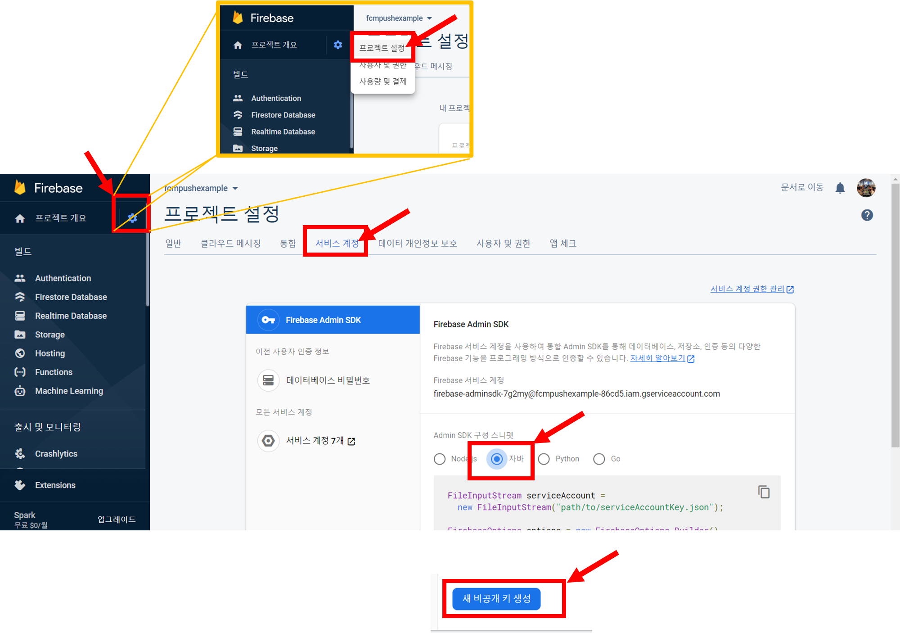
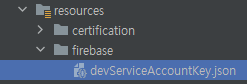

## Intro
이번 프로젝트를 진행하며 푸시알림 전송을 위한 전용 서버를 구축하여 해당 내용을 공유하려합니다.
혹시 내용 보시고 더 좋은 방안이 있었다면 내용 공유를 해주시면 감사하겠습니다.
<br/><br/><br/><br/>

## FCM(Firebase Cloud Message)이란?
FCM은 타겟 모바일에 푸시를 보낼 수 있도록 해주는 Google 솔루션입니다. 푸시 발송은 Firebase 콘솔 이나 서버에서 API를 활용해 발송이 가능합니다.
오늘은 API를 통해 발송하는 방법에 대해 알아보겠습니다.
[Firebase 홈페이지](https://firebase.google.com/?hl=ko)

#### 이해를 위해 제작한 라이프사이클
>   푸시 알림은 커스텀알림 보다는 배치 또는 특정 상황에 자동으로 발송되도록 설정하기 때문에 Batch를 사용한다고 가정하고 작성하였습니다.<br/>
>   아래에서 만들어볼 로직이 아래 라이프사이클과 같이 작동하는 것이므로 간단하게 인지하시고 넘어가시면 좋을 것 같습니다.<br/>
>   (Admin이 임의로 발송하길 원하신다면 저 Batch 대신 Admin이 들어간다고 생각하시면 됩니다.)
>
>   
<br/><br/><br/><br/>

## FCM 적용 방법
FCM 서버 구축과 관련된 내용이므로 FCM 어플리케이션을 홈페이지에서 만드는 방법은 생략하겠습니다.
(검색하시면 많이 나옵니다~)

FCM을 사용하기 위해서는 크게 4가지 작업이 필요합니다.
1. [Native App] 해당 어플리케이션이 APN에 접근하기 위한 APN 인증키 업로드 및 승인 작업
2. [Native App] FCM 전송을 받기 위해 타겟 모바일의 고유한 값을 지정하는 토큰 생성
3. [API Server] FCM ServiceAccountKey를 활용해 FCM용 Config 설정
4. [API Server] 서버에 FCM API 적용

이 중 1, 2는 Native App단에서 처리해야 하는 내용이며 푸시서버개발 시에는 3, 4번 내용이 필요하기 때문에 같이 확인해보겠습니다.

### FCM ServiceAccountKey 발급 방법
아래 이미지를 따라 FCM 홈페이지로 부터 파일을 받아 resources 폴더 내에 위치시켜주고 아래 이미지와 같이 파일명을 변경해주세요
> 

처음 받으면 아래와 같은 파일명이 아닙니다. dev와 prod용을 구분하기 좋게 파일명을 저는 이렇게 지정하였습니다.
> 
<br/><br/>

### FCM관련 Config 설정
위 과정을 통해 파일을 resources 폴더 내에 위치 시겼다면 다음은 Config 설정을 통해 FCM 서버로 요청을 전달하기 위한 준비를 하는 단계가 필요합니다.

#### 1. 각 배포환경에 따른 properties 세팅
필요데이터 종류
1. 메시지를 보낼 발송할 FCM API 서버 URL
2. 위에서 다운로드한 ServiceAccountKey File Path
3. GoogleCredentials 생성 시 필요한 googleapisUrl
위 3가지를 각 개발환경별 Properties 내에 세팅해주시면 됩니다.

>   ```xml
    // application-dev.properties
    api.firebase.apiUrl=https://fcm.googleapis.com/fcm/send
    api.firebase.configPath=firebase/devServiceAccountKey.json
    api.firebase.googleapisUrl=https://www.googleapis.com/auth/cloud-platform

    // application-prod.properties
    api.firebase.apiUrl=https://fcm.googleapis.com/fcm/send
    api.firebase.configPath=firebase/prodServiceAccountKey.json
    api.firebase.googleapisUrl=https://www.googleapis.com/auth/cloud-platform
    ```
<br/><br/>

#### 2. configuration 파일 생성
@Configuration을 활용해 Spring Boot 실행 시 Configuration으로 등록될 수 있도록 설정이 필요합니다.
이 때 Getter, Setter를 Lombok으로 사용하고자 하시는 분들이 있을텐데 Lombok이 적용되는 시점보다 Configuration이 먼저 등록되므로 아래와 같이 따로 만드셔야 합니다.

>   ```java
    @Configuration
    @ConfigurationProperties(prefix="api.firebase")
    public class FirebaseConfig {
        private static String apiUrl;
        private static String configPath;
        private static String googleapisUrl;

        public static String getApiUrl() {
            return apiUrl;
        }
        public void setApiUrl(String apiUrl) {
            FirebaseConfig.apiUrl = apiUrl;
        }

        public static String getConfigPath() {
            return configPath;
        }
        public void setConfigPath(String configPath) {
            FirebaseConfig.configPath = configPath;
        }

        public static String getGoogleapisUrl() {
            return googleapisUrl;
        }
        public void setGoogleapisUrl(String googleapisUrl) {
            FirebaseConfig.googleapisUrl = googleapisUrl;
        }
    }
    ```
<br/><br/>

#### 3. FCM API와 관련된 dependency 추가(with Maven)
아래 내용을 pom.xml에 추가해주시면 됩니다.

>   ```xml
    <dependency>
        <groupId>com.google.firebase</groupId>
        <artifactId>firebase-admin</artifactId>
        <version>8.2.0</version>
    </dependency>
    ```
<br/><br/>

#### 4. FCM 푸시 발송 Client 생성
FCM 메시지를 전송하기 위해 FCM 메시지 전송 Client를 생성해야합니다.
일반적인 클라이언트 생성들과 비슷하게 먼저 사용자 인증을 위한 ServiceAccountKey를 활용해 Credentials를 생성하고
이를 활용해 FirebaseApp을 인스턴스합니다.

>   ```java
    @Service
    @Slf4j
    public class FirebaseService {
        /**
         * @apiNote 클라이언트 생성
         * @param pushUid - 다중 전송 시 각각 개별 Push Uid별로 푸시를 발송하기 때문에 필요
         * @throws IOException - 잘못된 데이터 입력 시 익셉션 발생 가능
         */
        private FirebaseMessaging setFirebaseMessage(String pushUid) throws IOException {
            String firebaseConfigPath = FirebaseConfig.getConfigPath();
            GoogleCredentials googleCredentials = GoogleCredentials
                    .fromStream(new ClassPathResource(firebaseConfigPath).getInputStream())
                    .createScoped(List.of(FirebaseConfig.getGoogleapisUrl()));
            googleCredentials.refreshIfExpired();

            FirebaseOptions firebaseOptions = FirebaseOptions
                    .builder()
                    .setCredentials(googleCredentials)
                    .build();

            FirebaseApp app = FirebaseApp.initializeApp(firebaseOptions, pushUid);
            return FirebaseMessaging.getInstance(app);
        }

        ...

    }
    ```
<br/><br/>

#### 5. Client를 활용한 메시지 발송 Service 제작
단건 메시지 발송 Service 예시
메시지 발송 순서
1. Client 객체 인스턴스
2. Notification 객체 인스턴스
3. Message 객체 인스턴스
4. 생성된 Message 객체를 Client 내 메서드를 활용해 발송

>   ```java
    @Service
    @Slf4j
    public class FirebaseService {

        ...

        /**
         * @apiNote 단건 Push 메시지 전송 API
         * @param note - 메시지 발송에 필요한 DTO
         * @param userData - 푸시발송 받을 유저 정보
         * @return Push 발송 성공여부
         */
        public Boolean sendNotification(Note note, TargetUserDTO userData) throws IOException {
            FirebaseMessaging firebaseMessagingClient = setFirebaseMessage(getPushUid());
            ApiFuture<String> result = firebaseMessagingClient.sendAsync(dtoToMessage(note, userData), false);
            return !result.isCancelled();
        }

        /**
         * @apiNote Note DTO를 Message 객체로 Converting 해주는 Method
         * @param note - 발송할 메세지에 대한 DTO
         * @return 생성된 Message 객체
         */
        private Message dtoToMessage(Note note, TargetUserDTO userData){
            Notification notification = Notification
                    .builder()
                    .setTitle(note.getSubject())
                    .setBody(note.getContent())
                    .build();
            return Message
                    .builder()
                    .setToken(userData.getFcmToken())
                    .setNotification(notification)
                    .build();
        }
    }
    ```
<br/><br/>

#### 6. Notification 객체를 만들기 위해 필요한 DTO 두가지 생성
발송할 Message 정보 DTO
>   ```java
    @Getter
    @Setter
    public class Note {
        @NotNull
        private String subject;
        @NotNull
        private String content;

        ...

    }
    ```

푸시를 받을 User 정보 DTO
>   ```java
    @Getter
    @Setter
    public class TargetUserDTO {
        private String userUid;
        private String fcmToken;

        ...

    }
    ```
<br/><br/>

#### 7. 다중 푸시알림 전송방법
아래 예시와 같이 발송하고자 하는 Message 객체들을 List형식으로 받아 sendAll() 또는 sendAllAsync() 메서드를 활용해 발송하면 됨

>   ```java
    @Service
    @Slf4j
    public class FirebaseService {

        ...

        /**
         * @apiNote 메시지를 리스트단위로 발송하는 API
         * @param messageList - 발송할 메시지 리스트
         */
        private void multiMessagePush(List<Message> messageList) {
            try {
                FirebaseMessaging firebaseMessaging = setFirebaseMessage(getPushUid());
                firebaseMessaging.sendAllAsync(messageList);
            }catch (Exception e) {
                Util.customLogger(ApiCode.ERR_9997, "Push 발송 중 기타 에러 발생 : " + e.getMessage(), this.getClass().getName());
                throw new CustomException(ApiCode.ERR_9997);
            }
        }

        ...

    }
    ```
<br/><br/><br/><br/>


