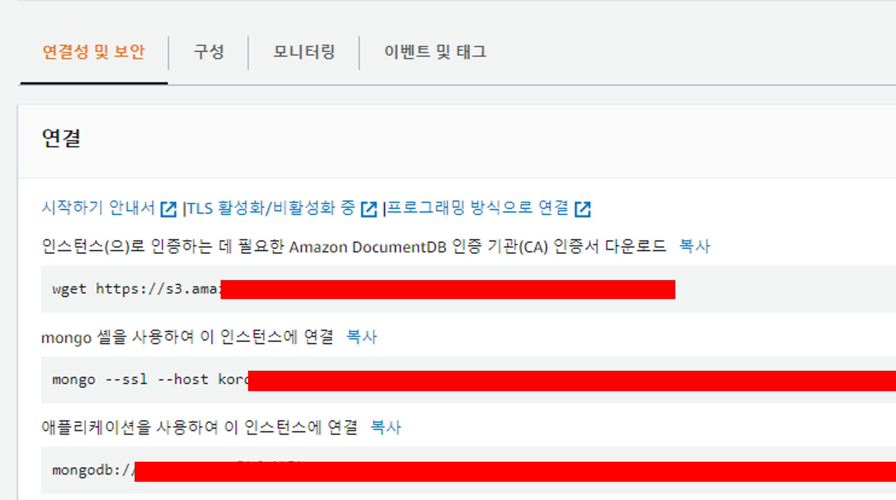
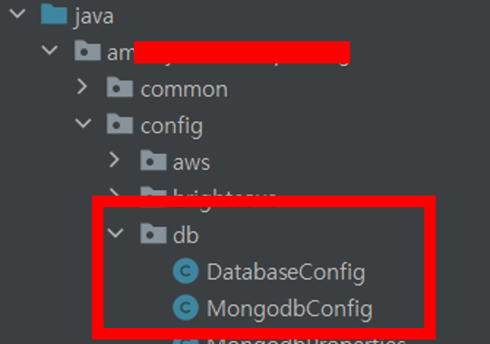

## Intro
안녕하세요 **Noah**입니다

오늘은 이미 서버에 RDB가 연결되어 있지만 추가로 DocumentDB(MongoDB)를 서버에 연결해야 할 시 사용할 수 있는 방법을 공유드리려고 합니다.<br/>
그 중에서도 Master Slave 형식으로 Read 요청은 모두 Slave에게 위임하고 Write 권한이 필요한 요청들만 Master에게 요청을 보내도록 요청을 분할하는 작업을 같이 진행했습니다.
(소스를 공유하며 순서대로 설명할 거라 글이 조금 길 수 있습니다)

DocumentDB 자체가 MongoDB 엔진을 사용하고 있기 때문에 MongoDB를 연결하고자 하시는 분들도 비슷한 구조로 작업하시면 되겠습니다.

그럼 시작하겠습니다.
<br/><br/><br/><br/>


## DB 사용을 위한 세팅
1. 각 개발 환경별 Properties 세팅
> 환경별로 DocumentDB(MongoDB)를 연결할 데이터들을 정리해줍니다.<br/>
> 
<br/><br/>

2. properties 내 변수들을 객체화 시킬 MongodbProperties 객체 생성
```
    import org.springframework.boot.context.properties.ConfigurationProperties;
    import org.springframework.context.annotation.Configuration;

    @Configuration
    @ConfigurationProperties(prefix = "spring.data.mongodb")
    public class MongodbProperties {
        private static String writeUri;
        private static String readUri;
        private static String host;
        private static String port;
        private static String database;
        private static String username;
        private static String password;
        private static String authenticationDatabase;
        private static String exerciseHistoryByClass;
        private static String exerciseHistoryBySecond;
        private static String databaseSelect;

        public static String getWriteUri() {
            return writeUri;
        }
        public void setWriteUri(String writeUri) {
            MongodbProperties.writeUri = writeUri;
        }

        public static String getReadUri() {
            return readUri;
        }
        public void setReadUri(String readUri) {
            MongodbProperties.readUri = readUri;
        }

        public static String getDatabaseSelect() {
            return databaseSelect;
        }
        public void setDatabaseSelect(String databaseSelect) {
            MongodbProperties.databaseSelect = databaseSelect;
        }

        public static String getHost() {
            return host;
        }
        public void setHost(String host) {
            MongodbProperties.host = host;
        }

        public static String getPort() {
            return port;
        }
        public void setPort(String port) {
            MongodbProperties.port = port;
        }

        public static String getDatabase() {
            return database;
        }
        public void setDatabase(String database) {
            MongodbProperties.database = database;
        }

        public static String getUsername() {
            return username;
        }
        public void setUsername(String username) {
            MongodbProperties.username = username;
        }

        public static String getPassword() {
            return password;
        }
        public void setPassword(String password) {
            MongodbProperties.password = password;
        }

        public static String getAuthenticationDatabase() {
            return authenticationDatabase;
        }
        public void setAuthenticationDatabase(String authenticationDatabase) {
            MongodbProperties.authenticationDatabase = authenticationDatabase;
        }

        public static String getExerciseHistoryByClass() {
            return exerciseHistoryByClass;
        }
        public void setExerciseHistoryByClass(String exerciseHistoryByClass) {
            MongodbProperties.exerciseHistoryByClass = exerciseHistoryByClass;
        }

        public static String getExerciseHistoryBySecond() {
            return exerciseHistoryBySecond;
        }
        public void setExerciseHistoryBySecond(String exerciseHistoryBySecond) {
            MongodbProperties.exerciseHistoryBySecond = exerciseHistoryBySecond;
        }
    }

```
<br/><br/>

3. DocumentDB 사용 시 요청 인증을 위한 TLS 연결 설정을 위한 CA파일 다운로드
> AWS 내에서 DocumentDB 생성 후 아래와 같이 CA파일을 다운로드받을 수 있는 기능을 제공합니다. 해당 내용 확인하시고 본인들에 맞는 CA파일을 받아주세요.<br/>
> 
<br/>
> 저는 resources 하위에 certification 디렉토리를 만들고 그 안에 파일을 두었습니다.<br/>
> 
<br/><br/>

4. MongoDB 사용을 위한 Client 생성 및 다운로드 받은 CA파일 주입
> Config 파일 생성 및 초기 세팅<br/>
> 
>   ```
        @Slf4j
        @Configuration
        @RequiredArgsConstructor
        // MongoDB Client 생성을 위해 AbstractMongoClientConfiguration를 Extends
        public class MongodbConfig extends AbstractMongoClientConfiguration {
            // 2단계에서 생성한 MongodbProperties 활용
            private final MongodbProperties mongodbProperties;
            @Override
            public String getDatabaseName() {
                return mongodbProperties.getDatabase();
            }

            ...
        }
    ```
<br/><br/>

#### MongoDB Client 생성을 위한 Builder를 생성
```
    ...

    /**
     * @apiNote mongo client 생성을 위한 builder를 생성
     *          DocumentDB의 경우 TLS로 인해 pem, ssl 등의 보안 설정이 필요
     * @return MongoClientSettings.Builder - 생성된 Client Builder
     */
    private MongoClientSettings.Builder getMongodbBuilder() throws IOException, KeyStoreException, NoSuchAlgorithmException, KeyManagementException, CertificateException {
        // builder 초기화
        MongoClientSettings.Builder builder = MongoClientSettings.builder();
        String endOfCertificateDelimiter = "-----END CERTIFICATE-----";
        File file;

        // resources에서 CA파일 주입
        ClassPathResource classPathResource = new ClassPathResource("certification/rds-combined-ca-bundle.pem");
        InputStream inputStream = classPathResource.getInputStream();
        try{
            file = File.createTempFile("rds-combined-ca-bundle", ".pem");
            FileUtils.copyInputStreamToFile(inputStream, file);
        }catch (Exception e){
            System.out.println("MongoDB용 CA File 조회 중 Error발생 ::::::::::: " + e.getMessage());
            throw new CustomException(ApiCode.ERR_8995);
        } finally {
            inputStream.close();
        }

        // 주입 받은 CA파일을 활용해 CertificateFactory Setting
        String pemContents = new String(Files.readAllBytes(file.toPath()));
        List<String> allCertificates = Arrays.stream(pemContents
                        .split(endOfCertificateDelimiter))
                .filter(line -> !line.isBlank())
                .map(line -> line + endOfCertificateDelimiter)
                .collect(Collectors.toUnmodifiableList());
        CertificateFactory certificateFactory = CertificateFactory.getInstance("x.509");

        KeyStore keyStore = KeyStore.getInstance(KeyStore.getDefaultType());
        keyStore.load(null);

        for (int i = 0; i < allCertificates.size(); i++) {
            String certString = allCertificates.get(i);
            Certificate caCert = certificateFactory.generateCertificate(new ByteArrayInputStream(certString.getBytes()));
            keyStore.setCertificateEntry(String.format("AWS-certificate-%s", i), caCert);

            TrustManagerFactory trustManagerFactory = TrustManagerFactory.getInstance(TrustManagerFactory.getDefaultAlgorithm());
            trustManagerFactory.init(keyStore);

            SSLContext sslContext = SSLContext.getInstance("TLS");
            sslContext.init(null, trustManagerFactory.getTrustManagers(), null);

            // 위에서 초기화한 MongoDB Builder SSL 인증 작업 진행
            builder.applyToSslSettings(ssl -> {
                ssl.enabled(true).context(sslContext);
            });
        }
        return builder;
    }

    ...
```
<br/><br/>

#### 위에서 생성한 Builder를 활용해 Client 생성
```
    ...

    /**
     * @apiNote Uri별 Client 제작 Method
     * @param uri - mongodb 연결용 URI
     * @return MongoClient - 제작한 MongoDB Client
     */
    private MongoClient createClient(String uri) throws IOException, KeyStoreException, NoSuchAlgorithmException, KeyManagementException, CertificateException {
        ConnectionString connectionString = new ConnectionString(uri);
        CodecRegistry pojoCodecRegistry = CodecRegistries.fromProviders(PojoCodecProvider.builder().automatic(true).build());
        CodecRegistry codecRegistry = CodecRegistries.fromRegistries(MongoClientSettings.getDefaultCodecRegistry(), pojoCodecRegistry);

        MongoClientSettings mongoClientSettings = this.getMongodbBuilder()
                .applyConnectionString(connectionString)
                .codecRegistry(codecRegistry)
                .build();
        return MongoClients.create(mongoClientSettings);
    }

    ...
```
<br/><br/>

#### 기본적으로 연결되어야 할 Write권한이 있는 Master DB URI를 활용해 초기 mongoClient 세팅
```

    ...

    /**
     * @apiNote MongoDB로 쿼리를 날리기 위한 mongo client를 생성합니다.
     * @return MongoClient - Singleton 형태로 등록되어 사용될 Client
     */
    @SneakyThrows
    @Override
    @Bean
    public MongoClient mongoClient() {
        return createClient(MongodbProperties.getWriteUri());
    }

    ...

```
<br/><br/>

#### 생성한 Master 및 Slave DB를 @Bean을 활용해 Spring 컨테이너에서 싱글톤으로 관리되도록 설정
```

    ...

    // Master DB(쓰기, 수정, 삭제 등 Write 권한 요청 처리)
    @Bean
    public MongoDatabase writeMongoDatabase(){
        return mongoClient().getDatabase(MongodbProperties.getDatabaseSelect());
    }

    // Slave DB(단순 조회 요청 처리)
    @Bean
    public MongoDatabase readMongoDatabase() throws CertificateException, IOException, KeyStoreException, NoSuchAlgorithmException, KeyManagementException {
        return createClient(MongodbProperties.getReadUri()).getDatabase(MongodbProperties.getDatabaseSelect());
    }

    ...

```
<br/><br/>

#### 전체 소스코드 공유
```
    import my.project.common.enums.ApiCode;
    import my.project.common.error.CustomException;
    import com.mongodb.ConnectionString;
    import com.mongodb.MongoClientSettings;
    import com.mongodb.client.MongoClient;
    import com.mongodb.client.MongoClients;
    import com.mongodb.client.MongoDatabase;
    import lombok.RequiredArgsConstructor;
    import lombok.SneakyThrows;
    import lombok.extern.slf4j.Slf4j;
    import org.apache.commons.io.FileUtils;
    import org.bson.codecs.configuration.CodecRegistries;
    import org.bson.codecs.configuration.CodecRegistry;
    import org.bson.codecs.pojo.PojoCodecProvider;
    import org.springframework.context.annotation.Bean;
    import org.springframework.context.annotation.Configuration;
    import org.springframework.core.io.ClassPathResource;
    import org.springframework.data.mongodb.config.AbstractMongoClientConfiguration;

    import javax.net.ssl.SSLContext;
    import javax.net.ssl.TrustManagerFactory;
    import java.io.ByteArrayInputStream;
    import java.io.File;
    import java.io.IOException;
    import java.io.InputStream;
    import java.nio.file.Files;
    import java.security.KeyManagementException;
    import java.security.KeyStore;
    import java.security.KeyStoreException;
    import java.security.NoSuchAlgorithmException;
    import java.security.cert.Certificate;
    import java.security.cert.CertificateException;
    import java.security.cert.CertificateFactory;
    import java.util.Arrays;
    import java.util.List;
    import java.util.stream.Collectors;

    @Slf4j
    @Configuration
    @RequiredArgsConstructor
    public class MongodbConfig extends AbstractMongoClientConfiguration {
        private final MongodbProperties mongodbProperties;


        @Override
        public String getDatabaseName() {
            return mongodbProperties.getDatabase();
        }

        @Bean
        public MongoDatabase writeMongoDatabase(){
            return mongoClient().getDatabase(MongodbProperties.getDatabaseSelect());
        }

        @Bean
        public MongoDatabase readMongoDatabase() throws CertificateException, IOException, KeyStoreException, NoSuchAlgorithmException, KeyManagementException {
            return createClient(MongodbProperties.getReadUri()).getDatabase(MongodbProperties.getDatabaseSelect());
        }

        /**
         * @apiNote MongoDB로 쿼리를 날리기 위한 mongo client를 생성합니다.
         * @return MongoClient - Singleton 형태로 등록되어 사용될 Client
         */
        @SneakyThrows
        @Override
        @Bean
        public MongoClient mongoClient() {
            return createClient(MongodbProperties.getWriteUri());
        }

        /**
         * @apiNote Uri별 Client 제작 Method
         * @param uri - mongodb 연결용 URI
         * @return MongoClient - 제작한 MongoDB Client
         */
        private MongoClient createClient(String uri) throws IOException, KeyStoreException, NoSuchAlgorithmException, KeyManagementException, CertificateException {
            ConnectionString connectionString = new ConnectionString(uri);
            CodecRegistry pojoCodecRegistry = CodecRegistries.fromProviders(PojoCodecProvider.builder().automatic(true).build());
            CodecRegistry codecRegistry = CodecRegistries.fromRegistries(MongoClientSettings.getDefaultCodecRegistry(), pojoCodecRegistry);

            MongoClientSettings mongoClientSettings = this.getMongodbBuilder()
                    .applyConnectionString(connectionString)
                    .codecRegistry(codecRegistry)
                    .build();
            return MongoClients.create(mongoClientSettings);
        }

        /**
         * @apiNote mongo client 생성을 위한 builder를 생성합니다.
         *          DocumentDB의 경우 TLS로 인해 pem, ssl 등의 보안 설정이 필요합니다.
         * @return MongoClientSettings.Builder - 생성된 Client Builder
         */
        private MongoClientSettings.Builder getMongodbBuilder() throws IOException, KeyStoreException, NoSuchAlgorithmException, KeyManagementException, CertificateException {
            String endOfCertificateDelimiter = "-----END CERTIFICATE-----";
            File file;
            ClassPathResource classPathResource = new ClassPathResource("certification/rds-combined-ca-bundle.pem");
            InputStream inputStream = classPathResource.getInputStream();
            try{
                file = File.createTempFile("rds-combined-ca-bundle", ".pem");
                FileUtils.copyInputStreamToFile(inputStream, file);
            }catch (Exception e){
                System.out.println("MongoDB용 CA File 조회 중 Error발생 ::::::::::: " + e.getMessage());
                throw new CustomException(ApiCode.ERR_8995);
            } finally {
                inputStream.close();
            }

            String pemContents = new String(Files.readAllBytes(file.toPath()));
            List<String> allCertificates = Arrays.stream(pemContents
                            .split(endOfCertificateDelimiter))
                    .filter(line -> !line.isBlank())
                    .map(line -> line + endOfCertificateDelimiter)
                    .collect(Collectors.toUnmodifiableList());

            CertificateFactory certificateFactory = CertificateFactory.getInstance("x.509");
            KeyStore keyStore = KeyStore.getInstance(KeyStore.getDefaultType());
            // This allows us to use an in-memory key-store
            keyStore.load(null);

            MongoClientSettings.Builder builder = MongoClientSettings.builder();
            for (int i = 0; i < allCertificates.size(); i++) {
                String certString = allCertificates.get(i);
                Certificate caCert = certificateFactory.generateCertificate(new ByteArrayInputStream(certString.getBytes()));
                keyStore.setCertificateEntry(String.format("AWS-certificate-%s", i), caCert);

                TrustManagerFactory trustManagerFactory = TrustManagerFactory.getInstance(TrustManagerFactory.getDefaultAlgorithm());
                trustManagerFactory.init(keyStore);

                SSLContext sslContext = SSLContext.getInstance("TLS");
                sslContext.init(null, trustManagerFactory.getTrustManagers(), null);

                builder.applyToSslSettings(ssl -> {
                    ssl.enabled(true).context(sslContext);
                });
            }
            return builder;
        }
    }
```
<br/><br/><br/><br/>

## Master, Slave 활용 방법
> 원하는 @Service에서 DI를 통해 Spring Bean을 주입하여 사용<br/>
```
    @Service
    public class myService <T> {
        final MongoDatabase writeMongoDatabase;
        final MongoDatabase readMongoDatabase;

        public myService(MongoDatabase writeMongoDatabase, MongoDatabase readMongoDatabase) {
            this.writeMongoDatabase = writeMongoDatabase;
            this.readMongoDatabase = readMongoDatabase;
        }

        // insert하는 부분은 writeMongoDatabase를 활용
        public void sampleInsertCollection(DocumentDBTable documentDBTable, T dto){
            MongoCollection<Document> collection = writeMongoDatabase.getCollection(documentDBTable.getCollectionName());
            Document document = Util.dtoToDocument(dto);
            collection.insertOne(document);
        }

        // select하는 부분은 readMongoDatabase활용
        public void findByDocument(DocumentDBTable documentDBTable){
            try {
                MongoCollection<Document> collection = readMongoDatabase.getCollection(documentDBTable.getCollectionName());
                Document query = new Document();
                query.append("Count", new Document()
                        .append("$gt", 300L)
                );
                List<Kor25CRExerciseHistoryByclass> result01 = collection.find(query, Kor25CRExerciseHistoryByclass.class).into(new ArrayList<>());
                result01.forEach(dto -> System.out.println("조회 종료 조건 > key : " + dto));
            } catch (MongoException e) {
                System.out.println("MongoDB 조회 중 Exception 발생 ::::::::::: " + e.getMessage());
            }
        }
    }
```
<br/><br/><br/><br/>

## 마치며
War로 빌드 시 Resources 내 파일 조회 방법에는 아래와 같은 유의사항이 있습니다.
1. new ClassPathResource(”파일Path”)를 하게 되면 해당 위치에 있는 파일을 가져올 수는 있으나 .getFile()을 하는 순간 에러가 발생한다.
2. 이 문제를 해결하기 위해 InputStream을 이용해줘야 한다.
```
    File file;
    // ClassPathResource는 Path에 classpath:을 작성하지 않아도 기본적으로 classpath에서 찾는 객체
    ClassPathResource classPathResource = new ClassPathResource("certification/rds-combined-ca-bundle.pem");
    InputStream inputStream = classPathResource.getInputStream();
    try{
        file = File.createTempFile("rds-combined-ca-bundle", ".pem");
        FileUtils.copyInputStreamToFile(inputStream, file);
    }catch (Exception e){
        System.out.println("MongoDB용 CA File 조회 중 Error발생 ::::::::::: " + e.getMessage());
        throw new CustomException(ApiCode.ERR_8995);
    } finally {
        inputStream.close();
    }
```
3. 위와 같이 하지 않아도 IDE에서는 되는 경우가 있으나 어차피 War로 빌드해서 서버에 배포하면 에러가 나므로 애초에 .getFile()을 사용하지 않는 습관을 들여야합니다.

여기까지입니다. 긴글 읽어주셔서 감사합니다.