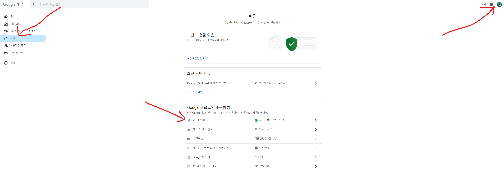
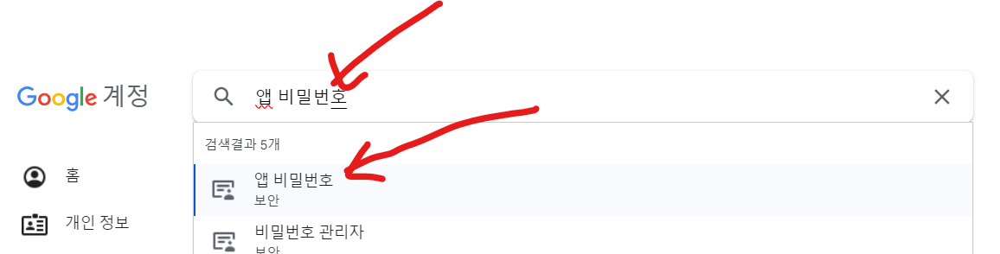
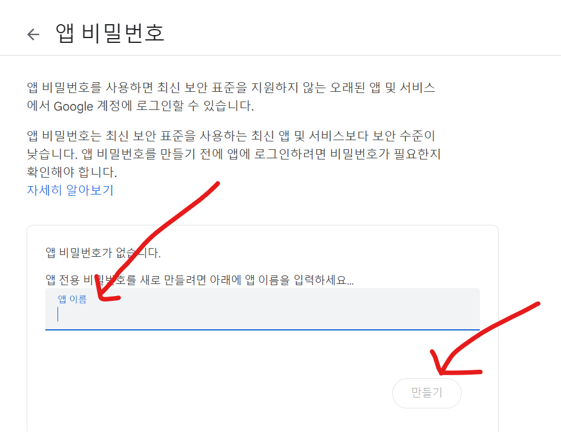

## Intro
안녕하세요 **Noah**입니다.<br/>
오늘은 확인해보니 Gmail 발송에 대해 최신정보가 반영된 블로그 글을 찾기 어려워 작성하게 되었습니다.<br/>
이 글에서는 구글 계정 설정이 예전과 달라진 것들이 있어(2024년 05월 01일 기준) 그 부분을 이미지로 다루고 있습니다. 꼭 참고 해주세요!(전 이걸 찾는게 더 오래걸렸습니다 ㅠㅠ)<br/>
기본적인 환경은 Java 17, Spring Boot 3.2.3을 사용했고 Gmail을 발송하는 방법에 대해 알아보겠습니다.<br/>
<br/><br/><br/><br/>

## 본문
### 1. 이메일 발송 프로토콜(SMTP)
#### SMTP (Simple Mail Transfer Protocol)와 HTTP (Hypertext Transfer Protocol) 차이점
##### 1) 목적
  SMTP: SMTP는 주로 이메일을 보내고 받는 데 사용됩니다. 이 프로토콜은 이메일 서버 간에 이메일 메시지를 전송하고, 사용자가 이메일 클라이언트를 통해 메일 서버로 이메일을 보낼 때 사용됩니다.<br/>
  HTTP: HTTP는 웹 서버와 클라이언트(웹 브라우저) 사이의 정보를 교환하기 위해 사용됩니다. 웹 페이지, 이미지, 비디오 등의 자원을 불러오는 데 사용됩니다.<br/>
##### 2) 작동 방식
  SMTP: 이메일을 보낼 때 SMTP는 "푸시" 방식을 사용합니다. 즉, 발신자의 메일 서버가 수신자의 메일 서버로 직접 이메일을 보내며, 연결이 성공하면 메일을 전송합니다. SMTP 서버는 보내는 이의 이메일 클라이언트와 수신 이의 메일 서버 사이에서 통신합니다.<br/>
  HTTP: 클라이언트(브라우저)가 서버에 요청을 보내고 서버가 그 요청에 응답을 보내는 "요청-응답" 방식을 사용합니다. 사용자가 URL을 입력하면, HTTP는 해당 웹 서버로부터 정보를 요청하고, 서버는 요청받은 자원을 클라이언트에게 전송합니다.<br/>
##### 3) 사용되는 포트
  SMTP: 일반적으로 SMTP는 25번 포트를 사용합니다. 보안이 강화된 전송을 위해 SSL/TLS를 사용하는 경우 465번 또는 587번 포트를 사용할 수 있습니다.<br/>
  HTTP: HTTP는 기본적으로 80번 포트를 사용하며, 보안이 강화된 HTTPS는 443번 포트를 사용합니다.<br/>
##### 4) 보안
  SMTP: SMTP 자체는 메시지 내용을 암호화하지 않기 때문에 메시지가 중간에 가로채질 위험이 있습니다. 이를 보완하기 위해 SMTPS(SSL을 사용한 SMTP)가 개발되었습니다.<br/>
  HTTP: HTTP도 기본적으로 암호화되지 않지만, HTTPS(SSL/TLS를 사용한 HTTP)는 데이터를 암호화하여 통신합니다.<br/>
  이 두 프로토콜은 각각 특화된 목적과 기능을 가지고 있어, 이메일 전송이 필요할 때는 SMTP를, 웹 컨텐츠 전송이 필요할 때는 HTTP를 사용합니다.
<br/><br/><br/><br/>

### 2. Gmail Console 설정
* Gmail 설정에서 2차 인증을 설정합니다.
  * 
* 앱 비밀번호를 생성합니다.
  * 
* 앱을 생성해줍니다.
  * 
* 생성 시 나오는 패스워드는 반드시 저장해주셔야합니다.
  * 추후 환경변수에 작성할 것이므로 별도로 안전한 곳에 저장해줍니다.
<br/><br/><br/><br/>

### 3. 의존성 추가
```gradle
// Email
implementation group: 'com.sun.mail', name: 'javax.mail', version: '1.6.2'
implementation group: 'com.google.api-client', name: 'google-api-client', version: '2.4.1'
implementation 'com.google.oauth-client:google-oauth-client-jetty:1.34.1'
implementation 'com.google.apis:google-api-services-gmail:v1-rev20220404-2.0.0'
implementation 'com.google.auth:google-auth-library-oauth2-http:1.23.0'
```

<br/><br/>

### 4. 환경변수 설정
GMAIL_EMAIL, GMAIL_PASSWORD 환경변수를 설정합니다.

```dockerfile
# 베이스 이미지로 OpenJDK 17을 사용
FROM openjdk:17-slim as build

# Gradle 래퍼를 사용하기 위한 준비
WORKDIR /app
COPY gradlew .
COPY gradle gradle
COPY build.gradle .
COPY settings.gradle .
COPY src src

# gradlew에 실행 권한 부여
RUN chmod +x ./gradlew

# 애플리케이션 빌드
RUN ./gradlew build -x test

# 빌드 결과물을 실행할 새로운 스테이지
FROM openjdk:17-slim
WORKDIR /app
COPY --from=build /app/build/libs/app.jar app.jar

ENTRYPOINT java -jar app.jar -Dspring.profiles.active=${SPRING_PROFILES_ACTIVE} -Dspring.datasource.password=${SPRING_DATASOURCE_PASSWORD} -Djwt.secret=${JWT_SECRET} -Dtoss.api.secretKey=${TOSS_API_SECRETKEY} -Dserver.port=${SERVER_PORT} -Dgmail.email=${GMAIL_EMAIL} -Dgmail.password=${GMAIL_PASSWORD}
```

<br/><br/>

### 5. 메일 발송 서비스 구현
```java
import lombok.AllArgsConstructor;
import lombok.Getter;

@Getter
@AllArgsConstructor
public class GmailSendDto {
    private String to;
    private String isSuccess;
}
```

```java
import com.plapp.indist_front_api.core.code.IsSuccess;
import lombok.extern.slf4j.Slf4j;
import org.springframework.beans.factory.annotation.Value;
import org.springframework.stereotype.Component;

import javax.mail.*;
import javax.mail.internet.InternetAddress;
import javax.mail.internet.MimeMessage;
import java.util.List;
import java.util.Properties;

@Component
@Slf4j
public class EmailClient {
    @Value("${gmail.email}")
    private String EMAIL_ADDRESS;
    @Value("${gmail.password}")
    private String PASSWORD;

    public GmailSendDto sendEmail(String toEmail, String subject, String bodyText){
        String isSuccess = IsSuccess.SUCCESS.getCode();
        Session session = getSession();

        // Email 발송
        try {
            MimeMessage message = new MimeMessage(session);
            message.setFrom(new InternetAddress(EMAIL_ADDRESS));
            message.addRecipient(Message.RecipientType.TO, new InternetAddress(toEmail));
            message.setSubject(subject); //메일 제목을 입력
            message.setText(bodyText);    //메일 내용을 입력
            Transport.send(message); ////전송
            log.info("[EMAIL SENT SUCCESS] Email: {}", toEmail);
        } catch (MessagingException e) {
            isSuccess = IsSuccess.FAIL.getCode();
            log.error("[EMAIL SENT ERROR] Email: {} \tReason: {}", toEmail, e.getMessage());
        }

        // Email 발송 결과 반환
        return new GmailSendDto(toEmail, isSuccess);
    }

    private Session getSession() {
        // Email 발송을 위한 설정
        Properties prop = new Properties();
        prop.put("mail.smtp.host", "smtp.gmail.com");
        prop.put("mail.smtp.port", 465);
        prop.put("mail.smtp.auth", "true");
        prop.put("mail.smtp.ssl.enable", "true");
        prop.put("mail.smtp.ssl.trust", "smtp.gmail.com");
        return Session.getDefaultInstance(prop, new Authenticator() {
            protected PasswordAuthentication getPasswordAuthentication() {
            return new PasswordAuthentication(EMAIL_ADDRESS, PASSWORD);
            }
        });
    }

    // 다중 발송
    public List<GmailSendDto> sendMultiEmail(List<String> toEmails, String subject, String bodyText){
        return List.of(
                toEmails.stream()
                        .map(toEmail -> sendEmail(toEmail, subject, bodyText))
                        .toArray(GmailSendDto[]::new)
        );
    }
}
```
<br/><br/><br/><br/>

## 글을 마치며
이번 포스트에서는 Java와 Spring Boot를 활용하여 Gmail 이메일 발송 기능을 구현하는 방법에 대해 알아보았습니다. 처음부터 Gmail 설정, 의존성 추가, 환경변수 설정, 그리고 실제 메일 발송 로직까지 단계별로 설명을 드렸습니다. 특히, 보안이 강화된 구글 계정 설정을 위해 2차 인증과 앱 비밀번호 생성이 필요하다는 점을 강조하고 실제 활용 예를 이미지로 보여드렸습니다.

본 가이드를 통해 개발자 여러분이 자신의 Java 애플리케이션에서 사용자의 이메일로 직접 알림을 보낼 수 있는 기능을 손쉽게 구현할 수 있기를 바랍니다. 또한, 이메일 발송 기능은 사용자와의 커뮤니케이션뿐만 아니라, 애플리케이션의 오류 알림, 사용자 인증 등 다양한 분야에서 활용될 수 있습니다.

혹시라도 설정 과정에서 문제가 발생하거나 추가적으로 궁금한 점이 있다면 언제든지 댓글을 통해 질문해 주시기 바랍니다. 앞으로도 유용한 개발 팁과 정보를 지속적으로 공유할 예정이니, 많은 관심과 응원 부탁드립니다.

다들 즐코하세요~ 🚀
<br/><br/>

