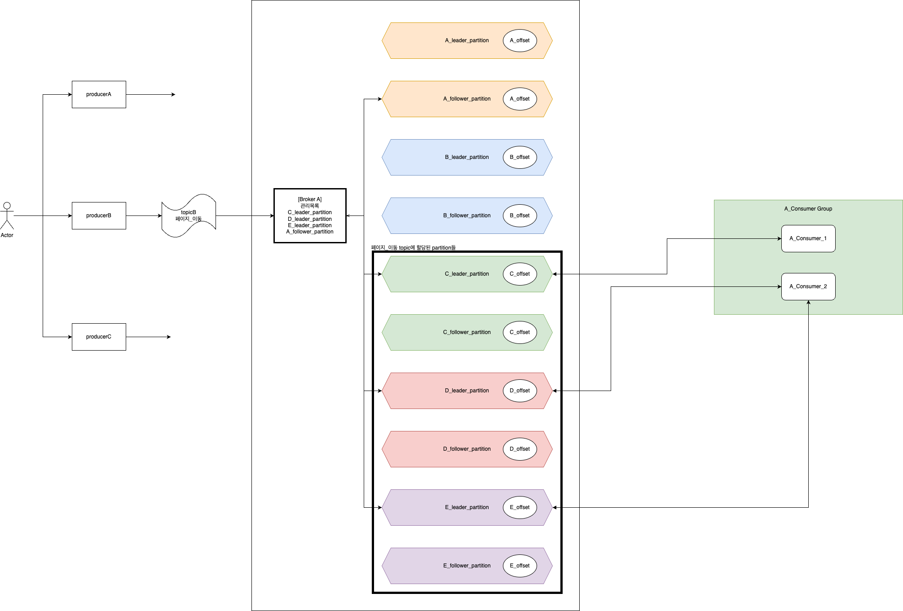
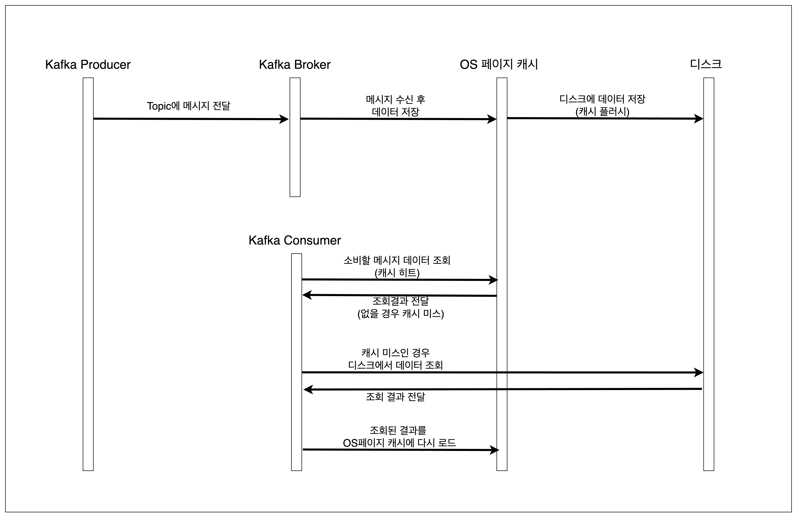
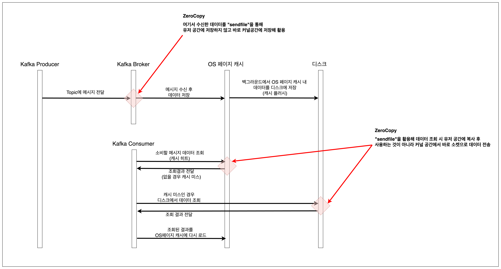
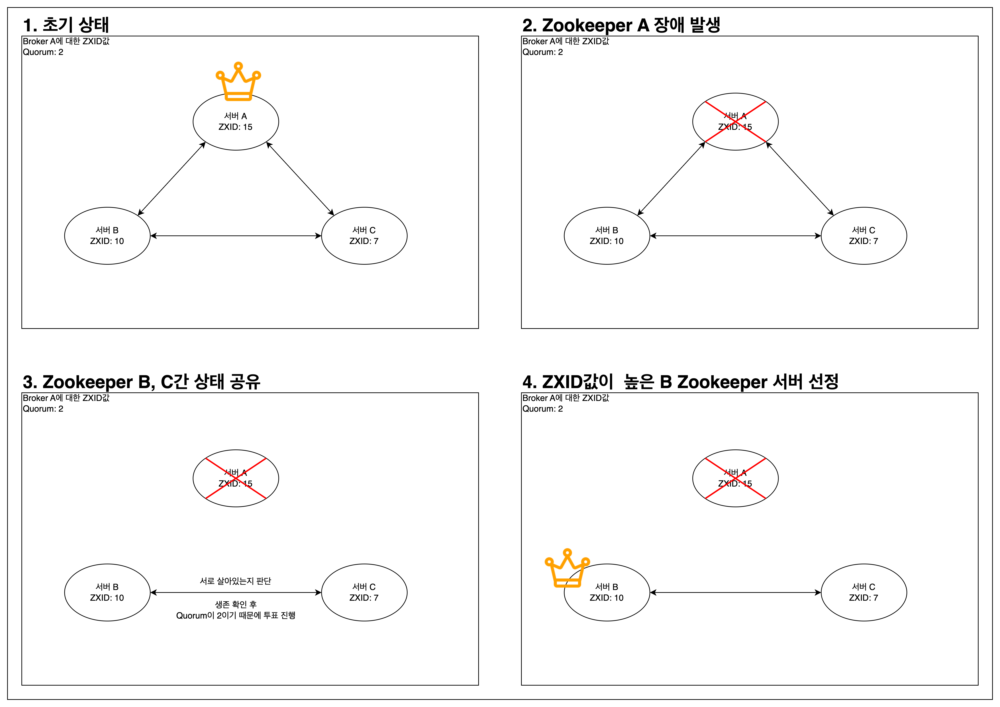
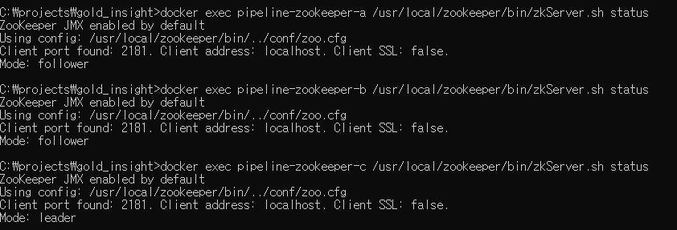
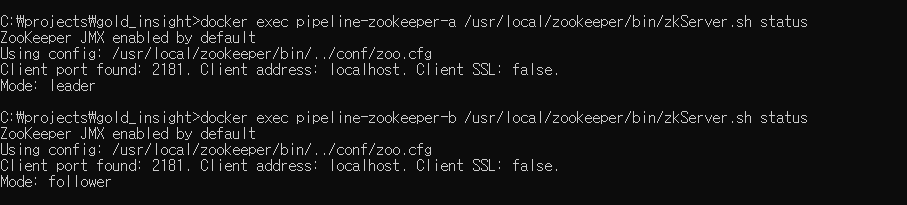

# Intro
안녕하세요 **Noah**입니다.<br/>
오늘은 제가 막연하게 어려운 기술이라고 생각했던 Kafka라는 기술에 대해 공부하면서 알게된 기본적인 지식들에 대해 공유해보려 합니다.<br/>
REST API와 AWS Infra 구축을 주로 다루다보니 이벤트 기반의 메시지 처리기술에 대한 지식이 부족했는데, 이번 기회에 Kafka에 대해 공부하면서 이해도를 높이고자 했습니다.<br/>
이제부터 제가 Kafka에 대해 공부하면서 알게된 내용들 + 삽질했던 이력들을 개념정리와 함께 공유해보겠습니다.
<br/><br/><br/><br/>


# 목차
1. [개념정리](#개념정리)
    - [0. Kafka Local 설치](#0-kafka-local-설치)
    - [1. Producer](#1-producer)
    - [2. Topic](#2-topic)
    - [3. Broker](#3-broker)
    - [4. Consumer](#4-consumer)
    - [5. Consumer Group](#5-consumer-group)
    - [6. Offset](#6-offset)
    - [7. Partition](#7-partition)
    - [8. ZooKeeper](#8-zookeeper)
<br/><br/><br/><br/>


# 개념정리
제가 저를 이해시키기 위해 그리던 그림인데, 처음엔 이미지 이해 못해도 밑에 글들 보면서 정리해보시면 좋을 것 같아서 첨부합니다.


<br/><br/><br/>

## **0. Kafka Local 설치**
- 시작부터 한가지 팁이라면 바로 Kafka를 활용하는 프레임워크들을 활용하는 것 보단, 카프카와 친해지기 위해 Local에서 명령어들로 카프카 자체와 친해져보시면 좋을 것 같습니다~

```shell
// 설치
brew install kafka
// 환경변수 설정
export PATH="/opt/homebrew/opt/kafka/bin:$PATH"
// 버전확인을 통한 설치 여부 확인
kafka-topics --version
// zookeeper(2181 port)
brew services start zookeeper
// kafka(9092 port) 기본 브로커 실행
brew services start kafka
```
<br/><br/><br/>

## **1. Producer**
- 좌측 상단의 파란색 직사각형들로 표시됩니다. Producer들은 메시지를 Kafka 내 특정 Topic 카테고리로 메시지를 전달하는 역할
<br/><br/><br/>


## **2. Topic**
- 메시지의 카테고리와 같은 논리적인 개념
- 각 producer들은 이 topic별로 broker에 메시지를 전달하고 broker는 이 topic에서 원하는 수량에 맞게 partition을 생성.
    - 때문에 성능이슈가 발생할 수 있어 Topic 추가 및 partition 개수 설정 시에는 서버 성능을 고려해 추가해야함
- consumer들은 이 topic을 기준으로 작업을 처리함
- Topic 생성에 따라 Patition이 추가된 모습
    - Topic 추가 시 지정된 명령어로 partition도 여러개 생긴 모습

        ```shell
        # Topic 추가
        dave.jeong@Daveui-MacBookAir bin % ./kafka-topics --create --topic test-tatum-service --bootstrap-server localhost:9092 --partitions 5
        Created topic test-tatum-service.
       
        # 검증
        dave.jeong@Daveui-MacBookAir bin % ./kafka-topics --describe --topic test-tatum-service --bootstrap-server localhost:9092
        Topic: test-tatum-service	TopicId: vR2mIZSzQxW4FsxYCkwO1A	PartitionCount: 5	ReplicationFactor: 1	Configs:	Topic: test-tatum-service	Partition: 0	Leader: 0	Replicas: 0	Isr: 0	Topic: test-tatum-service	Partition: 1	Leader: 0	Replicas: 0	Isr: 0	Topic: test-tatum-service	Partition: 2	Leader: 0	Replicas: 0	Isr: 0	Topic: test-tatum-service	Partition: 3	Leader: 0	Replicas: 0	Isr: 0	Topic: test-tatum-service	Partition: 4	Leader: 0	Replicas: 0	Isr: 0
        ```
<br/><br/><br/>


## **3. Broker**
- producer와 consumer 간 통신을 담당
- 브로커는 영속성을 보장하기 위해 producer에게 받은 메시지를 자신의 OS페이지 캐시 또는 로컬 디스크에 로그형태로 기록하고, 적합한 partition에 작업 할당
    - 파일로 저장하면서도 빠른 처리 성능이 보장되는 이유
        - OS 페이지 캐싱 활용
            - OS 페이지 캐싱이란?

              

                - 데이터가 디스크에 쓰이고 읽히는 과정을 운영 체제의 페이지 캐시를 이용해 최적화하는 방법
                - 저장되는 작업 순서
                    - Kafka Producer
                        - 메시지 발신
                    - Kafka Broker
                        - 메시지 수신 후 topic에 기록
                        - 데이터는 디스크에 쓰기 직전 OS 페이지 캐시에 저장
                    - OS 페이지 캐시
                        - 디스크 작업을 빠르게 하기 위해 사용되는 메모리의 일부분
                        - 메모리에 쓰이기 때문에 디스크에 쓰기하는 것보다 훨씬 빠르기 때문에 쓰기 작업을 가속화
                        - OS는 백그라운드에서 이 캐시에 저장된 데이터를 디스크에 쓰는 작업을 진행
                            - 하지만 백그라운드에서 진행되므로 Broker의 Process와 무관
                            - 이것을 “캐시 플러시” 라고 부름
                    - 디스크 저장소
                        - 데이터 영속성을 보장하기 위해 디스크에 저장됨
                    - Kafka Consumer
                        - Kafka Consumer가 데이터를 읽을 때, 먼저 OS 페이지 캐시를 확인(캐시 히트)해 데이터 유무를 확인
                        - 데이터가 페이지 캐시에 있으면 직접 거기서 데이터를 읽어 처리함. 이 때 작업 속도가 엄청 빠름
                        - 데이터가 캐시에 없으면(캐시 미스), 디스크에서 데이터를 읽고 다시 페이지 캐시에 데이터 등록.
                        - 이후 같은 데이터를 다시 읽으면 페이지 캐시에 저장되어 빠른 접근 가능.
        - Zero Copy 기법 활용
            - Zero Copy 기법이란?
                - 데이터 전송 과정에서 불필요한 데이터 복사를 최소화하여 성능 향상
                - 위 말만 보면 너무 추상적인데, 결론만 말하면 메시지 데이터 복사 시 유저 공간에 메시지 데이터를 복사하는 과정을 생략하고, 커널 공간에만 복사해 처리 속도 향상.

                  

                - 일반적인 데이터 전송 과정 예시
                    - 일반적인 데이터 전송과정은 아래와 같이 데이터가 여러번 복사되면서 CPU 사용량을 증가시키고 전송 속도를 저하
                    - Producer > Broker 메시지 발송
                        - 데이터가 유저 공간에서 커널 공간으로 복사됨
                    - 브로커가 데이터를 디스크에 저장
                        - 브로커가 데이터를 수신하고, 이를 다시 유저 공간에서 커널 공간으로 복사하여 디스크에 쓰기 실행
                    - 브로커가 데이터를 컨슈머에 전송
                        - 브로커가 데이터를 컨슈머에 보낼 때, 데이터는 다시 유저 공간에서 커널 공간으로 복사
                - Zero Copy를 활용한 전송 과정 예시
                    - 주로 “sendfile“ 시스템 콜을 활용해 구현되며, 이는 파일을 소켓으로 직접 전송하는 시스템콜이라 데이터를 유저 공간으로 복사하지 않고 커널 공간에서 직접 처리
                    - Producer > Broker 메시지 발송
                        - 데이터가 유저 공간에서 커널 공간으로 복사됨(이건 동일)
                    - 브로커가 데이터를 디스크에 저장
                        - 브로커는 데이터를 디스크에 쓸 때 sendfile을 사용하여, 데이터를 유저 공간으로 복사하지 않고 커널 공간에서 직접 디스크로 전송
                        - 이 과정에서 데이터는 메모리 매핑을 통해 OS 페이지 캐시에 저장
                    - 브로커가 데이터를 컨슈머에게 전송
                        - 브로커가 컨슈머에게 데이터를 전송할 때도 ‘sendfile’을 사용해 전달
                        - 데이터는 디스크에서 직접 소켓으로 전송되며, 유저 공간으로 복사되지 않음
            - 유저 공간과 커널 공간이란?**(결국 메모리 영역임)**
                - 유저 공간
                    - 애플리케이션이 실행되는 메모리 영역
                    - 일반적인 프로그램과 응용 소프트웨어는 이 공간에서 실행
                - 커널 공간
                    - 운영 체제의 커널이 실행되는 메모리 영역
                    - 하드웨어와 소프트웨어 간의 상호작용을 관리 및 시스템 리소스 제어
- 마지막으로 Offset Commit된 번호를 확인하고 해당 번호 만큼 앞의 메세지를 건너뛴 뒤 Consumer가 처리할 메시지 전달
- Broker는 partition들의 안전성과 고가용성을 보장하기 위해 복제본을 만들어 관리 가능
    - Broker는 기본적으로 한개지만 추가도 가능은 함. 하지만 Kafka에서는 기본 3대 ~ 5대를 사용할 것을 권장함.
    - Broker는 kafka 내 여러개가 존재할 경우 각각의 broker들이 서로다른 여러 partition들을 관리할 수 있음
        - 예를 들어 A라는 broker는 a_leader_partition, b_leader_partion, c_leader_partioin을 관리하고 d_follower_partition, e_follower_partion을 관리
        - 원본: leader partition
            - 기본적인 읽고 쓰기는 원본이 담당
        - 복제본: follower partion
            - 주기적으로 leader partition을 감시하며, 이 때 leader partition의 데이터로 갱신되기 때문에 동일한 offset 정보도 존재
            - follower partition은 여러개 존재 가능하며 리더가 장애 시 follower가 leader partition으로 승격되는 옵저버패턴으로 구현됨
- broker가 acks 설정에 따라 메시지 처리 성공을 보장하는 방법
    - acks란?
        - 메시지가 성공적으로 처리되었음을 확인하는 신호
        - 메시지 신뢰성과 성능을 조절하는 중요한 요소
    - acks=0
        - 개념
            - 프로듀서가 메시지를 브로커로 보내고 나서 ACK를 대기하지 않는 상태
        - 장점
            - 가장 빠른 전송 속도 제공
        - 단점
            - 메시지가 브로커에 도달하지 못하거나 데이터 손실이 발생하더라도 프로듀서가 모름
    - acks=1
        - 개념
            - 리더 브로커가 메시지를 성공적으로 기록한 후 프로듀서에게 ACK를 발송
        - 장점
            - 리더 브로커에 데이터가 기록된 것을 보장
        - 단점
            - 리더 브로커가 장애를 겪으면 해당 메시지에 대한 추적 불가
    - acks=all
        - 개념
            - 리더 브로커와 모든 동기화된 팔로워 브로커가 메시지를 기록한 후 프로듀서에게 ACK 발송
        - 장점
            - 리더와 동기화된 모든 팔로워 브로커가 메시지를 가지고 있어야만 ACK가 발송되기 때문에 메시지 유실 가능성 최소화
        - 단점
            - 전송 속도가 가장 느리고 모든 팔로워가 다 기록될 때까지 작업이 블록된다는 단점 존재
- Brocker 실험
    - 초기 설정의 Kafka Broker는 하나만 존재하기 때문에 replication-factor를 여러개 만들려고 하면 에러발생.
        - replication-factor를 1개로 설정하는 것은 복제본 없이 원본 1개만 유지한다는 뜻과 동일해서 저런 설정 자체를 추가할 필요는 없음. 결국 follower를 만들기 위해서는 Brocker를 늘리는 설정 필요
            - replication-factor를 1로 지정해서 생성 시 Replicas 값이 0으로 들어있는 모습(복제 안됨)

            ```shell
            dave.jeong@Daveui-MacBookAir bin % ./kafka-topics --create --topic test-tatum-service --bootstrap-server localhost:9092 --partitions 5 --replication-factor 1
            Created topic test-tatum-service.
          
            dave.jeong@Daveui-MacBookAir bin % ./kafka-topics --describe --topic test-tatum-service --bootstrap-server localhost:9092
            Topic: test-tatum-service	TopicId: WPLWESCrQJeiypCCMo9FOQ	PartitionCount: 5	ReplicationFactor: 1	Configs:	Topic: test-tatum-service	Partition: 0	Leader: 0	Replicas: 0	Isr: 0	Topic: test-tatum-service	Partition: 1	Leader: 0	Replicas: 0	Isr: 0	Topic: test-tatum-service	Partition: 2	Leader: 0	Replicas: 0	Isr: 0	Topic: test-tatum-service	Partition: 3	Leader: 0	Replicas: 0	Isr: 0	Topic: test-tatum-service	Partition: 4	Leader: 0	Replicas: 0	Isr: 0
            ```

            ```shell
            # 브로커가 여러개 일 때 아래처럼 replication-factor를 여러개로 지정하면 follower partition 생성 가능
            ./kafka-topics --create --topic test-tatum-service --bootstrap-server localhost:9092 --partitions 5 --replication-factor 3
            ```

        - 하지만 Broker가 한대라 에러난 모습

            ```shell
            dave.jeong@Daveui-MacBookAir bin % ./kafka-topics --create --topic test-tatum-service --bootstrap-server localhost:9092 --partitions 5 --replication-factor 2
            Error while executing topic command : Replication factor: 2 larger than available brokers: 1.
            [2024-06-21 18:27:13,525] ERROR org.apache.kafka.common.errors.InvalidReplicationFactorException: Replication factor: 2 larger than available brokers: 1. (org.apache.kafka.tools.TopicCommand)
            ```

    - 여러 Broker를 띄우는 방법
        - 띄우고 싶은 만큼 Broker Config 생성

            ```shell
            # kafka가 설치된 bin폴더로 이동
            dave.jeong@Daveui-MacBookAir bin % cd opt/homebrew/opt/kafka/bin
          
            # config 폴더 생성
            dave.jeong@Daveui-MacBookAir bin % mkdir config
          
            # config 폴더 내 config 파일 생성(2대를 띄우기 위해 2개 생성)
            # server-1.properties, server-2.properties
            dave.jeong@Daveui-MacBookAir config % cat >> server-1.properties
            broker.id=1
            log.dirs=/tmp/kafka-logs-1
            listeners=PLAINTEXT://:9093
            zookeeper.connect=localhost:2181
            dave.jeong@Daveui-MacBookAir config % cat >> server-2.properties
            broker.id=2
            log.dirs=/tmp/kafka-logs-2
            listeners=PLAINTEXT://:9094
            zookeeper.connect=localhost:2181
          
            # 다시 bin 폴더로 이동
            cd ..
            ```

        - 각각의 config를 활용해 kafka broker 실행
            - 주의사항 각각 다른 터미널에서 실행해야함

            ```shell
            # 실행
            ./kafka-server-start config/server-1.properties
            ./kafka-server-start config/server-1.properties
          
            # 종료
            ./kafka-server-stop config/server-1.properties
            ./kafka-server-stop config/server-2.properties
            ```

        - 브로커가 여러대 띄워진 모습
            - Open 스크린샷 2024-06-21 오후 7.30.52.png

            ```shell
            # broker 목록 확인
            # 1. zookeeper를 통한 확인: 인덱스 정보를 제공
            dave.jeong@Daveui-MacBookAir bin % ./zookeeper-shell localhost:2181
            Connecting to localhost:2181
            Welcome to ZooKeeper!
            JLine support is disabled
            WATCHER::
            WatchedEvent state:SyncConnected type:None path:null
            ls /brokers/ids
            [0, 1, 2] >>>>>> 기본적으로 떠있는 broker 1대와 새로 띄운 2개 포함 총 3개가 있는 모습
          
            # kafka를 통해 확인 > 각 broker가 정상적으로 떠있는 것을 확인 가능
            dave.jeong@Daveui-MacBookAir bin % ./kafka-broker-api-versions --bootstrap-server localhost:9092,localhost:9093,localhost:9094
            localhost:9092 (id: 0 rack: null) -> (	Produce(0): 0 to 10 [usable: 10],	Fetch(1): 0 to 16 [usable: 16],	...
            )
            localhost:9093 (id: 1 rack: null) -> (	Produce(0): 0 to 10 [usable: 10],	Fetch(1): 0 to 16 [usable: 16],	...
            )
            localhost:9094 (id: 2 rack: null) -> (	Produce(0): 0 to 10 [usable: 10],	Fetch(1): 0 to 16 [usable: 16],	...
            )
            ```

        - 여러 브로커에 follower partition 생성한 모습

            ```shell
            # replica-factor를 3개로 지정해 생성
            dave.jeong@Daveui-MacBookAir bin % ./kafka-topics --create --topic test-tatum-service-2 --bootstrap-server localhost:9092,localhost:9093,localhost:9094 --partitions 5 --replication-factor 3
          
            # Leader와 replicas에 담당 broker index가 들어온 모습
            dave.jeong@Daveui-MacBookAir bin % ./kafka-topics --describe --topic test-tatum-service-2 --bootstrap-server localhost:9092,localhost:9093,localhost:9094
            Topic: test-tatum-service-2	TopicId: 6snkWGs0SOiJ_Zx8I71LWw	PartitionCount: 5	ReplicationFactor: 3	Configs:	Topic: test-tatum-service-2	Partition: 0	Leader: 0	Replicas: 0,2,1	Isr: 0,2,1	Topic: test-tatum-service-2	Partition: 1	Leader: 2	Replicas: 2,1,0	Isr: 2,1,0	Topic: test-tatum-service-2	Partition: 2	Leader: 1	Replicas: 1,0,2	Isr: 1,0,2	Topic: test-tatum-service-2	Partition: 3	Leader: 0	Replicas: 0,1,2	Isr: 0,1,2	Topic: test-tatum-service-2	Partition: 4	Leader: 2	Replicas: 2,0,1	Isr: 2,0,1
            ```
<br/><br/><br/>


## **4. Consumer**
- message를 받아 작업 처리를 담당
- 각 Consumer는 서로 다른 partifion에서 메시지를 읽고 작업을 처리함.
<br/><br/><br/>


## **5. Consumer Group**
- 주의할점은 Consumer group이 있다고 해서 partition이 여기에 연결되는 것이 아니라 group 내 하나의 consumer에 연결된다는 것.
- Consumer group이 존재하는 이유
    - consumer 관리
        - 각 consumer group은 자신에게 속한 Consumer들을 관리함
        - kafka는 consumer 실행 시 해당 그룹에 할당된 consumer를 조회 가능하며, 어떤 partition에
    - multi-tenancy
        - 여러 consumer group이 하나의 partition을 구독하고 메시지를 처리하는 것
        - 예시: 사용자가 상품페이지로 진입했다는 product_into로 topic 메시지가 전달되고 A라는 partition에 메시지가 할당된 경우
            - A partition을 구독하고 있던 consumer group들은 동시에 작업 처리가 가능
                - 실시간 사용자 행동분석 로그 저장 consumer group
                - 상품 조회수 관리 consumer group
                - 메 이벤트 단위로 리포트를 만드는 consumer group
    - 병렬처리
        - 여러 partition의 메시지 처리를 group 내 여러 consumer가 처리할 수 있도록 관리
    - 부하분산
        - "user-activity"라는 토픽에 10개의 partifion이 있다고 가정
        - 평상 시. Consumer Group A에는 5명의 Consumer가 있다고 가정하면, 각 Consumer는 2개의 partifion을 처리
        - 트래픽이 증가하면 Consumer Group A에 5명의 Consumer를 추가로 그룹내 주입시켜 각 Consumer가 1개의 partifion을 당담하도록 설정 가능
    - 장애복구
        - Consumer가 장애가 발생해 disconnect 되더라도 rebalance를 통해 바로 다른 consumer를 활용해 해당 작업을 처리할 수 있음
        - 이후 사용자가 지정한 consumer 개수만큼 다시 consumer를 create하고 consumer가 다 만들어지면 다시 rebalance 수행
- consumer 실험
    - Consumer group은 topic에 종속적이며 topic을 삭제하면 같이 삭제

        ```shell
        dave.jeong@Daveui-MacBookAir bin % ./kafka-console-producer --topic test-consumer-topic --bootstrap-server localhost:9092
        >Hello, consumer?
        
        # consumer group을 토픽에 맞춰 Group 생성 후 메세지 처리
        dave.jeong@Daveui-MacBookAir bin % ./kafka-console-consumer --topic test-consumer-topic --bootstrap-server localhost:9092 --group test-group --from-beginning
        Hello, consumer?
        
        # 현재 Group목록 조회
        dave.jeong@Daveui-MacBookAir bin % ./kafka-consumer-groups --bootstrap-server localhost:9092 --list
        mygroup
        farmer-group
        test-group > 생성된 것을 확인 가능
        keyword-farmer-group
        
        # Consumer Group이 연결된 Topic 삭제
        dave.jeong@Daveui-MacBookAir bin % ./kafka-topics --delete --topic test-consumer-topic --bootstrap-server localhost:9092
        
        # Consumer Group도 삭제된 모습
        dave.jeong@Daveui-MacBookAir bin % ./kafka-consumer-groups --bootstrap-server localhost:9092 --list
        mygroup
        farmer-group
        keyword-farmer-group
        ```

    - Consumer Group에서 Consumer 할당 확인

        ```shell
        # Consumer Group에 Consumer 할당 전
        dave.jeong@Daveui-MacBookAir bin % ./kafka-consumer-groups --bootstrap-server localhost:9092 --group test-consumer-group --describe
        Consumer group 'test-consumer-group' has no active members.
        GROUP TOPIC PARTITION CURRENT-OFFSET LOG-END-OFFSET LAG CONSUMER-ID HOST CLIENT-ID
        test-consumer-group test-consumer-topic 0 1 1 0 - - -
        test-consumer-group test-consumer-topic 1 0 0 0 - - -
        test-consumer-group test-consumer-topic 2 0 0 0 - - -
        
        # 1개 할당 시
        dave.jeong@Daveui-MacBookAir bin % ./kafka-consumer-groups --bootstrap-server localhost:9092 --group test-consumer-group --describe
        GROUP TOPIC PARTITION CURRENT-OFFSET LOG-END-OFFSET LAG CONSUMER-ID HOST CLIENT-ID
        test-consumer-group test-consumer-topic 0 1 1 0 console-consumer-a68c4fd8-e3f8-40bd-936d-4ce7b9ac4bd7 /127.0.0.1 console-consumer
        test-consumer-group test-consumer-topic 1 0 0 0 console-consumer-a68c4fd8-e3f8-40bd-936d-4ce7b9ac4bd7 /127.0.0.1 console-consumer
        test-consumer-group test-consumer-topic 2 0 0 0 console-consumer-a68c4fd8-e3f8-40bd-936d-4ce7b9ac4bd7 /127.0.0.1 console-consumer
        
        # 2개 할당 시 > CONSUMER-ID가 새로 추가된 것이 보이며 Rebalance를 통해 새로운 consumer에게 partition 분배가 끝난 것을 확인가능
        # Rebalance는 partition에서 개념 확인
        dave.jeong@Daveui-MacBookAir bin % ./kafka-consumer-groups --bootstrap-server localhost:9092 --group test-consumer-group --describe
        GROUP TOPIC PARTITION CURRENT-OFFSET LOG-END-OFFSET LAG CONSUMER-ID HOST CLIENT-ID
        test-consumer-group test-consumer-topic 0 1 1 0 console-consumer-37b01744-771e-429c-b8b4-76068ca1fc89 /127.0.0.1 console-consumer
        test-consumer-group test-consumer-topic 1 0 0 0 console-consumer-37b01744-771e-429c-b8b4-76068ca1fc89 /127.0.0.1 console-consumer
        test-consumer-group test-consumer-topic 2 0 0 0 console-consumer-a68c4fd8-e3f8-40bd-936d-4ce7b9ac4bd7 /127.0.0.1 console-consumer
        ```
<br/><br/><br/>


## **6. Offset**
- 각 partifion에 위치하며, Consumer에게 마지막으로 전달된 메시지 위치를 추적하는 용도로 사용됨
- Offset 번호는 시퀀셜하게 추가
- Consumer는 작업이 완료될 시 Offset Commit을 실행해 자신이 해당 작업을 처리했음을 알림.
    - 저장된 offset commit 이력은 내부 토픽 “__consumer_offsets“에 저장됨
- Offset 실험
    - consumer가 메시지를 읽고 처리할 경우 offset이 시퀀셜하게 변경되는 모습

        ```shell
        # Topic 생성
        dave.jeong@Daveui-MacBookAir bin % ./kafka-topics --create --topic test-offest-topic --partitions 2 --bootstrap-server localhost:9092
        Created topic test-offest-topic.
        
        # 메시지 전송
        dave.jeong@Daveui-MacBookAir bin % ./kafka-console-producer --topic test-offset-topic --bootstrap-server localhost:9092
        >Hello, offset!
        >Hello, offset!
        
        # consumer group을 토픽에 맞춰 Group 생성 후 메세지 처리
        dave.jeong@Daveui-MacBookAir bin % ./kafka-console-consumer --topic test-consumer-topic --bootstrap-server localhost:9092 --group test-offset-group --from-beginning
        Hello, offset!
        Hello, offset!
        
        # offset 확인 > 현재 offset은 2
        dave.jeong@Daveui-MacBookAir bin % ./kafka-consumer-groups --describe --group test-offset-group --bootstrap-server localhost:9092
        Consumer group 'test-offset-group' has no active members.
        GROUP TOPIC PARTITION CURRENT-OFFSET LOG-END-OFFSET LAG CONSUMER-ID HOST CLIENT-ID
        test-offset-group test-offset-topic 0 2 2 0 - - -
        
        # 새로운 메시지 전달
        dave.jeong@Daveui-MacBookAir bin % ./kafka-console-producer --topic test-offset-topic --bootstrap-server localhost:9092
        >New Message!
        
        # 새로운 메시지 처리
        dave.jeong@Daveui-MacBookAir bin % ./kafka-console-consumer --topic test-offset-topic --from-beginning --group test-offset-group --bootstrap-server localhost:9092
        New Message!
        
        # Offset 확인 > 3으로 늘어난 것을 확인 가능
        dave.jeong@Daveui-MacBookAir bin % ./kafka-consumer-groups --group test-offset-group --describe --bootstrap-server localhost:9092
        Consumer group 'test-offset-group' has no active members.
        GROUP TOPIC PARTITION CURRENT-OFFSET LOG-END-OFFSET LAG CONSUMER-ID HOST CLIENT-ID
        test-offset-group test-offset-topic 0 3 3 0 - - -
        ```
<br/><br/><br/>


## **7. Partition**
- 물리적으로 분리된 Queue로 partition을 증식 시킬 시 이 Queue 자체가 여러개로 늘어나는 것
- 기본적으로 Topic은 1개 이상의 파티션을 브로커에 의해 분산 배치 될 수 있음.
- 이 Partition이 Consumer와 맵핑되어 각 consumer가 병렬적으로 작업이 가능.
- Queue와 같아보이지만 처리된 메시지가 바로 지워지는 것이 아니라 로그 형태로 보관됨.
- 브로커에 저장되며, 브로커에 의한 복제를 통해 고가용성을 보장함(병렬처리 가능)
- 하나의 partifion은 하나의 consumer가 배분되어 작업함
    - 이유는 여러 consumer가 한번에 작업을 하게되면 Offset Commit 시점 문제가 발생하기 때문임
    - 이 때문에 partition의 숫자가 consumer의 숫자보다 일반적으로는 같거나 더 많아야함.
- Partition Rebalance(partifion 재배치)
    - Rebalance가 위험한 이유는 신호가 떨어짐과 동시에 모든 Consumer들이 추가로 작업을 받지 못하고 자신과 연결될 새로운 partition들이 배정되기 전까지 모든 작업이 블럭된다는데 있음.
    - 따라서 실제 서비스 구현 시에는 Rebalance가 발생하는 상황을 최대한 막아야함
    - Rebalance가 발생하는 대표적인 경우들
        - partition과 연결된 consumer가 장애로 동작하지 않는 경우
            - 쉽게 말해서 연결된 consumer가 없으니 partition에게 새로운 consumer를 연결해주는 것
        - 새로운 consumer가 추가(connect)되었을 경우
            - 기존 consumer가 처리하던 일부 partifion이 새로운 consumer에 할당 될 수 있음
- 파티션 실험
    - 리벨런싱 실험
        - Consumer 추가 시
            - PARTITION[0, 1]의 CONSUMER-ID 값이 리벨런싱된 것을 확인 가능

            ```shell
            # 1개 할당 시
            dave.jeong@Daveui-MacBookAir bin % ./kafka-consumer-groups --bootstrap-server localhost:9092 --group test-consumer-group --describe
            GROUP TOPIC PARTITION CURRENT-OFFSET LOG-END-OFFSET LAG CONSUMER-ID HOST CLIENT-ID
            test-consumer-group test-consumer-topic 0 1 1 0 console-consumer-a68c4fd8-e3f8-40bd-936d-4ce7b9ac4bd7 /127.0.0.1 console-consumer
            test-consumer-group test-consumer-topic 1 0 0 0 console-consumer-a68c4fd8-e3f8-40bd-936d-4ce7b9ac4bd7 /127.0.0.1 console-consumer
            test-consumer-group test-consumer-topic 2 0 0 0 console-consumer-a68c4fd8-e3f8-40bd-936d-4ce7b9ac4bd7 /127.0.0.1 console-consumer
            
            # 2개 할당 시 > CONSUMER-ID가 새로 추가된 것이 보이며 Rebalance를 통해 새로운 consumer에게 partition 분배가 끝난 것을 확인가능
            # Rebalance는 partition에서 개념 확인
            dave.jeong@Daveui-MacBookAir bin % ./kafka-consumer-groups --bootstrap-server localhost:9092 --group test-consumer-group --describe
            GROUP TOPIC PARTITION CURRENT-OFFSET LOG-END-OFFSET LAG CONSUMER-ID HOST CLIENT-ID
            test-consumer-group test-consumer-topic 0 1 1 0 console-consumer-37b01744-771e-429c-b8b4-76068ca1fc89 /127.0.0.1 console-consumer
            test-consumer-group test-consumer-topic 1 0 0 0 console-consumer-37b01744-771e-429c-b8b4-76068ca1fc89 /127.0.0.1 console-consumer
            test-consumer-group test-consumer-topic 2 0 0 0 console-consumer-a68c4fd8-e3f8-40bd-936d-4ce7b9ac4bd7 /127.0.0.1 console-consumer
            ```

        - Consumer 삭제 시
            - PARTITION[0, 1]의 CONSUMER-ID 값이 리벨런싱된 것을 확인 가능

                ```shell
                dave.jeong@Daveui-MacBookAir bin % ./kafka-consumer-groups --bootstrap-server localhost:9092 --group test-consumer-group --describe
                GROUP TOPIC PARTITION CURRENT-OFFSET LOG-END-OFFSET LAG CONSUMER-ID HOST CLIENT-ID
                test-consumer-group test-consumer-topic 0 1 1 0 console-consumer-37b01744-771e-429c-b8b4-76068ca1fc89 /127.0.0.1 console-consumer
                test-consumer-group test-consumer-topic 1 0 0 0 console-consumer-37b01744-771e-429c-b8b4-76068ca1fc89 /127.0.0.1 console-consumer
                test-consumer-group test-consumer-topic 2 0 0 0 console-consumer-a68c4fd8-e3f8-40bd-936d-4ce7b9ac4bd7 /127.0.0.1 console-consumer
                
                dave.jeong@Daveui-MacBookAir bin % ./kafka-consumer-groups --bootstrap-server localhost:9092 --group test-consumer-group --describe
                GROUP TOPIC PARTITION CURRENT-OFFSET LOG-END-OFFSET LAG CONSUMER-ID HOST CLIENT-ID
                test-consumer-group test-consumer-topic 0 1 1 0 console-consumer-a68c4fd8-e3f8-40bd-936d-4ce7b9ac4bd7 /127.0.0.1 console-consumer
                test-consumer-group test-consumer-topic 1 0 0 0 console-consumer-a68c4fd8-e3f8-40bd-936d-4ce7b9ac4bd7 /127.0.0.1 console-consumer
                test-consumer-group test-consumer-topic 2 0 0 0 console-consumer-a68c4fd8-e3f8-40bd-936d-4ce7b9ac4bd7 /127.0.0.1 console-consumer
                ```

    - 분산처리 실험 > 작업이 몇만개 몰렸을 시 처리되고 있는 모습

        ```shell
        // topic에 들어온 요청을 broker가 적절한 partition을 찾아 나눠 작업시키고 있는 모습
        dave.jeong@Daveui-MacBookAir bin % ./kafka-consumer-groups --bootstrap-server localhost:9092 --group multi-group --describe
        GROUP TOPIC PARTITION CURRENT-OFFSET LOG-END-OFFSET LAG CONSUMER-ID HOST CLIENT-ID
        multi-group multi-partition-topic 0 81392 81424 32 single-consumer-5d908cd5-8e68-47fa-b52e-fd6758524d4a /0:0:0:0:0:0:0:1 single-consumer
        multi-group multi-partition-topic 2 81392 81423 31 single-consumer-5d908cd5-8e68-47fa-b52e-fd6758524d4a /0:0:0:0:0:0:0:1 single-consumer
        multi-group multi-partition-topic 1 81392 81433 41 single-consumer-ae822809-ee81-496b-8d69-5b102f165e18 /0:0:0:0:0:0:0:1 single-consumer
        multi-group multi-partition-topic 3 81393 81433 40 single-consumer-ae822809-ee81-496b-8d69-5b102f165e18 /0:0:0:0:0:0:0:1 single-consumer
        multi-group multi-partition-topic 4 81392 81435 43 single-consumer-cf1c2b94-b89a-4260-bc02-d72092014886 /0:0:0:0:0:0:0:1 single-consumer
        ```
<br/><br/><br/>


## **8. ZooKeeper**
- 담당 기능
    - 쉽게 생각하면 분산시스템 전체에 대한 제어 및 조율을 담당하는 서버
    - kafka broker의 메타데이터 저장 및 관리
    - partition의 leader broker 선출
    - Topic관련 설정 정보 저장
    - Consumer Group관리(Offset, Membership정보 관리)
    - …
- Kafka broker는 Zookeeper와 주기적으로 통신하며 클러스터의 상태를 유지하고 조정함
    - Kafka 브로커 시작
        - Kafka 브로커가 시작되면 Zookeeper Ensemble에 연결
        - 브로커는 자신의 메타데이터(상태, 주제 정보 등)를 Leader Zookeeper에 등록(쓰기이므로)
    - 메타데이터 읽기 및 쓰기
        - Kafka 브로커는 주제 생성, 파티션 정보 변경 등 메타데이터 변경이 필요할 때 Zookeeper Leader 서버에 쓰기 요청 전송
        - Leader Zookeeper 서버는 데이터를 업데이트하고, 다른 Follower 서버로 메타데이터 복제
        - Kafka 브로커는 메타데이터를 읽을 때, Zookeeper 서버 중 하나에 읽기 요청을 전송(굳이 Leader가 아니어도 읽기 처리는 가능)
    - Zookeeper 서버 고장 시
        - 하나의 Zookeeper 서버가 고장 나도, 나머지 서버가 **Quorum**을 유지하면 Ensemble은 정상 작동
            - Quorum은 시스템 내에서 합의가 이루어지기 위해 필요한 최소한의 구성원 수를 의미
            - Quorum이 2인데 3대의 Zookeeper 서버 중 2대가 고장나버리면 앙상블이 정상작동을 하지 않게 됨(과반 투표를 못함)
        - 브로커에 새로운 Leader Zookeeper서버를 선정 후 관리
            - 
            - 리더 선출 과정
                - **1. 초기 상태**: 3대의 Zookeeper 서버가 존재
                - **2. 서버 A 장애**: 서버 A가 장애 발생, 서버 B와 서버 C이 존재
                - **3. 상태 교환**: 서버 B와 서버 C가 서로의 상태를 교환
                - **4. 투표**: 서버 B와 서버 C가 서로를 지목할 경우, ZXID(리더 적합도 점수라고 생각하면 편함)와 Epoch 번호를 비교하여 최종적으로 하나의 리더를 선택
                - **5. Quorum 달성**: 과반수 이상의 지지를 얻은 서버가 리더로 선출
        - 고장난 서버가 복구되면, Leader 서버로부터 최신 데이터를 복제받아 동기화
- Zookeeper 서버 3대를 구성하면 각 브로커당 Zookeeper 서버 1대가 Leader로 동작을 하며, 나머지는 Follower 상태로 대기

    ```shell
    docker exec pipeline-zookeeper-a /usr/local/zookeeper/bin/zkServer.sh status
    docker exec pipeline-zookeeper-b /usr/local/zookeeper/bin/zkServer.sh status
    docker exec pipeline-zookeeper-c /usr/local/zookeeper/bin/zkServer.sh status
    ```

  

- 여기서 c가 leader인 것을 알 수 있으며 리더인 c를 stop하자 follower였던 a가 leader가 된 것을 볼 수 있었다.

    ```shell
    docker stop pipeline-zookeeper-c
    docker exec pipeline-zookeeper-a /usr/local/zookeeper/bin/zkServer.sh status
    docker exec pipeline-zookeeper-b /usr/local/zookeeper/bin/zkServer.sh status
    ```

  

<br/><br/><br/><br/>


# Outro
Kafka에 대해 공부하면서 알게 된 내용을 정리하면서, 제가 처음에 막연하게 어렵게만 느껴졌던 기술이 점점 더 흥미롭고 이해하기 쉬워졌습니다. <br/>
이번 포스팅을 통해 Kafka의 기본 개념부터 설치, 주요 구성 요소들까지 다루면서 저 자신도 많은 성장을 할 수 있었습니다. <br/>
여러분들도 이 글을 통해 Kafka에 대해 좀 더 쉽게 이해하고, 실무에서 활용할 수 있는 기초 지식을 쌓을 수 있기를 바랍니다.<br/>
다음 글에서는 실제 Docker를 활용해서 Broker 3대를 띄우고 메시지를 전송, 수신하는 방법에 대해 공유하겠습니다.<br/>
(이 내용을 추후에 EC2로 옮기게 되면 그대로 사용하실 수 있게 구성해보겠습니다.)<br/>
긴글 읽어주셔서 감사합니다. 혹시 궁금한 점이나 추가적인 질문이 있다면 언제든지 댓글로 남겨주세요.<br/>
감사합니다.
<br/><br/><br/><br/>
