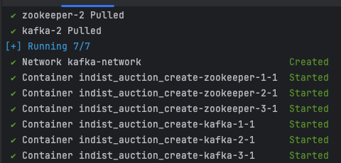
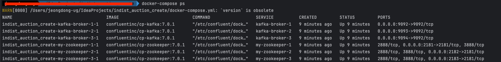

# Intro
안녕하세요 Noah입니다.<br/>
오늘은 저번 글에서 얘기했던 것 처럼 Kafka를 로컬 환경에서 설치하지 않고, Docker를 활용해 Zookeeper와 Kafka 브로커를 클러스터로 구성하는 방법을 공유하려 합니다.<br/>
Docker Compose를 사용하면 필요한 모든 서버와 미들웨어를 한번에 띄우고 관리할 수 있어, 개발 환경 설정이 훨씬 간편해집니다.<br/>

이 글에서는 Docker Compose를 사용해 Kafka 클러스터를 구성하고, Spring Kafka와 Spring Boot를 활용한 예제를 통해 실습을 진행하겠습니다.<br/>
이전 ["Kafka 기본 개념정리"](https://jd6186.github.io/KafkaBasic/) + 이번 "실무 적용 방법"을 모두 보시면 쉽게 이해할 수 있을 것 같습니다.<br/>
(조금 길지만 이전 글을 읽고 오시면 좋을 것 같아요 ^^)<br/>

이제부터 시작해보겠습니다.
<br/><br/><br/><br/>


# 목차
1. [Docker Compose로 Kafka 클러스터 구성](#Docker Compose로 Kafka 클러스터 구성)
2. [Spring Kafka로 Consumer 구현](#Spring Kafka로 Consumer 구현)
3. [Spring Boot로 Producer 구현](#Spring Boot로 Producer 구현)
4. [API 연동 예시](#API 연동 예시)
5. [Outro](#Outro)
<br/><br/><br/><br/>


# Docker Compose로 Kafka 클러스터 구성
Kafka를 운영하기 위해서는 Zookeeper와 Kafka 브로커가 필요합니다. 

이번 섹션에서는 Docker Compose를 사용해 Zookeeper와 Kafka 브로커를 3대씩 띄우는 방법을 설명하겠습니다.

## Docker Compose 파일 작성
우선, Docker Compose 파일을 작성합니다. 이 파일은 Zookeeper와 Kafka 브로커를 설정하는데 필요한 모든 정보를 담고 있습니다.

```yaml
# Docker Compose 파일 버전을 명시합니다. 여기서는 버전 3.8을 사용합니다.
version: '3.8'

# services 섹션은 실행할 개별 서비스를 정의합니다.
services:
  # 첫 번째 Zookeeper 인스턴스를 정의합니다.
  my-zookeeper-1:
    # 사용할 도커 이미지와 버전을 명시합니다. 여기서는 confluentinc/cp-zookeeper 이미지의 7.0.1 버전을 사용합니다.
    image: confluentinc/cp-zookeeper:7.0.1
    # 호스트 이름을 설정합니다.
    hostname: my-zookeeper-1
    # 호스트와 컨테이너 간의 포트 매핑을 설정합니다. 여기서는 호스트의 2181 포트를 컨테이너의 2181 포트에 매핑합니다.
    ports:
      - "2181:2181"
    # Zookeeper의 환경 변수를 설정합니다.
    environment:
      # Zookeeper 서버 ID를 설정합니다.
      ZOOKEEPER_SERVER_ID: 1
      # 클라이언트가 Zookeeper 서버에 접속하는 데 사용하는 포트입니다.
      ZOOKEEPER_CLIENT_PORT: 2181
      # 틱 타임을 설정합니다.
      ZOOKEEPER_TICK_TIME: 2000
      # 초기화 제한 시간을 설정합니다.
      ZOOKEEPER_INIT_LIMIT: 20
      # 동기화 제한 시간을 설정합니다.
      ZOOKEEPER_SYNC_LIMIT: 5
      # 선거 포트 바인딩 재시도 횟수를 설정합니다.
      ZOOKEEPER_electionPortBindRetry: 20
      # Zookeeper 서버 목록을 설정합니다. > 특이한 점은 자기 자신이 제일 먼저 위치할 경우 투표 시 장애가 발생할 수 있습니다.(이거 때문에 삽질 오래했습니다. ㅠㅠ)
      ZOOKEEPER_SERVERS: |
        server.2=my-zookeeper-2:2888:3888
        server.3=my-zookeeper-3:2888:3888
        server.1=my-zookeeper-1:2888:3888

  # 두 번째 Zookeeper 인스턴스를 정의합니다.
  my-zookeeper-2:
    image: confluentinc/cp-zookeeper:7.0.1
    hostname: my-zookeeper-2
    ports:
      - "2182:2181"
    environment:
      ZOOKEEPER_SERVER_ID: 2
      ZOOKEEPER_CLIENT_PORT: 2181
      ZOOKEEPER_TICK_TIME: 2000
      ZOOKEEPER_INIT_LIMIT: 20
      ZOOKEEPER_SYNC_LIMIT: 5
      ZOOKEEPER_electionPortBindRetry: 20
      ZOOKEEPER_SERVERS: |
        server.1=my-zookeeper-1:2888:3888
        server.2=my-zookeeper-2:2888:3888
        server.3=my-zookeeper-3:2888:3888

  # 세 번째 Zookeeper 인스턴스를 정의합니다.
  my-zookeeper-3:
    image: confluentinc/cp-zookeeper:7.0.1
    hostname: my-zookeeper-3
    ports:
      - "2183:2181"
    environment:
      ZOOKEEPER_SERVER_ID: 3
      ZOOKEEPER_CLIENT_PORT: 2181
      ZOOKEEPER_TICK_TIME: 2000
      ZOOKEEPER_INIT_LIMIT: 20
      ZOOKEEPER_SYNC_LIMIT: 5
      ZOOKEEPER_electionPortBindRetry: 20
      ZOOKEEPER_SERVERS: |
        server.1=my-zookeeper-1:2888:3888
        server.2=my-zookeeper-2:2888:3888
        server.3=my-zookeeper-3:2888:3888

  # 첫 번째 Kafka 브로커를 정의합니다.
  kafka-broker-1:
    # 사용할 도커 이미지와 버전을 명시합니다. 여기서는 confluentinc/cp-kafka 이미지의 7.0.1 버전을 사용합니다.
    image: confluentinc/cp-kafka:7.0.1
    # 호스트 이름을 설정합니다.
    hostname: kafka-broker-1
    # 호스트와 컨테이너 간의 포트 매핑을 설정합니다. 여기서는 호스트의 9092 포트를 컨테이너의 9092 포트에 매핑합니다.
    ports:
      - "9092:9092"
    # 컨테이너의 환경 변수를 설정합니다.
    environment:
      # Kafka 브로커의 고유 ID를 설정합니다.
      KAFKA_BROKER_ID: 1
      # Kafka 브로커가 연결할 Zookeeper 서버 목록을 설정합니다.
      KAFKA_ZOOKEEPER_CONNECT: my-zookeeper-1:2181,my-zookeeper-2:2181,my-zookeeper-3:2181
      # Kafka 브로커의 광고된 리스너 주소를 설정합니다.
      KAFKA_ADVERTISED_LISTENERS: PLAINTEXT://kafka-broker-1:9092
      # Kafka 브로커의 리스너 주소를 설정합니다.
      KAFKA_LISTENERS: PLAINTEXT://0.0.0.0:9092
      # 오프셋 토픽의 복제 인자 수를 설정합니다. 복제 인자가 3인 이유는 데이터의 안정성과 가용성을 높이기 위함입니다.
      KAFKA_OFFSETS_TOPIC_REPLICATION_FACTOR: 3
    # 의존성을 설정하여 Zookeeper가 먼저 시작되도록 합니다.
    depends_on:
      - my-zookeeper-1
      - my-zookeeper-2
      - my-zookeeper-3

  # 두 번째 Kafka 브로커를 정의합니다.
  kafka-broker-2:
    image: confluentinc/cp-kafka:7.0.1
    hostname: kafka-broker-2
    ports:
      - "9093:9092"
    environment:
      KAFKA_BROKER_ID: 2
      KAFKA_ZOOKEEPER_CONNECT: my-zookeeper-1:2181,my-zookeeper-2:2181,my-zookeeper-3:2181
      KAFKA_ADVERTISED_LISTENERS: PLAINTEXT://kafka-broker-2:9092
      KAFKA_LISTENERS: PLAINTEXT://0.0.0.0:9092
      KAFKA_OFFSETS_TOPIC_REPLICATION_FACTOR: 3
    depends_on:
      - my-zookeeper-1
      - my-zookeeper-2
      - my-zookeeper-3

  # 세 번째 Kafka 브로커를 정의합니다.
  kafka-broker-3:
    image: confluentinc/cp-kafka:7.0.1
    hostname: kafka-broker-3
    ports:
      - "9094:9092"
    environment:
      KAFKA_BROKER_ID: 3
      KAFKA_ZOOKEEPER_CONNECT: my-zookeeper-1:2181,my-zookeeper-2:2181,my-zookeeper-3:2181
      KAFKA_ADVERTISED_LISTENERS: PLAINTEXT://kafka-broker-3:9092
      KAFKA_LISTENERS: PLAINTEXT://0.0.0.0:9092
      KAFKA_OFFSETS_TOPIC_REPLICATION_FACTOR: 3
    depends_on:
      - my-zookeeper-1
      - my-zookeeper-2
      - my-zookeeper-3

# 네트워크 설정을 정의해, 모든 서비스가 동일한 네트워크를 공유하도록 합니다.
networks:
  default:
    name: kafka-network
```

이 Docker Compose 파일은 다음을 수행합니다
* Zookeeper 3대로 앙상블을 구성합니다.
* Kafka 브로커 3대를 설정해 고가용성을 확보합니다.
* 각 Kafka 브로커는 Zookeeper 클러스터에 연결됩니다.

### ZOO_SERVERS
환경변수 중 ZOO_SERVERS 내용이 어려워 조금더 디테일하게 확인해보겠습니다.(제 기준 ㅎㅎ)

> ZOOKEEPER_SERVERS: | <br/>
server.1=my-zookeeper-1:2888:3888 <br/>
server.2=my-zookeeper-2:2888:3888 <br/>
server.3=my-zookeeper-3:2888:3888

하나씩 뜯어보면 다음과 같습니다.

```dockerfile
# server.주키퍼서버아이디=호스트명:포트1:포트2
server.<id>=<hostname>:<port1>:<port2>
#예시: server.1=my-zookeeper-1:2888:3888
```

각 부분의 의미는 다음과 같습니다
- **server.id: 서버의 ID를 지정합니다. 환경변수 중 "ZOOKEEPER_SERVER_ID" 값과 대응됩니다.**
  - 예: server.1, server.2, server.3
- **hostname: Zookeeper 서버의 호스트 이름 또는 IP 주소를 지정합니다. Docker Compose에서는 서비스 이름을 호스트 이름으로 사용할 수 있습니다.** 
  - 예: zookeeper-1, zookeeper-2, zookeeper-3
- **port1: "서버 간 통신(리더선출 등)"을 위한 포트입니다.** 
  - 예: 2888
- **port2: 서버 간 "데이터 동기화"를 위한 포트입니다.** 
  - 예: 3888

여기서 사용되는 port들이 모두 중요한 역할을 하기 때문에, 이 부분을 잘 이해하고 있어야 합니다. ^^<br/>
<br/><br/>

## Docker Compose 실행
자, 이제 진짜 실행해볼까요? 

Docker Compose 파일을 작성한 후, 해당 파일이 있는 디렉토리에서 다음 명령어를 실행하여 Kafka 클러스터를 시작합니다.<br/>

```sh
# 이 명령어는 백그라운드에서 모든 컨테이너를 실행합니다.
docker-compose up -d
```



```sh
# 명령어를 사용해 모든 서비스가 정상적으로 실행되고 있는지 확인할 수 있습니다.
docker-compose ps
```


<br/><br/><br/><br/>


# Spring Kafka로 Consumer 구현
Kafka Consumer는 특정 토픽에서 메시지를 읽어오는 역할을 합니다. Spring Kafka를 사용하여 간단한 Consumer를 구현하는 방법을 소개하겠습니다.

## 프로젝트 설정
먼저, Spring Boot 프로젝트를 설정합니다. build.gradle 또는 pom.xml 파일에 필요한 의존성을 추가합니다.

[Gradle]

```groovy
dependencies {
  implementation 'org.springframework.boot:spring-boot-starter'
  implementation 'org.springframework.kafka:spring-kafka'
}
```

[Maven]

```xml
<dependencies>
    <dependency>
        <groupId>org.springframework.boot</groupId>
        <artifactId>spring-boot-starter</artifactId>
    </dependency>
    <dependency>
        <groupId>org.springframework.kafka</groupId>
        <artifactId>spring-kafka</artifactId>
    </dependency>
</dependencies>
```

## Kafka Consumer 설정
application.yml 파일에 Kafka 설정을 추가합니다.

```yaml
spring:
  kafka:
    consumer:
      # Kafka broker 서버 목록을 설정합니다.
      bootstrap-servers: localhost:9092,localhost:9093,localhost:9094
      # Consumer 그룹 ID를 설정합니다.
      group-id: my-group
      # 메시지 키를 문자열로 역직렬화합니다.
      key-deserializer: org.apache.kafka.common.serialization.StringDeserializer
      # 메시지 값을 문자열로 역직렬화합니다.
      value-deserializer: org.apache.kafka.common.serialization.StringDeserializer
      # 자동 오프셋이 어디서부터 데이터를 읽어올 것인지 설정합니다.
      auto-offset-reset: earliest
    # 혹시 Consumer에서 메시지를 처리후 다른 Consumer로 메시지를 다시 전달하고 싶다면, Producer 설정도 추가해주세요.
    producer:
      # Kafka broker 서버 목록을 설정합니다.
      bootstrap-servers: localhost:9092,localhost:9093,localhost:9094
      # 메시지 키를 문자열로 직렬화합니다.
      key-serializer: org.apache.kafka.common.serialization.StringSerializer
      # 메시지 값을 문자열로 직렬화합니다.
      value-serializer: org.apache.kafka.common.serialization.StringSerializer
```

위 설정에서 주의 깊게 봐야할 부분은 '직렬화, 역직렬화'와 'Partition Offset' 설정입니다. <br/>
직렬화하는 이유는 Kafka는 메시지를 바이트 배열로 저장하기 때문에, 이를 적절한 데이터 형식으로 변환하기 위해 역직렬화가 필요합니다. <br/>
Partition 개념에서 Offset은 해당 Partition에서 어디까지 메시지를 읽었는지를 나타내는 인덱스 값입니다. <br/>
Offset 설정은 다음과같은 종류가 있습니다.
- **earliest**: 가장 처음부터 데이터를 읽어옵니다.
- **latest**: 가장 최근부터 데이터를 읽어옵니다.
- **none**: 오프셋을 찾을 수 없을 때 예외를 발생시킵니다.

[Code 구현]

```java
import org.springframework.kafka.annotation.KafkaListener;
import org.springframework.stereotype.Service;

@Service
public class KafkaConsumerService {

    @KafkaListener(topics = "my-topic", groupId = "my-group")
    public void listen(String message) {
        System.out.println("Received message: " + message);
        // TODO - 여러분이 원하는 메시지 처리 로직을 작성합니다.
    }
}
```

위 예제에서는 my-topic이라는 토픽에서 메시지를 읽어오는 Kafka Consumer를 구현했습니다. 메시지가 수신되면 listen 메서드가 호출됩니다.<br/>
위 코드에서 'KafkaListener'를 통해 원하는 topic의 원하는 groupId에 해당하는 메시지를 수신할 수 있습니다. <br/> 

## 수동 커밋 구현 방법
Spring Kafka의 Consumer 설정은 기본적으로 자동 커밋입니다.<br/>
하지만, 수동으로 커밋하는 방법을 사용하면 메시지 처리 중 예외가 발생했을 때 다양하게 메시지를 재처리할 수 있습니다.

[설정방법]

```yaml
spring:
  kafka:
    consumer:
      enable-auto-commit: false
```

[커밋 방법]
수동 커밋을 위해 @KafkaListener 메서드에서 Acknowledgment 객체를 사용합니다.

```java
import org.apache.kafka.clients.consumer.ConsumerRecord;
import org.springframework.kafka.annotation.KafkaListener;
import org.springframework.kafka.support.Acknowledgment;
import org.springframework.stereotype.Service;

@Service
@Slf4j
public class KafkaConsumerService {

    @KafkaListener(topics = "my-topic", groupId = "my-group")
    public void listen(ConsumerRecord<String, String> record, Acknowledgment acknowledgment) {
        System.out.println("Received message: " + record.value());
        try {
            // TODO - 비즈니스 로직 수행
            // ~~~
        } catch (CustomException e) {
            // TODO - ex_1: 재시도 시 처리 가능할 수 있는 예외 상황 처리 로직 구현 > 예외 메시지들만 처리하는 별도 consumer로 메시지 발송 등의 방법 존재
            // ~~~
        } catch (Exception e) {
            // TODO - ex_2: 재시도 시에도 처리가 불가능한 예외상황 발생 시, 로그를 남기고 메시지 강제소비 로직 구현
            log.error("The message that caused the error: {}\nException occurred while processing message: {}", record.value(), e.getMessage());  
        } finally {
            // 수동으로 커밋
            acknowledgment.acknowledge();
        }
    }
}
```

위 예제는 수동 커밋을 구현한 Kafka Consumer입니다. 메시지 처리 중 예외가 발생하면, 해당 메시지를 다시 처리하거나 로그를 남기는 등의 작업을 수행할 수 있습니다.<br/>
<br/><br/><br/><br/>


# Spring Boot로 Producer 구현
<br/><br/><br/><br/>


# 예시 코드
여러분들이 이해하실 수 있게 간단한 예시 코드를 작성해보겠습니다.<br/>
핵심은 작업을 쪼개 병렬적으로 작업을 처리해 성능을 확보한다는 것에 있습니다.<br/>
(간단하지만 실제로 기업들에서 사용하는 코드와 유사하게 작성해보겠습니다.)

## Spring Boot 서버 간단 예시
### [Controller]
```java
import io.swagger.v3.oas.annotations.Operation;
import jakarta.servlet.http.HttpServletRequest;
import jakarta.transaction.Transactional;
import jakarta.validation.Valid;
import lombok.extern.slf4j.Slf4j;
import org.springframework.http.ResponseEntity;
import org.springframework.web.bind.annotation.*;
import jakarta.servlet.http.HttpServletRequest;

import java.util.List;

@Slf4j
@RestController
@RequestMapping("/ad")
public class AdController {
    private final AdService adService;

    @Autowired
    public KafkaProducerController(AdService adService) {
        this.adService = adService;
    }

    @PostMapping("/click")
    @Operation(summary = "광고 클릭 API", description = "광고 클릭 API입니다.")
    public void adClick(HttpServletRequest request) {
        // TODO - Token에서 userSeq를 추출하여 사용합니다.
        Long userSeq = tokenProvider.getUserIdFromToken(request);
        adService.adClick(userSeq);
    }
}
```

### [Service]
```java
import com.fasterxml.jackson.core.JsonProcessingException;
import com.fasterxml.jackson.databind.ObjectMapper;
import org.springframework.beans.factory.annotation.Autowired;
import org.springframework.kafka.core.KafkaTemplate;
import org.springframework.stereotype.Service;

@Service
@Slf4j
public class AdService {

  private final KafkaTemplate<String, String> kafkaTemplate;
  private final ObjectMapper objectMapper;

  @Autowired
  public AdService(KafkaTemplate<String, String> kafkaTemplate, ObjectMapper objectMapper) {
    this.kafkaTemplate = kafkaTemplate;
    this.objectMapper = objectMapper;
  }

  public void adClick(Long userId, Long adId) {
    try {
      AdClickMessage message = new AdClickMessage(TopicTypeCode.AD_CLICK.getCode(), userId, adId);
      String jsonMessage = objectMapper.writeValueAsString(message);
      // 메시지를 문자열로 변환하여 Kafka Producer에 전송합니다.
      kafkaTemplate.send(TopicTypeCode.AD_MANAGER.getCode(), jsonMessage);
    } catch (JsonProcessingException e) {
      log.error("Producer Failed to process message: {}", jsonMessage);
      log.error("ERROR Message: {}", e.getMessage());
    }
  }

  // 메시지 형식을 나타내는 내부 클래스 > DTO로 분리해서 사용해도 괜찮아요 지금은 이해를 위해 여기에 작성했습니다.
  @AllArgsConstructor
  private static class AdClickMessage {
    private final String taskType;
    private final Long userId;
    private final Long adId;
  }
}
```

### [TypeCode]
```java
public enum TopicTypeCode {
    AD_MANAGER("ad-manager"),
    AD_SCHEDULED_DATA_TRANSFER("ad-scheduled-data-transfer");

    private final String code;

    TopicTypeCode(String code) {
        this.code = code;
    }

    public String getCode() {
        return code;
    }
}
```

## Kafka 클러스터 구현과 Consumer 예시
[예시 코드 Gihub 링크](https://github.com/jd6186/sample_kafka)

위 깃헙으로 접근하시면 Producer, Consumer, Kafka 설정, Docker Compose 파일 등을 확인하실 수 있습니다.<br/>
실제 프로젝트에서는 메시지를 작은 작업 단위로 나누어 병렬적으로 처리하는 것이 중요합니다.<br/>
이렇게 하면 성능을 향상시킬 수 있고, 예외가 발생했을 때 메시지를 다시 처리할 수 있는 유연성을 확보할 수 있으니 한번 참고해보시면 좋을 것 같습니다~<br/>
<br/><br/><br/><br/>


# Outro
Kafka에 대해 공부하면서 알게 된 내용을 정리하면서, 제가 처음에 막연하게 어렵게만 느껴졌던 기술이 점점 더 흥미롭고 이해하기 쉬워졌습니다. <br/>
이번 포스팅을 통해 Kafka의 기본 개념부터 설치, 주요 구성 요소들까지 다루면서 저 자신도 많은 성장을 할 수 있었습니다. <br/>
여러분들도 이 글을 통해 Kafka에 대해 좀 더 쉽게 이해하고, 실무에서 활용할 수 있는 기초 지식을 쌓을 수 있기를 바랍니다.<br/>
다음 글에서는 실제 Docker를 활용해서 Broker 3대를 띄우고 메시지를 전송, 수신하는 방법에 대해 공유하겠습니다.<br/>
(이 내용을 추후에 EC2로 옮기게 되면 그대로 사용하실 수 있게 구성해보겠습니다.)<br/>
긴글 읽어주셔서 감사합니다. 혹시 궁금한 점이나 추가적인 질문이 있다면 언제든지 댓글로 남겨주세요.<br/>
감사합니다.
<br/><br/><br/><br/>
