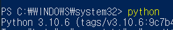
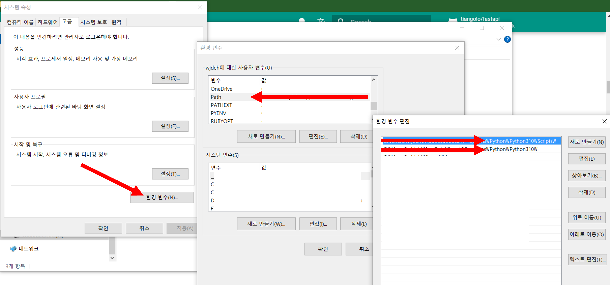

## Intro

안녕하세요 **Noah**입니다

오늘은 FastAPI에 대해 알아보도록 하겠습니다.<br/>
FastAPI는 Python 3.6+ 이상에서 사용가능한 Framework입니다.<br/>
Django, Flask와 비견되며 FastAPI의 장점은 이름과 같이 빠른 성능을 제공하는 것입니다.

성능이 무척 뛰어나 V8엔진을 사용하는 Node.js나 빠른 속도로 명성이 자자한 GO 언어와 비견할 수 있을 정도입니다.

이 때문에 Micro 서비스를 만들기 위해 Container를 활용해 서버를 운용할 때나 AWS Lambda와 같은 Serverless 환경에서 활용하기 적합한 Framework입니다.

최근에는 Cloud환경에서 개발을 하는 것이 트렌드가 되면서 많은 관심을 받고 있는 Framework입니다.

그럼 간략한 설명은 여기까지 하도록 하고 FastAPI를 Container환경에서 사용하기 위해서는 어떤 방식을 이용해야하는지 같이 알아보도록 하겠습니다.

더 디테일한 설명을 보고 싶은 분들은 아래 사이트를 방문해보시길 바랍니다.
> https://fastapi.tiangolo.com/ko/

<br/><br/><br/><br/>

## FastAPI를 활용해 간단히 서버 띄우는 방법
- Python 3.6 이상 버전을 설치<br/>
  > 최신버전을 설치해주세요~<br/>
  > https://www.python.org/downloads/
  
  <br/>
  
  설치가 완료되면 버전을 확인해줍니다.<br/>
  > 

  <br/><br/>
  
- 환경변수 설정<br/>
  CLI에서 python명령어와 pip명령어를 사용하기 위해 아래 두가지를 path에 설정해줍니다.
  > 환경변수 설정<br/>
  > <br/><br/>
  > 해당 Path 내 파일 종류<br/>
  > 

  <br/><br/>

- FastAPI 설치<br/>
  Powershell을 열고 아래 pip명령어를 입력하여 CLI로 FastAPI 설치<br/>
  > pip install fastapi

  <br/><br/>

- 서버 및 랙 웹서버 선택<br/>
  - Server<br/>
    Python 진영에서 가장 많이 사용되는 <strong style="color: #bb4177;">'Nginx'</strong>로 선정하였습니다.
  
  <br/><br/>
  
  - Server Gateway Interface<br/>
    FastAPI 공식 문서에 나와있는 ASGI들(Uvicorn, Hypercorn) 중에서 이번에는 <strong style="color: #bb4177;">'Hypercorn'</strong>을 선택하게 되었습니다.<br/>
    CLI로 설치해 주세요
    > pip install hypercorn[standard]
    
    <br/>
    
    선정이유 - <strong style="color: #bb4177;">'HTTP 2.0 지원여부'</strong><br/>
    가장 흔히들 사용하는 Uvicorn은 아직 HTTP 1.1을 지원하며 2.0은 지원하고 있지 않습니다.
    반면 Hypercorn은 이를 지원하고 있어 미래 확장성을 고려하여 선정하게 되었습니다.<br/><br/>
    
    HTTP 2.0이라고도 불리는 HTTP/2는 Hypertext Transfer Protocol Version 2의 약자로서, 
    2015년 IETF에 의해 공식적으로 발표된 HTTP/1.1(기존 표준)의 차기 버전입니다.
    기존 HTTP 1.x 버전대와는 다르게 Header Frame와 Data Frame을 분할하여 관리되며 퍼포먼스가 기존 1.x대에 비해 높습니다.<br/>
    > 번외로 이 HTTP 2.0은 AWS CloudFront 등에서 지원되기 때문에 Cloud 환경에서도 무리없이 활용 가능합니다.
    
    <strong>따로 HTTP 2.0을 지원할 계획이 없으신 분들은 Uvicorn을 사용하셔도 큰 문제가 없습니다.</strong>
    <br/><br/>
    
    #### 부가설명들
    <strong style="color: #bb4177;">'Server Gateway Interface'란?</strong><br/>
    CGI 기술을 발전시킨 형태로 Python 진영에서 사용되는 용어입니다. 
    해당 내용을 어렵게 말하면 웹 서버 와 웹 애플리케이션 간의 모듈식 인터페이스로 이를 사용 시 웹 프레임워크 및 미들웨어용 API(응용 프로그래밍 인터페이스)가 HTTP 요청 및 응답을 처리하는 단일 메서드 호출로 랩핑해주는 것을 의며하며 
    쉽게 말하면 Nginx 같은 웹 서버와 Django, Flask, Fast API 등으로 만든 웹 애플리케이션 사이에서 HTTP통신이 가능하도록 지원하는 미들웨어입니다.<br/>
    <br/>
    WSGI, ASGI가 Python 진영에서 통용되는 말이며 다른 언어 진영에서는 WAS, Rack Web Server 등으로 불리고 있습니다.<br/>
    주로 하는 역할은 Web Server에서 전달된 요청을 Web Application에서 인식할 수 있는 양식으로 컨버팅하고 Controller 역할을 하는 대상들을 호출하며 여러 요청이 접수될 시 이를 큐에 보관하고 있다가 Thread를 분배하여 요청을 처리하는 것이 주된 역할입니다.<br/>
    물론 일부 요청을 차단하거나 특정 시간 이상 처리되지 않은 요청들을 관리하기 위해 세부 설정을 하는 등의 작업을 하기도 합니다.
    
    <br/><br/>
    
    <strong style="color: #bb4177;">CGI, WSGI, ASGI의 차이</strong>
    - CGI<br/>
      Common Gateway Interface로 웹 서버에서 동적인 페이지를 보여 주기 위해 임의의 프로그램을 실행할 수 있도록 하는 기술이며 규약 중 하나입니다.<br/>
      하지만 CGI는 치명적인 이슈가 존재했는데 요청이 하나 들어올 때마다 Web Application을 fork하여 프로세스가 하나씩 실행된다는 것입니다. 다시 말씀드리지만 Thread를 분할하는 것이 아니고 프로세스를 실행시킵니다.<br/>
      때문에 서버 자원 낭비 이슈로 요새는 거의 사용되지 않는 기술입니다.<br/>
      > 관련해서 생활코딩님 강의가 있는 것을 확인하여 첨부하였습니다. 좀 더 디테일하게 아시고 싶은 분은 시청해보세요.<br/>
      > https://opentutorials.org/course/3256/19819
    - WSGI<br/>
      Web Server Gateway Interface는 CGI와 다르게 파이썬에 종속된 개념이라 CGI와 다르게 여러 Python진영의 여러 Web Applicatino을 만드는 Framework들과 Web Server간 표준화된 통신 인터페이스를 제공하는 것으로 CGI 기술을 발전 시켰습니다. 요청이 들어올 때마 Web Application을 fork하여 프로세스를 실행하는 거서이 아니라 필요에 따라 프로세스를 실행하게 하여 자원 낭비를 최소화하였습니다.<br/>
      또한 WAS에서 Servlet을 호출하듯이 WSGI에서는 callable객체를 호출하게 됩니다.<br/>
      > 
      
      더 자세한 내용은 아래 글을 확인해 보세요
      > https://docs.python.org/ko/3/library/wsgiref.html
       
      <br/><br/>
    - ASGI<br/>
      Asynchronous Server Gateway Interface는 WSGI에서 처리가 불가능하던 비동기 처리를 지원하는 것<br/>
      > https://asgi.readthedocs.io/en/latest/

  <br/><br/>

- <strong style="color: #bb4177;">'main.py'</strong> 작성<br/>
  Python은 기본적으로 main.py를 실행하기 때문에 해당 파일을 작성해 줍니다.<br/>
  이 때 FastAPI의 최대 장점이 발현되는데 다른 어떤 설정 파일도 생성할 필요가 없으며 main.py 내 코드를 몇줄만 작성하면 바로 Server Open이 가능합니다.<br/>
  ```python
  from typing import Union
  from fastapi import FastAPI
    
  app = FastAPI()
    
  @app.get("/")
  def read_root():
    return {"Hello": "World"}
  
  @app.get("/items/{item_id}")
  def read_item(item_id: int, q: Union[str, None] = None):
    return {"item_id": item_id, "q": q}
  ```

  <br/>
  또한 이 자체로 별다른 설정 없이도 엄청나게 빠른 성능을 자랑하기 때문에 최근 각광받고 있는 것입니다.
  
  <br/><br/>
  
- 실제 Server Open<br/>
  해당 파일이 있는 디렉토리로 접근하여 CLI로 아래 명령어 실행<br/>
  > hypercorn main:app --reload
  
  <br/>
  오픈된 것을 확인 가능<br/>
  

<br/><br/><br/><br/>

## Container 환경에서 서버 오픈
위에서 제작한 서버를 Container 환경에서 오픈해 보겠습니다.

> https://fastapi.tiangolo.com/deployment/docker/ <br/>
> 아래 내용들은 위 공식문서를 참고하여 제작하였습니다.

```dockerfile
FROM python:3.9.13-slim

COPY requirements.txt ./

RUN pip install --upgrade pip
RUN pip install -r requirements.txt

WORKDIR /work
COPY . ./work

# User Setting
RUN chmod 775 /work /work \
&& chown -R 1001 /work \
&& chmod -R "g+rwX" /work \
&& chown -R 1001:root /work

EXPOSE 8000
USER 1001

ENTRYPOINT hypercorn ./work/src/main.py:app --reload --bind 0.0.0.0:8000
```
Docker를 활용하여 서버를 오픈할 때 hypercorn을 이용하신다면 위와같이 bind를 이용해서 host를 잡아주는 것이 중요합니다.


## 글을 마치며
이전 Quarkus를 사용할 때 보다 훨씬 간결하게 사용할 수 있어서 좋았고 fastapi, ASGI 외에는 따로 다른 API들을 설치할 필요가 없어 가볍고 좋았습니다.

여러분들도 위와 같이 간결하게 Container환경에 서버를 배포할 수 있는 FastAPI를 한번 사용해 보시고 다양한 API, 커뮤니티를 형성해주시면 좋을 것 같습니다.

이상입니다. 긴 글 읽어주셔서 감사합니다.