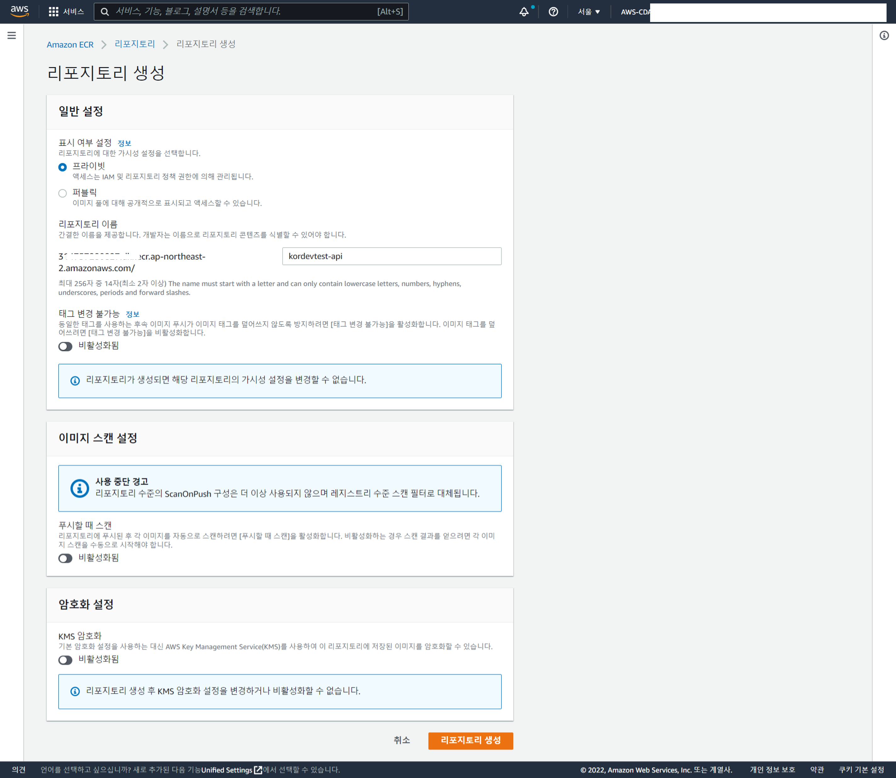
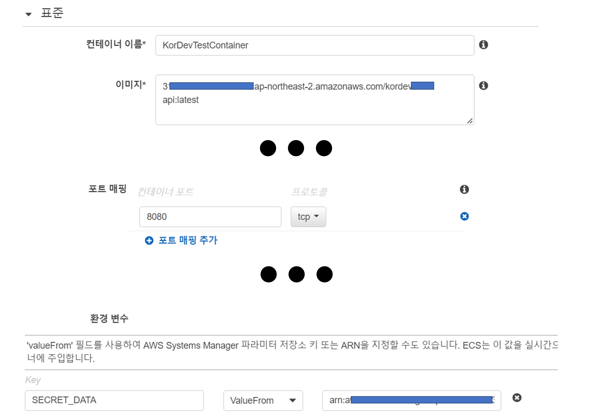
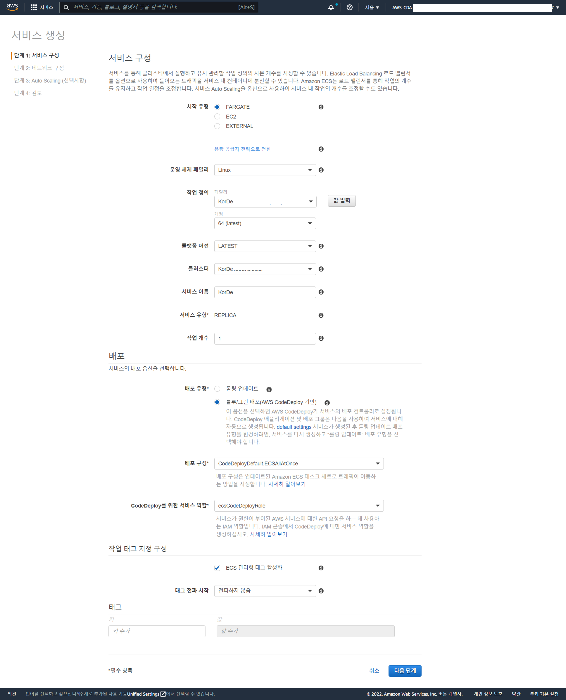
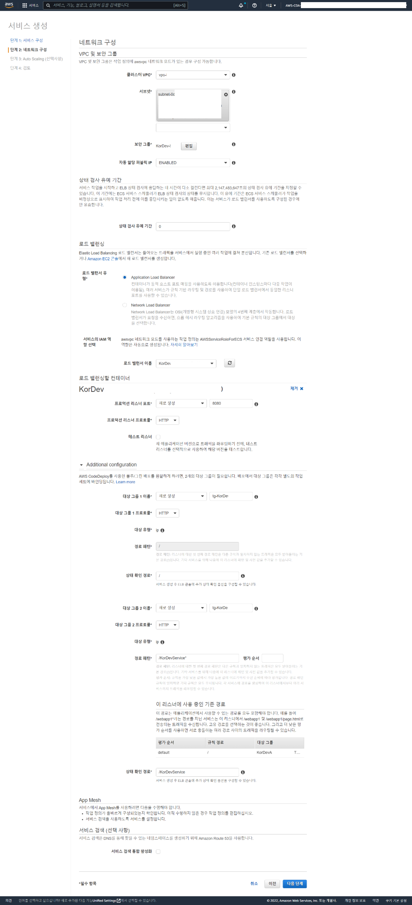

## Intro
안녕하세요 **Noah**입니다.

이번엔 간단한 ECS Architecture Diagram을 보고 이를 분석해보는 시간은 가져보도록 하겠습니다.
> 

제가 작성한 글에 수정할 사항이 있거나 더 좋은 아이디어가 있으시다면 피드백 주시면 감사하겠습니다~
<br/><br/><br/><br/>

## ECS(Elastic Container Service) 사용 이유
ECS는 컨테이너(Docker)를 활용하기 때문에 확장성이 뛰어나고 빠릅니다.<br/>
또한 AWS Fargate를 사용하면 서버를 관리, 용량 계획을 처리, 보안을 위해 컨테이너 워크로드를 격리 등을 클라우드에서 모두 관리해주는 서비스라서 서버 관리에 대한 부담을 많이 덜을 수 있습니다.

컨테이너 관리는 개별 또는 사용자 지정 task를 생성하여 컨테이너 환경 또한 관리가 가능합니다.
이렇게 세팅된 컨테이너를 사용할 때 이점은 원하는 스팩으로 생성한 컨테이너들을 원하는 수량 만큼 동시에 실행하고 유지하며 클러스터링을 하기 편하다는 점입니다. 
이는 ECS 클러스터에서 컨테이너를 실행, 중지 및 관리가 가능하며 또한 Auto-Scaling 기능을 통해 부하가 몰릴 때는 scale-out을 하고 부하가 적어지면 다시 자동으로 scale-in을 하도록 설정 또한 할 수 있습니다.

이 외에도 AWS Identity and Access Management(IAM)와의 통합. 각 컨테이너에 대해 세분화된 권한을 할당이 가능하며
리소스 요구 사항, 격리 정책 및 가용성 요구 사항을 기반으로 클러스터에서의 컨테이너 배치를 예약할 수도 있고 지속적인 통합 및 지속적인 배포(CI/CD)가 가능하도록 지원합니다.
<br/><br/><br/><br/>

## ECS 컨테이너 배포 방법
오늘은 요새 회사에서 자주 구축하고 있는 지속적인 통합 및 지속적인 배포(CI/CD) 형태로 배포하는 방법에 대해 알아보겠습니다.<br/>
AWS를 활용해서 CI/CD를 구현하기 위한 가장 쉬운 방법은 대중적으로 사용되는 Github과 함께 CodePipeline을 활용하는 것입니다.
<br/><br/>

### ECS 내 클러스터 및 작업 정의(Task), 서비스 생성
1. AWS ECS로 접근하셔서 <strong style="color: #bb4177;">'클러스터'</strong>를 먼저 생성해주면 됩니다. 클러스터 생성은 ECS Fargate를 활용해주시면 되겠습니다.<br/>Fargate를 사용하게 되면 Amazon EC2 인스턴스의 서버나 클러스터를 따로 관리할 필요 없어 컨테이너를 실행하고 관리하기에 용의합니다.
    > 
    <br/><br/>

2. 1단계를 완료하셨으면 ECR로 접근하셔서 앞으로 배포할 도커 이미지들이 저장될 <strong style="color: #bb4177;">'레포지토리'</strong>를 하나 생성해주시면 됩니다.
    * 아래는 ECR 생성 샘플입니다.<br/>
    > 
    <br/>

     * Maven을 기본 이미지로한 간단한 <strong style="color: #bb4177;">'Dockerfile'</strong>코드<br/>
    (작업을 완료하셨으면 Root 유저로 사용하지 않도록 변경해 주시는게 좋습니다.)
    ```dockerfile
    FROM maven:3.8.6-amazoncorretto-11
    
    ## Root User로 권한 설정
    USER root
    
    ## Linux 설정 및 필요 파일 Copy
    RUN yum update -y
    ARG SRC=/src
    COPY ${SRC} /src
    
    ARG POM_FILE=/pom.xml
    COPY ${POM_FILE} pom.xml
    
    ## Maven Build
    RUN ["mvn","clean","package"]
    
    ## Port 설정
    EXPOSE 8080
    
    ### 작업 완료 시 User 변경
    RUN useradd -ms /bin/bash testserver
    USER testserver
    
    ## War 실행
    ENTRYPOINT java -Xms256m -Xmx4g -jar ./target/server-0.0.1-SNAPSHOT.war
    ```
<br/><br/>

3. 2단계를 완료하셨으면 <strong style="color: #bb4177;">'작업 정의(Task)'</strong>를 생성해주시면 됩니다. 마찬가지로 Fargate를 선택해주시고 작업과 관련된 설정을 진행해주시면 됩니다.<br/>여기서 설정을 하긴 하지만 추후 배포 시 taskdefinition.json을 통해 설정을 변경할 수 있으니 가볍게 작업해주시면 됩니다.
   * 아래는 작업 정의 생성 샘플입니다.<br/>
    > 
    <br/>
   
   * <strong style="color: #bb4177;">'taskdefinition.json'</strong> 샘플
    ```json
    {
      "executionRoleArn": "사용할 Role에 대한 Arn 주소값",
      "containerDefinitions": [
        {
          "name": "컨테이너명",
          "image": "ECR에 저장된 Docker Image URI",
          "essential": true,
          "logConfiguration": {
            "logDriver": "awslogs",
            "options": {
              "awslogs-group": "/ecs/작업정의명",
              "awslogs-region": "ap-northeast-2",
              "awslogs-stream-prefix": "ecs"
            }
          },
          "portMappings": [
            {
              "hostPort": 8080,
              "protocol": "tcp",
              "containerPort": 8080
            }
          ],
          "secrets": [
            {
              "valueFrom": "SecretsManager연결 시 Arn주소",
              "name": "사용할변수명"
            }
          ]
        }
      ],
      "requiresCompatibilities": ["FARGATE"],
      "networkMode": "awsvpc",
      "cpu": "512",
      "memory": "1024",
      "family": "작업정의명"
    }
    ```
<br/><br/>

4. 작업 정의 생성 시 사용할 <strong style="color: #bb4177;">'컨테이너'</strong>를 제작해줍니다. 이 또한 taskdefinition.json에서 정의해 수정할 수 있으므로 가볍게 제작해주시면 됩니다.
    * 컨테이너 생성 샘플입니다.<br/>
      SecretsManager를 사용하지 않으실 분들은 SECRET_DATA는 생략하셔도 됩니다만 보통 데이터베이스 연결 정보와 같은 민감 정보는 소스코드상에 남기지 말고 Secrets Manager에서 가져와 사용하시는 걸 추천드립니다.<br/>
      > 
      <br/><br/>

5. 이제 제작된 작업 정의(Task)를 기반으로 클러스터 내 <strong style="color: #bb4177;">'Service'</strong>를 제작해줍니다.
   * 서비스 구성 샘플<br/>
     > 
     <br/>

   * 네트워크 구성 샘플<br/> VPC, Subnet, 보안그룹, 로드벨런서, IAM Role 등에 대한 설정은 보통 사내 Infra팀에서 모두 잡아주실 겁니다. 하지만 만약 본인이 직접 설정하시는 분들도 있을 것 같아서 다음에 각각에 대해 설명하는 시간을 만들어보겠습니다.
   <br/><br/>
   여기서 네트워크 구성 시 크게 2가지를 추천드리고 싶은데 먼저 컨테이너간 클러스터링을 기본으로 하는 서비스인 만큼 <strong style="color: #bb4177;">'Application Load Balancer'</strong>와 잘 어울린다는 생각이 듭니다.
   <br/> 
   사용자 요청에 맞게 각 컨테이너에 자동으로 트래픽 분산을 시켜주는 것은 기본이며 추가로 컨테이너들이 Auto-Scaling에 의해 증식이 되더라도 알아서 이를 감지해 요청을 처리해주기 때문에 
   ECS를 사용하실분들은 Application Load Balancer를 고려해보시길 추천드립니다.
   <br/><br/>
   두번째로 <strong style="color: #bb4177;">'ECS Blue/Green'</strong> 사용입니다.<br/> 
   ECS Blue/Green 사용 시 기존 서버는 그대로 둔 상태에서 새로운 서버를 추가 배포하며 새로운 서버 배포 중 장애 발생 시 현재 서버 계속 유지할 수 있습니다. 
   정상 배포 시에는 새로운 서버로 서버 교체 후 기존 서버는 Shutdown하는 방식입니다.
   <br/>
   ECS Blue/Green 사용하지 않을 경우 기존 서버 Shutdown 후 새로운 서버를 배포하기 때문에 순간적으로 서비스가 자동하지 않아 장애가 발생할 수 있습니다.
   <br/><br/>
   전체 설정은 아래 전체 이미지를 참고해주세요.
   <br/><br/>
     > 
     > 
<br/><br/>

6. <strong style="color: #bb4177;">'Auto-Scaling'</strong> 설정은 보통 운영 서버일 경우 진행해주고 개발은 설정하지 않는 경우가 많았습니다.
   * 아래는 Auto-Scaling 설정화면입니다.
     > 
<br/><br/>

### CodePipeline 생성 방법
1. CodePipeline을 생성 시 <strong style="color: #bb4177;">'Github Webhook'</strong>을 이용해 지정한 Github branch 내 데이터 변경을 감지하도록 Source 부분은 Github을 보통 선택해줍니다.<br/>(다른 형상관리 툴을 사용하시는 분들은 그에 맞춰 사용하시되 hooking을 활용하실 수 있는 것들을 활용하셔야 저와 같이 사용 가능하십니다.)


2. 데이터 변경 시 CodePipeline이 이를 감지하고 해당 변경 내용이 서버에 반영되도록 <strong style="color: #bb4177;">'Build, Deploy'</strong> 순서로 작업 진행되기 때문에 각각을 스테이지 추가를 통해 생성해주어야 합니다.


3. <strong style="color: #bb4177;">'Build 스테이지'</strong> 생성 방법
   * 다음은 CodePipeline에서 Build 스테이지를 생성하는 부분 Sample입니다.<br/> 먼저 아래와 같이 세팅한 후 Code Build 프로젝트를 생성해주어야 합니다.<br/>(이 곳에서 프로젝트를 생성하셔야 프로젝트 생성 시 자동으로 소스공급자가 CodePipeline으로 설정됩니다.)<br/>
     > 
    <br/>

   * <strong style="color: #bb4177;">'Code Build 프로젝트'</strong> 생성 예시<br/>
     > 
    <br/>
  
  * 아래는 위 예시에서 보신 <strong style="color: #bb4177;">'dev.buildspec.yml'</strong> 샘플 코드입니다. 개발환경 예시라 dev가 앞에 붙은 것을 확인하실 수 있습니다.<br/>보시게 되면 $AWS_ACCOUNT_ID와 같이 환경변수를 가져온 것을 보실 수 있는데 이는 위에서 Code Build 프로젝트를 생성하실 때 지정하신 환경변수 내 값을 가져오는 것이므로 위에서 잘 세팅해주셔야 합니다. 
    ```yml
    version: 0.1
    
    phases:
      pre_build:
        commands:
          - echo AWS Connect
          - aws --version
          - aws ecr get-login-password --region ap-northeast-2 | docker login --username AWS --password-stdin $AWS_ACCOUNT_ID.dkr.ecr.$AWS_DEFAULT_REGION.amazonaws.com
      build:
        commands:
          - echo Build started on `date`
          - echo Make Docker image
          - docker build -t $IMAGE_REPO_NAME:$IMAGE_TAG -f Dockerfile .
          - docker tag $IMAGE_REPO_NAME:$IMAGE_TAG $AWS_ACCOUNT_ID.dkr.ecr.$AWS_DEFAULT_REGION.amazonaws.com/$IMAGE_REPO_NAME:$IMAGE_TAG
      post_build:
        commands:
          - echo Build completed on `date`
          - echo Pushing the Docker image to ECR
          - docker push $AWS_ACCOUNT_ID.dkr.ecr.$AWS_DEFAULT_REGION.amazonaws.com/$IMAGE_REPO_NAME:$IMAGE_TAG
          - printf '[{"name":"%s","imageUri":"%s"}]' $IMAGE_REPO_NAME $AWS_ACCOUNT_ID.dkr.ecr.$AWS_DEFAULT_REGION.amazonaws.com/$IMAGE_REPO_NAME:$IMAGE_TAG  > imagedefinitions.json
    artifacts:
      files:
        - imagedefinitions.json
        - appspec.yml
        - taskdefinition.json
      discard-paths: yes
    ```
    <br/>

    * 위 파일 내용 중 artifacts 내 3가지 파일이 보이실 겁니다. 그 중 appspec과 taskdefinition은 아래에서 따로 설명드리도록 하고 Docker Image에 대한 설정을 하는 imagedefinitions.json 파일만 살펴보고 넘어가겠습니다. 
      ```json
      [
        {
          "name": "kordevtest-api",
          "imageUri": "ECR 내 배포된 Docker Image URI를 입력"
        }
      ]
      ```
<br/><br/>


4. <strong style="color: #bb4177;">'Code Deploy 스테이지'</strong> 생성 방법
   * 다음은 CodePipeline에서 Deploy 스테이지를 생성하는 부분 Sample입니다.<br/> 먼저 아래와 같이 세팅한 후 Code Deploy Application 및 Deploy Group을 생성해주어야 합니다.<br/>
     > 
     <br/>
   
   * <strong style="color: #bb4177;">'Code Deploy Application'</strong> 생성 예제
     > 
     <br/>

   * <strong style="color: #bb4177;">'Deploy Group'</strong> 생성 예제
     위에서 ECS 클러스터 및 서비스를 생성할 때 선택했던 내용들을 다시 여기서 선택해줍니다.<br/>
     서비스 생성 시 지정한 역할(Role), 로드벨런서, 대상그룹(Target Group)<br/><br/>
     추가 주의사항으로 원래 개정 종료 시간을 <strong style="color: #bb4177;">'0일 0시간 0분'</strong>으로 하지 않으면 ECS 서비스 내 새로운 작업이 생성되어도 저 시간동안 교체되지 않고 있게 됩니다. 그 때문에 저는 보통 0, 0, 0으로 세팅하고 있습니다.
     > 
     <br/>
      
   * <strong style="color: #bb4177;">'dev.appspec.yml'</strong> 예시<br/>
     (dev.taskdefinition.json에 대한 예시는 위에 있습니다.)
     ```yml
     version: 0.1
     Resources:
       - TargetService:
           Type: AWS::ECS::Service
           Properties:
             TaskDefinition: "제작한 작업정의(Task)의 Arn 주소"
             LoadBalancerInfo:
               ContainerName: "제작한컨테이너명"
               ContainerPort: 사용한포트번호(8080)
             PlatformVersion: "LATEST"
             NetworkConfiguration:
               AwsvpcConfiguration:
                 Subnets: ["지정한서브넷들_01", "지정한서브넷들_02"]
                 SecurityGroups:
                   [
                     "지정한보안그룹들_01"
                   ]
                 AssignPublicIp: "DISABLED"
     ```
<br/><br/><br/><br/>

## 


