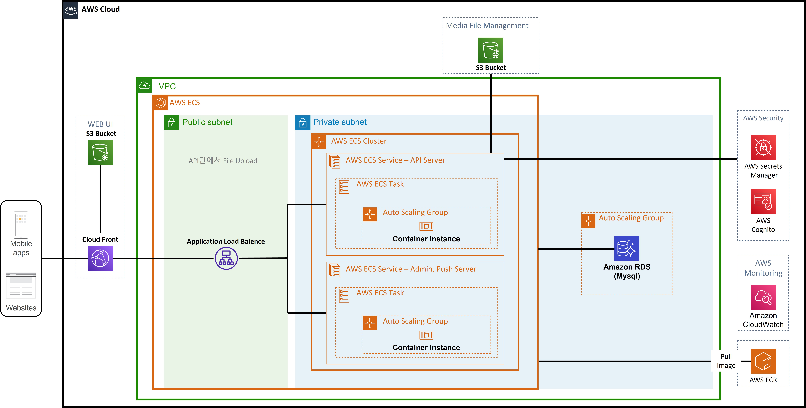

## Intro
안녕하세요 **Noah**입니다.

오늘은 간단한 ECS Architecture Diagram을 보고 이를 분석해보는 시간은 가져보도록 하겠습니다.
> 

제가 작성한 글 내 허점이 있거나 더 좋은 아이디어가 있으시다면 피드백 주시면 감사하겠습니다~
    

## ECS(Elastic Container Service) 사용 이유
ECS는 컨테이너(Docker)를 활용하기 때문에 확장성이 뛰어나고 빠릅니다. 
또한 AWS Fargate를 사용하면 서버를 관리, 용량 계획을 처리, 보안을 위해 컨테이너 워크로드를 격리 등을 클라우드에서 모두 관리해주는 서비스라서 서버 관리에 대한 부담을 많이 덜을 수 있습니다.

컨테이너 관리는 개별 또는 사용자 지정 task를 생성하여 컨테이너 환경 또한 관리가 가능합니다.
이렇게 세팅된 컨테이너를 사용할 때 이점은 원하는 스팩으로 생성한 컨테이너들을 원하는 수량 만큼 동시에 실행하고 유지하며 클러스터링을 하기 편하다는 점입니다. 
이는 ECS 클러스터에서 컨테이너를 실행, 중지 및 관리가 가능하며 또한 Auto-Scaling 기능을 통해 부하가 몰릴 때는 scale-out을 하고 부하가 적어지면 다시 자동으로 scale-in을 하도록 설정 또한 할 수 있습니다.

이 외에도 AWS Identity and Access Management(IAM)와의 통합. 각 컨테이너에 대해 세분화된 권한을 할당이 가능하며
리소스 요구 사항, 격리 정책 및 가용성 요구 사항을 기반으로 클러스터에서의 컨테이너 배치를 예약할 수도 있고 지속적인 통합 및 지속적인 배포(CI/CD)가 가능하도록 지원합니다.
    

## ECS 컨테이너 배포 방법
오늘은 요새 회사에서 자주 구축하고 있는 지속적인 통합 및 지속적인 배포(CI/CD) 형태로 배포하는 방법에 대해 알아보겠습니다. 
AWS를 활용해서 CI/CD를 구현하기 위한 가장 쉬운 방법은 대중적으로 사용되는 Github과 함께 CodePipeline을 활용하는 것입니다.
  

> ### CodePipeline 작동 순서
> 1. CodePipeline을 생성 시 Github Webhook을 이용해 지정한 Github branch 내 데이터 변경을 감지
> 2. 데이터 변경 시 CodePipeline이 이를 감지하고 해당 변경 내용이 서버에 반영되도록 Build, Deploy 순서로 작업 진행
> 3. Build 시 작업할 내역을 Buildspec.yml 내에 정의하고 이를 CodePipeline에 맵핑 
> 
> 4. Build 완료 후 생성된 Docker Image를 ECR 내 저장
> 5. CodePipeline CodeDeploy와 연결된 ECS 클러스터 및 서비스 조회
> 6. 서비스에 설정된 작업(task)를 새롭게 배포 이 때 설정과 관련된 파일이 필요(appspec.yml, taskdefinition.json, imageDefinition.json)
> 7. ECS Blue/Green 사용 시 기존 서버는 그대로 둔 상태에서 새로운 서버를 추가 배포.  새로운 서버 배포 중 장애 발생 시 현재 서버 계속 유지, 정상 배포 시 새로운 서버로 서버 교체 후 기존 서버는 Shutdown
> 8. ECS Blue/Green 사용하지 않을 시 기존 서버 Shutdown 후 새로운 서버 배포 진행.  이렇게 배포 진행 시 장애 발생에 따른 이슈가 크리티컬하기 때문에 Blue/Green 사용 권장

## 

