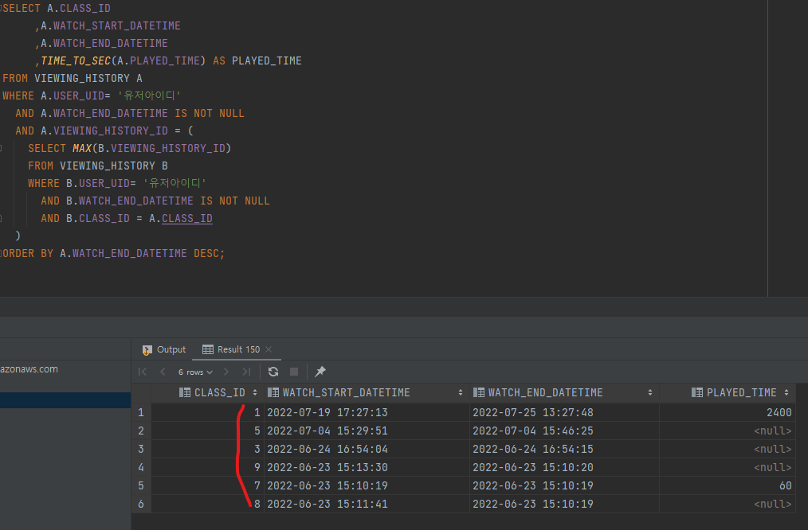

## Intro

안녕하세요 **Noah**입니다

오늘은 팀원이 작성한 쿼리 중 내부적으로 이슈가된 쿼리가 있어 해당 쿼리를 분석해보려 합니다.

어떤 쿼리인지 살펴보고 일반 개발자분들이 DBA 처럼 완벽한 쿼리 튜닝은 할 수 없을 지라도 
최소한의 주의사항은 지키면서 쿼리를 작성하자는 마음으로 글을 쓰게 되었습니다.

## 코드 예시
기능은 앱 시청기록 메뉴 접근 시 내가 시청했던 영상에 대한 시청 기록과 연관된 데이터 리스트를 받는 것입니다.<br/>
어떤 페이지든 성능을 고려해야겠지만 해당 페이지는 유저들의 이용량이 많을 것으로 판단되어 특히 신경을 써야하는 페이지입니다.<br/>
(아래 코드는 실제 작성되어 있는 것에서 컬럼명 및 테이블명만 수정하여 그대로 가져온 것입니다.)

```sql
SELECT A.*
     ,(SELECT IF(DEL_YN='N',true,false)
       FROM USER_CLASS
       WHERE USER_UID = '유저아이디'
         AND CLASS_ID=A.CLASS_ID
         AND RELATION =13) AS bookMark /* TRUE일경우 북마크설정, FLASE일경우 북마크해제 */
FROM (select TMP.*
           ,IFNULL(UC2.EVALUATION_SCORE,0)  AS EVALUATION_SCORE
           ,IFNULL(UC2.EVALUATION_USER_CNT, 0) AS EVALUATION_USER_CNT
           ,C.CLASS_NM AS classTitle
           ,(TIME_TO_SEC(TMP.PLAYED_TIME)/TIME_TO_SEC(C.LEN))*100 as playedPercent
           ,C.CLASS_CATEGORY AS classWorkoutCategoryCode
           ,C.LIVE_JOB_ID AS liveId
           ,C.CONTENTS_TYPE
           ,C.VOD_ENTRY_ID AS videoId
           ,C.CREATE_DATETIME
           ,C.CLASS_LEVEL AS classLevelCode
           ,C.PAID_FREE_TYPE AS PAID_FREE_GUBUN
           ,C.THUMBNAIL_S3_FILE_URL
           ,C.LEN
           ,(SELECT GROUP_CONCAT(L.LECTURE_NAME)
             FROM CLASS_LECTURE CL,LECTURE L
             WHERE CL.CLASS_ID=TMP.CLASS_ID
               AND CL.LECTURE_ID=L.LECTURE_ID
               AND L.DEL_YN='N'
               AND CL.DEL_YN='N') AS lectureName
           ,(SELECT COUNT(1)
             FROM VIEWING_HISTORY VH
             WHERE VH.CLASS_ID=TMP.CLASS_ID
    ) AS CLASSVIEWCNT
      from (SELECT VH.CLASS_ID
                 ,VH.WATCH_START_DATETIME
                 ,VH.WATCH_END_DATETIME
                 ,TIME_TO_SEC(VH.PLAYED_TIME) AS PLAYED_TIME
            from VIEWING_HISTORY VH
            WHERE VH.USER_UID= '유저아이디'
              AND VH.WATCH_END_DATETIME IS NOT NULL
            order by VIEWING_HISTORY_ID desc
            LIMIT 18446744073709551615)  TMP , CLASS C
                                                   LEFT JOIN  (SELECT   CLASS_ID
                                                                    ,IF(COUNT(1)=0,0 ,TRUNCATE(AVG(EVALUATION_CNT),1))  AS EVALUATION_SCORE
                                                                    ,COUNT(CLASS_ID) AS EVALUATION_USER_CNT
                                                               FROM USER_CLASS
                                                                 AND DEL_YN ='N'
                                                               GROUP BY CLASS_ID  ) UC2
                                                              ON C.CLASS_ID = UC2.CLASS_ID
         ,CLASS_LECTURE CL,LECTURE L
      WHERE TMP.CLASS_ID=C.CLASS_ID
        AND C.CONTENTS_TYPE = 'VV'
        AND C.CLASS_ID = CL.CLASS_ID
        AND CL.LECTURE_ID = L.LECTURE_ID
        AND L.DEL_YN='N'
      GROUP BY TMP.CLASS_ID
      LIMIT 10) A
ORDER BY A.WATCH_END_DATETIME DESC
```

<br/><br/><br/><br/>

## 분석
큰 틀에서 부터 위 쿼리를 하나씩 분석해보도록 하겠습니다.

<br/><br/>

### 1차 튜닝
1. 쿼리가 라인 정리 및 대소문자 정리가 되어있지 않아 보는 것 자체가 어려움
   코드 분석 전 우선 코드를 분석하는 것 자체가 어렵다는 것이 가장 큰 단점으로 보입니다.<br/>
   저라면 위 쿼리를 아래 쿼리와 같이 정리할 것 같습니다.<br/> 
   (더 좋은 정리 방법이 있다면 공유해주세요 ^^)
    
    ```sql
        SELECT A.*
        FROM (
              SELECT TMP.*
                   , IFNULL(UC2.EVALUATION_SCORE,0)  AS EVALUATION_SCORE
                   , IFNULL(UC2.EVALUATION_USER_CNT, 0) AS EVALUATION_USER_CNT
                   , C.CLASS_NM AS CLASSTITLE
                   , (TIME_TO_SEC(TMP.PLAYED_TIME)/TIME_TO_SEC(C.LEN))*100 AS PLAYEDPERCENT
                   , C.CLASS_CATEGORY AS CLASSWORKOUTCATEGORYCODE
                   , C.LIVE_JOB_ID AS LIVEID
                   , C.CONTENTS_TYPE
                   , C.VOD_ENTRY_ID AS VIDEOID
                   , C.CREATE_DATETIME
                   , C.CLASS_LEVEL AS CLASSLEVELCODE
                   , C.PAID_FREE_TYPE AS PAID_FREE_GUBUN
                   , C.THUMBNAIL_S3_FILE_URL
                   , C.LEN
              , (
                 SELECT GROUP_CONCAT(L.LECTURE_NAME)
                 FROM   CLASS_LECTURE CL, LECTURE L
                 WHERE  CL.CLASS_ID = TMP.CLASS_ID
                   AND  CL.LECTURE_ID = L.LECTURE_ID
                   AND  L.DEL_YN = 'N'
                   AND  CL.DEL_YN = 'N'
                ) AS LECTURENAME
              , (
                 SELECT COUNT(1)
                 FROM   VIEWING_HISTORY VH
                 WHERE  VH.CLASS_ID=TMP.CLASS_ID
                ) AS CLASSVIEWCNT
              FROM (
                    SELECT VH.CLASS_ID
                         , VH.WATCH_START_DATETIME
                         , VH.WATCH_END_DATETIME
                         , TIME_TO_SEC(VH.PLAYED_TIME) AS PLAYED_TIME
                    FROM   VIEWING_HISTORY VH
                    WHERE  VH.USER_UID = '유저아이디'
                      AND  VH.WATCH_END_DATETIME IS NOT NULL
                    ORDER BY VIEWING_HISTORY_ID DESC
                    LIMIT  18446744073709551615
              ) TMP
              , CLASS C
              LEFT JOIN (
                    SELECT CLASS_ID
                         , IF(COUNT(1)=0,0 ,TRUNCATE(AVG(EVALUATION_CNT),1)) AS EVALUATION_SCORE
                         , COUNT(CLASS_ID) AS EVALUATION_USER_CNT
                    FROM   USER_CLASS
                      AND  DEL_YN = 'N'
                    GROUP BY CLASS_ID
              ) UC2
              ON C.CLASS_ID = UC2.CLASS_ID
              , CLASS_LECTURE CL
              , LECTURE L
              WHERE TMP.CLASS_ID = C.CLASS_ID
                AND C.CONTENTS_TYPE = 'VV'
                AND C.CLASS_ID = CL.CLASS_ID
                AND CL.LECTURE_ID = L.LECTURE_ID
                AND L.DEL_YN = 'N'
              GROUP BY TMP.CLASS_ID
              LIMIT 10
        ) A
        LEFT OUTER JOIN (
              SELECT IF(DEL_YN='N',TRUE,FALSE) AS BOOKMARK
                   , CLASS_ID
              FROM   USER_CLASS
              WHERE  USER_UID = '유저아이디'
                AND  DEL_YN = 'N'
        ) B
        ON A.CLASS_ID = B.CLASS_ID
        ORDER BY A.WATCH_END_DATETIME DESC;
    ```

<br/><br/>
 
2. 스칼라 서브쿼리를 활용하기 때문에 영상 종류가 많아질 수록 성능이 떨어질 수 밖에 없음
   - 스칼라 서브쿼리 사용 지양
       이런 식으로 SELECT절 안에 <strong style="color: #bb4177;">'스칼라 서브쿼리'</strong>를 사용하게 되면 FROM절에서 <strong style="color: #bb4177;">'인라인뷰형태'</strong>로 사용하는 것과는 다른 작동방식을 보입니다.<br/>
       쿼리는 먼저 FROM절에 있는 Query문을 기반으로 데이터를 모두 조회한 뒤 SELECT절에 작성되어진 양식으로 값을 뿌려주게 됩니다.<br/>
       이 때 SELECT절 안에 또 다시 서브쿼리가 있다면 해당 <strong style="color: #bb4177;">서브쿼리를 별도로 실행하는 작업이 2차적으로 필요</strong>해지는 것입니다.<br/>
       문제는 이런 현상이 한 ROW를 조회할 때마다 반복되기 때문에 자주 조회하는 페이지일수록, 데이터량이 많아질 수록 성능이 당연히 떨어질 수 밖에 없습니다.<br/>(RDBMS에서 지원하는 캐싱에 대한 내용을 나중에 알아보겠습니다.)<br/>

       ```sql
       SELECT A.*
          ,(SELECT IF(DELETE_YN='N',true,false)
            FROM USER_MY_CLASS
            WHERE USER_ID = '유저아이디'
              AND CLASS_ID=A.CLASS_ID) AS bookMark
       ```
    
    <br/><br/>
    
   - 인라인뷰로 변경 시
       이렇게 작성을 하게 되면 최초 FROM을 통해 데이터를 가져올 당시에 한번에 데이터를 가져와 BOOKMARK 값을 뿌려주기 때문에 2차적인 조회를 하지 않게 됩니다.<br/>

       ```sql
       SELECT A.*
            , IFNULL(B.BOOKMARK, 0) AS BOOKMARK
            -- (중략)
            GROUP BY TMP.CLASS_ID
            LIMIT 10
       ) A
       LEFT OUTER JOIN (
             SELECT IF(DEL_YN='N',true,false) AS BOOKMARK
                   ,CLASS_ID
             FROM USER_CLASS
             WHERE USER_UID = '유저아이디'
       ) B
       ON A.CLASS_ID = B.CLASS_ID
       ORDER BY A.WATCH_END_DATETIME DESC
       ```

<br/><br/>

3. 불필요한 값을 서브쿼리로 호출하는 행위
   - 기존 쿼리
       기존 쿼리 내용을 살펴보면 유저의 최근 시청 기록에 대한 데이터를 각 영상별로 정제해서 가져오도록 조건이 설정된 것이 아니라 <strong style="color: #bb4177;">시청했던 모든 내역을 불필요하게 조회</strong>하고 있었습니다.<br/>
       <br/><br/>
       하지만 이런식으로 쿼리 조회 시 <strong style="color: #bb4177;">불필요한 데이터 ROW들을 상위 쿼리에서도 관리</strong>해야 하기 때문에 자원 낭비가 발생하게 됩니다. 
       때문에 <strong style="color: #bb4177;">자원을 효율적으로 사용</strong>할 수 있도록 조건절을 설정할 필요가 있습니다.
    
    <br/><br/>
    
   - 변경한 쿼리
       변경한 쿼리에서는 기존 쿼리와 달리 <strong style="color: #bb4177;">각 영상별 유저의 가장 최근 시청 기록만을 조회</strong>하도록 변경하였습니다.<br/>
       
    
<br/><br/><br/><br/>

### 2차 튜닝
1차 튜닝은 기존 쿼리에 대해 내용적으로 문제가 있던 것을 지적했다면 2차 튜닝은 아예 서브쿼리 뎁스가 너무 깊다는 점을 짚고 넘어가려합니다.
먼저 아래 쿼리를 보시면 위 쿼리와 다르게 서브쿼리 뎁스 자체가 적다는 것을 알 수 있습니다.

(중략)

저도 아직은 많이 미숙하고 어렵지만 여러분은 쿼리를 작성하기 전 먼저 서비스 로직을 이해하고 해당 서비스에 맞는 최적의 쿼리를 작성하실 수 있다면 좋겠습니다.
<br/><br/><br/><br/>

## 글을 마치며
이번에 프로젝트를 하며 느낀 것은 개발에 관해 꾸준히 학습하는 것 만큼 현재 서비스하고자 하는 내용이 무엇인지 파악하는 것이 중요하다는 것입니다.

저와 같은 주니어 개발자분들이 있으시다면 여러분도 우선 내가 어떤 서비스 어떤 기능을 지금 구현할 것인지 명확하게 인지하고 업무에 임하셨으면 좋겠습니다.

긴 글 읽어주셔서 감사합니다.