# Intro
안녕하세요, Noah입니다.<br/>
이번 글에서는 Kubernetes가 무엇인지 냄새를 맡아보는 시간입니다. 쿠버네티스와 도커를 통해 애플리케이션을 배포하고 관리하는 과정을 다루고자 합니다. <br/>
처음 Kubernetes를 설치하고 클러스터를 설정하는 단계부터 배포, 모니터링, 스케일링, 업데이트, 롤백, 그리고 로깅까지 실무에서 꼭 필요한 핵심 기능들을 자세히 설명해보겠습니다.<br/>
Kubernetes를 처음 사용하는 분들이나 실무에서 자주 마주치는 문제를 해결하고자 하는 분들에게 유용한 참고 자료가 됐으면 좋겠습니다.<br/>

아마... Kafka 글에 이어 분량 조절 실패할 것 같은 글이지만, 목차라도 잘 구분해서 적어보겠습니다 ㅎㅎ<br/>
(급하신 분들은 [Kubernetes 클러스터에 배포 및 모니터링 방법](#kubernetes-클러스터에-배포-및-모니터링-방법) 부터 보시면 될 것 같아요.)

그럼 시작해 보겠습니다.
<br/><br/><br/><br/>

# 목차
1. [Kubernetes를 활용 전 준비할 내용](#kubernetes를-활용-전-준비할-내용)
   - [기본 개념](#기본-개념)
     1. [Kubernetes 구성 요소](#1-kubernetes-구성-요소)
     2. [Kubernetes 라이프사이클](#2-kubernetes-라이프사이클)
   - [배포를 위한 설정 파일 준비](#배포를-위한-설정-파일-준비)
     1. [Kubernetes 설치 및 설정](#1-kubernetes-설치-및-설정)
     2. [Docker 이미지 생성하기](#2-docker-이미지-생성하기)
   - [Kubernetes 설정](#kubernetes-설정)
     1. [Kubernetes Deployment 리소스 정의하기(Deployment.yaml)](#1-kubernetes-deployment-리소스-정의하기deploymentyaml)
     2. [Kubernetes Service 리소스 정의하기(Service.yaml)](#2-kubernetes-service-리소스-정의하기serviceyaml)
     3. [Horizontal Pod Autoscaler 설정하기](#3-horizontal-pod-autoscaler-설정하기)
        - [스케일 아웃 조건 설정하기](#3-1-스케일-아웃-조건-설정하기)
        - [스케일 인 조건 설정하기](#3-2-스케일-인-조건-설정)
     4. [Kubernetes 리소스 파일로 설정 적용하기](#4-kubernetes-리소스-파일로-설정-적용하기)
        - [파일 구조 예시](#4-1-파일-구조-예시)
        - [파일 내용](#4-2-파일-내용)
        - [파일 적용 방법](#4-3-파일-적용-방법)
2. [Kubernetes 클러스터에 배포 및 모니터링 방법](#kubernetes-클러스터에-배포-및-모니터링-방법)
   - [위 설정 파일 기반으로 Kubernetes 클러스터에 배포하기](#1-위-설정-파일-기반으로-kubernetes-클러스터에-배포하기)
     1. [클러스터 초기 준비사항](#1-1-클러스터-초기-준비사항)
     2. [배포 파일 구조 재확인](#1-2-배포-파일-구조-재확인)
     3. [Deployment 설정 파일 배포하기](#1-3-deployment-설정-파일-배포하기)
     4. [Service 설정 파일 배포하기](#1-4-service-설정-파일-배포하기)
     5. [Horizontal Pod Autoscaler(HPA) 설정 파일 배포하기](#1-5-horizontal-pod-autoscalerhpa-설정-파일-배포하기)
     6. [배포할 이미지 Kind에 로드하기](#1-6-배포할-이미지-kind에-로드하기)
     6. [배포 후 Pod 상태 확인 및 문제 해결](#1-7-배포-후-pod-상태-확인-및-문제-해결)
   - [Kubernetes 클러스터 모니터링하기](#2-kubernetes-클러스터-모니터링하기)
     1. [기본 모니터링 명령어 활용하기](#2-1-기본-모니터링-명령어-활용하기)
     2. [리소스 사용량 모니터링하기 (CPU/메모리)](#2-2-리소스-사용량-모니터링하기)
     3. [실시간 모니터링 및 시각화 도구 활용](#2-3-실시간-모니터링-및-시각화-도구-활용)
     4. [알람 설정하기](#2-4-알람-설정하기)
   - [Kubernetes 클러스터 스케일링하기](#3-kubernetes-클러스터-스케일링하기)
     1. [수동 스케일링](#3-1-수동-스케일링)
     2. [자동 스케일링 (Horizontal Pod Autoscaler)](#3-2-자동-스케일링-horizontal-pod-autoscaler)
     3. [클러스터 노드 스케일링](#3-3-클러스터-노드-스케일링-cluster-autoscaler)
     4. [스케일링 상태 모니터링](#3-4-스케일링-상태-모니터링)
   - [Kubernetes 클러스터 업데이트하기](#4-kubernetes-클러스터-업데이트하기)
     1. [설정 파일을 통한 Deployment 업데이트](#4-1-설정-파일을-통한-deployment-업데이트)
     2. [`kubectl set` 명령어로 특정 설정 업데이트하기](#4-2-kubectl-set-명령어로-특정-설정-업데이트하기)
     3. [Rolling Update 확인하기](#4-3-rolling-update-확인하기)
     4. [환경 변수를 통한 설정 변경](#4-4-환경-변수를-통한-설정-변경)
     5. [업데이트 기록 관리 및 롤백 준비](#4-5-업데이트-기록-관리-및-롤백-준비)
   - [Kubernetes 클러스터 롤링 업데이트하기](#5-kubernetes-클러스터-롤링-업데이트하기)
     1. [롤링 업데이트의 기본 원리](#5-1-롤링-업데이트의-기본-원리)
     2. [기본 롤링 업데이트 설정](#5-2-기본-롤링-업데이트-설정)
     3. [롤링 업데이트 진행하기](#5-3-롤링-업데이트-진행하기)
     4. [롤링 업데이트 중 문제 해결](#5-4-롤링-업데이트-중-문제-해결)
     5. [롤링 업데이트 완료 확인](#5-5-롤링-업데이트-완료-확인)
   - [Kubernetes 클러스터 롤백하기](#6-kubernetes-클러스터-롤백하기)
     1. [롤백의 기본 원리](#6-1-롤백의-기본-원리)
     2. [롤백 가능한 업데이트 기록 확인하기](#6-2-롤백-가능한-업데이트-기록-확인하기)
     3. [롤백 수행하기](#6-3-롤백-수행하기)
     4. [롤백 확인하기](#6-4-롤백-확인하기)
   - [Kubernetes 클러스터 로깅하기](#7-kubernetes-클러스터-로깅하기)
     1. [기본 로깅 명령어로 Pod 로그 확인하기](#7-1-기본-로깅-명령어로-pod-로그-확인하기)
     2. [외부 로깅 시스템을 사용한 클러스터 로깅 확장](#7-2-외부-로깅-시스템을-사용한-클러스터-로깅-확장)
     3. [애플리케이션 레벨의 구조적 로깅 도입](#7-3-애플리케이션-레벨의-구조적-로깅-도입)
     4. [로깅 설정 최적화 및 주의 사항](#7-4-로깅-설정-최적화-및-주의-사항)
3. [Outro](#outro)
<br/><br/><br/><br/>

# Kubernetes를 활용 전 준비할 내용
## 기본 개념
### 1. Kubernetes 구성 요소
쿠버네티스(Kubernetes)는 클라우드 환경에서 애플리케이션을 **자동으로 배포**, **확장**, **관리**할 수 있는 오픈소스 플랫폼입니다.<br/>
이를 통해 애플리케이션을 손쉽게 **컨테이너화**하고, 대규모 트래픽이나 다양한 환경 변화에 따라 **유연하게 확장하거나 축소**할 수 있습니다.<br/>
이러한 쿠버네티스는 여러 주요 구성 요소로 이루어져 있으며, 각각의 역할이 **독립적**이면서도 **상호작용**을 통해 전체적인 클러스터 환경을 구축하고 관리하는 데 기여합니다.<br/>
아래는 주요 구성 요소와 그 역할에 대한 이미지입니다. 지금은 잘 이해 안되도 아래 적어둔 개념들과 이미지를 비교하면서 보시면 이해가 좀 더 빠르실 것 같습니다.

[쿠버네티스 공식 문서](https://kubernetes.io/docs/concepts/architecture/)

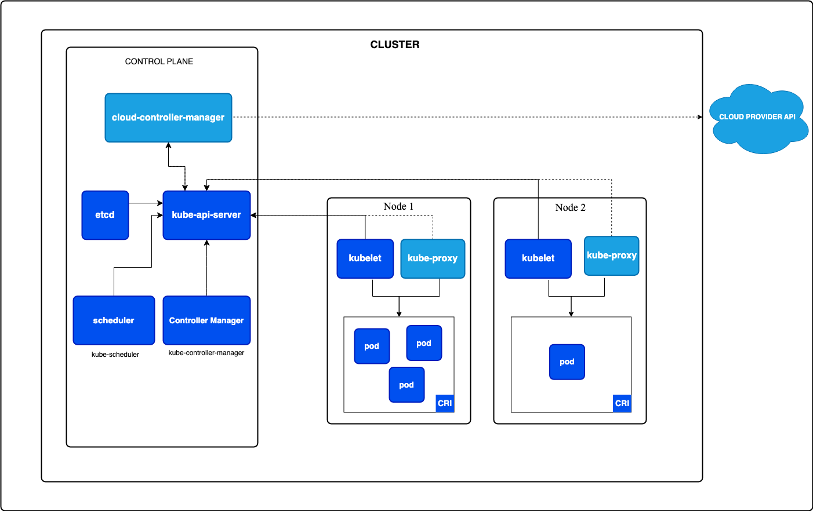
[출처: 쿠버네티스 공식 문서]

#### 1-1. 클러스터 (Cluster)
클러스터는 쿠버네티스의 **가장 기본적인 단위**로, 여러 개의 서버(노드)가 모여서 하나의 큰 시스템처럼 작동하는 환경입니다. <br/>
이 클러스터는 쿠버네티스에서 **애플리케이션을 실행하고 관리하는 단위**이며, 클러스터 내의 자원(노드, 파드 등)은 쿠버네티스에 의해 **자동으로 조율**됩니다.
<br/><br/>

#### 1-2. 노드 (Node)
노드는 클러스터를 구성하는 개별 서버입니다. <br/>
**하나의 클러스터는 여러 개의 노드**로 이루어질 수 있으며, 각각의 노드는 실제로 애플리케이션이 실행되는 물리적 또는 가상 머신입니다.

**[노드의 두 가지 유형]**
- **마스터 노드 (Master Node)**: 클러스터를 제어하고 관리하는 노드로, 클러스터의 모든 작업을 조정합니다.<br/>마스터 노드는 **API 서버**, **컨트롤러 매니저**, **스케줄러** 등으로 구성되어 있으며, 클러스터 내 **자원 배치**와 **상태를 관리**합니다.
- **워커 노드 (Worker Node)**: 애플리케이션이 실제로 실행되는 노드로, 파드(Pod)가 배포되어 실행됩니다.<br/>마스터 노드의 지시에 따라 각 컨테이너가 배포되고 관리됩니다.
<br/><br/>

#### 1-3. API 서버 (API Server)
API 서버는 쿠버네티스 클러스터의 **진입점 역할**을 합니다. <br/>
사용자가 클러스터에 명령을 내리기 위해 가장 먼저 접근하는 요소로, **클러스터 관리와 관련된 모든 요청을 받고**, 이 요청을 적절하게 처리하여 **다른 구성 요소에 전달**합니다. <br/>
**모든 통신은 API 서버를 통해 이루어지며**, API 서버는 클러스터의 중심적인 **소통 창구 역할**을 합니다.
<br/><br/>

#### 1-4. etcd
`etcd`는 클러스터의 **모든 설정**과 **상태 정보**를 저장하는 **분산 키-값 저장소**입니다. <br/>
클러스터 내에서 발생하는 **모든 데이터가 `etcd`에 저장**되며, 이를 통해 클러스터의 상태를 **복구**하거나 **백업**할 수 있습니다. <br/>
`etcd`는 **고가용성**을 위해 여러 노드에 **분산 배치**할 수 있으며, 클러스터의 모든 정보를 안정적으로 관리하는 데 핵심적인 역할을 합니다.
<br/><br/>

#### 1-5. 컨트롤러 매니저 (Controller Manager)
컨트롤러 매니저는 클러스터 내의 **다양한 리소스(자원)의 상태를 루프(Loop) 방식으로 지속적으로 모니터링**하고, 사용자가 원하는 상태(desired state)로 유지되도록 **자동으로 관리**하는 역할을 수행하는 핵심 구성 요소입니다. 
쿠버네티스에서 사용자는 애플리케이션이나 자원이 **어떤 상태가 되어야 한다**는 의도를 설정하게 되며, 컨트롤러 매니저는 이러한 설정에 따라 실제 상태(actual state)를 조정해 줍니다. 
예를 들어, 애플리케이션이 실행되는 파드가 무언가 오류로 인해 종료되면, 컨트롤러 매니저가 이를 감지하여 새로운 파드를 생성해 애플리케이션의 가용성을 유지하는 방식입니다.

**[주요 컨트롤러]**<br/>
컨트롤러 매니저는 **여러 개의 컨트롤러**로 이루어져 있으며, 각각의 컨트롤러는 특정 자원에 대해 관리 역할을 합니다.<br/>
이러한 컨트롤러들은 특정 자원의 상태를 주기적으로 확인하며, **문제가 발생하거나 설정된 상태와 다를 경우** 이를 자동으로 수정합니다.<br/>
1. **노드 컨트롤러 (Node Controller)**
    - 노드 컨트롤러는 클러스터에 포함된 **각 노드의 상태를 관리**하는 역할을 합니다.
    - 클러스터 내 노드에 문제가 발생하거나 노드가 비정상적으로 종료되면 이를 감지하여 해당 노드에서 실행 중이던 파드를 다른 노드로 이동시킵니다.
    - 또한, 특정 시간 동안 노드와의 통신이 이루어지지 않을 경우, 해당 노드를 클러스터에서 제거하거나 관련 파드를 재배치합니다.
2. **레플리케이션 컨트롤러 (Replication Controller)**
    - 레플리케이션 컨트롤러는 애플리케이션의 **파드 개수를 원하는 만큼 유지**하는 역할을 합니다.
    - 예를 들어, 사용자가 애플리케이션의 파드를 3개로 설정했는데, 무언가 오류로 인해 1개의 파드가 종료되면 레플리케이션 컨트롤러가 자동으로 새로운 파드를 생성해 파드 수를 3개로 유지합니다.
    - 이를 통해 애플리케이션의 **가용성을 보장**하고, 예기치 않은 문제에도 안정적인 서비스를 유지할 수 있습니다.
3. **레플리카셋 컨트롤러 (ReplicaSet Controller)**
    - 레플리카셋은 레플리케이션 컨트롤러와 유사하지만 **보다 효율적**으로 파드 개수를 관리할 수 있는 컨트롤러입니다.
    - 각 파드의 라벨을 기반으로 원하는 수의 파드를 유지하며, 디플로이먼트(Deployment)와 함께 사용하여 특정 버전의 파드 수를 조정하거나 롤아웃하는 데 활용됩니다.
4. **엔드포인트 컨트롤러 (Endpoint Controller)**
    - 엔드포인트 컨트롤러는 **서비스와 파드 간의 연결**을 관리합니다.
    - 서비스가 생성되면 엔드포인트 컨트롤러는 해당 서비스가 접근할 수 있는 파드 목록을 자동으로 업데이트하여, 로드밸런싱 및 통신을 원활히 할 수 있도록 합니다.
5. **서비스 어카운트 & 토큰 컨트롤러 (Service Account & Token Controller)**
    - 클러스터 내 각 파드에 대해 **서비스 어카운트**와 **인증 토큰**을 자동으로 생성하여 할당합니다.
    - 이로 인해, 파드가 클러스터 내 다른 자원과 상호작용할 때 필요한 인증을 간편하게 수행할 수 있습니다.
6. **잡 컨트롤러 (Job Controller)**
    - 잡 컨트롤러는 주로 **일회성 작업**을 수행하는 파드를 관리합니다.
    - 특정 작업이 완료될 때까지 파드를 실행하고, 작업이 완료되면 파드를 자동으로 종료합니다.
7. **스테이트풀셋 컨트롤러 (StatefulSet Controller)**
    - 스테이트풀셋 컨트롤러는 **상태가 중요한 애플리케이션**을 관리할 때 사용됩니다.
    - 데이터베이스와 같이 순차적 실행 순서와 데이터 상태를 보존해야 하는 애플리케이션의 파드를 생성 및 관리하며, 각 파드에 고유한 아이덴티티를 부여합니다.
<br/><br/>

#### 1-6. 스케줄러 (Scheduler)
스케줄러는 **파드를 어느 노드에 배치할지 결정**하는 역할을 합니다. <br/>
파드를 생성할 때 클러스터 내 자원을 분석하여, 파드가 원활하게 실행될 수 있는 **최적의 노드**를 찾습니다. <br/>
이는 **파드가 요구하는 자원**(CPU, 메모리 등)과 **노드의 현재 상태**를 고려하여 이루어집니다.
<br/><br/>

#### 1-7. 쿠버네티스 네트워크 (Kubernetes Network)
쿠버네티스는 각 파드와 서비스가 서로 원활하게 통신할 수 있도록 네트워크를 관리합니다. <br/>
쿠버네티스의 네트워크는 기본적으로 클러스터 내 모든 파드가 서로 IP를 통해 통신할 수 있도록 구성됩니다. <br/>
이 네트워크는 각 파드가 다른 파드나 서비스와 통신할 수 있도록 연결하고, 로드 밸런싱을 통해 트래픽을 분산하여 안정적인 서비스를 유지합니다.
<br/><br/>

#### 1-8. 서비스 (Service)
서비스는 클러스터 내 파드의 집합에 대한 네트워크 접근 방법을 정의하는 객체입니다. <br/>
예를 들어, 웹 애플리케이션의 프론트엔드 파드가 데이터베이스 파드에 접근할 때 서비스가 중간 역할을 하여 서로를 연결해줍니다. <br/>
서비스는 파드의 IP 주소가 변경되더라도 클러스터 내에서 안정적인 접근 경로를 제공합니다.
<br/><br/>

#### 1-9. 파드 (Pod)
파드는 쿠버네티스에서 **가장 작은 배포 단위**로, 하나 이상의 컨테이너를 포함하는 논리적인 그룹입니다.<br/>
파드는 주로 컨테이너를 하나씩 포함하지만, 서로 밀접하게 연관된 작업을 수행하는 여러 개의 컨테이너가 포함될 수도 있습니다.<br/>
예를 들어, 웹 서버와 파일 처리 백그라운드 작업을 동시에 수행해야 하는 경우, 이들을 하나의 파드에 배치해 리소스를 공유하며 통신할 수 있게 합니다.

**[파드의 특징]**<br/>
- **IP 주소 공유**: 파드 내 모든 컨테이너는 동일한 네트워크 네임스페이스에서 작동하므로, **동일한 IP 주소를 공유**합니다. 이를 통해 파드 내부 컨테이너 간의 통신이 간단해집니다.
- **스토리지 공유**: 파드 내의 모든 컨테이너는 **`volume`이라는 공유 스토리지 자원을 통해 데이터를 공유**할 수 있습니다. 예를 들어, 한 컨테이너가 생성한 파일을 다른 컨테이너에서 사용하는 경우 유용합니다.
- **수명 주기 관리**: 파드는 **일시적인 자원**으로, 특정 작업이 완료되면 **자동으로 삭제**될 수 있습니다. 따라서 쿠버네티스는 파드를 필요에 따라 생성, 제거, 재시작하여 애플리케이션의 가용성을 유지합니다.

**[pod.yaml 예시]**<br/>
웹 애플리케이션을 배포한다고 가정해 보겠습니다.<br/>
이 웹 애플리케이션은 데이터베이스와 통신해야 하므로, 이를 위해 파드를 설정할 수 있습니다.

```yaml
apiVersion: v1
kind: Pod
metadata:
  name: web-app
spec:
  containers:
  - name: web-container
    image: nginx
    ports:
    - containerPort: 80
  - name: db-container
    image: postgres
    ports:
    - containerPort: 5432
```

위 YAML 파일에서는 `web-app`이라는 파드에 `nginx`와 `postgres` 컨테이너가 포함됩니다.<br/>
이 두 컨테이너는 같은 파드에서 실행되며 네트워크와 스토리지를 공유할 수 있습니다.<br/>
하지만, 보통 위처럼 pod.yaml을 별도로 관리하기 보다는 **일반적으로 디플로이먼트(Deployment.yaml)나 스테이트풀셋(StatefulSet)과 같은 상위 컨트롤러에 의해 관리**됩니다.
<br/><br/><br/>

### 2. Kubernetes 라이프사이클
[쿠버네티스 파드 라이프사이클 공식 문서](https://kubernetes.io/docs/concepts/workloads/pods/pod-lifecycle/)

파드는 일반적으로 디플로이먼트(Deployment)와 같은 워크로드 리소스를 통해 관리되며, 이를 통해 파드의 복제, 업데이트, 자동 복구 등이 가능합니다.<br/>
쿠버네티스 공식 홈페이지를 방문하면 이런 파드들에 대한 라이프사이클 관리 문서를 확인할 수 있습니다.<br/>
쿠버네티스에서 파드(Pod)는 컨테이너를 관리하는 기본 단위로, 각 파드는 정의된 라이프사이클을 따릅니다.

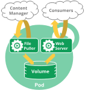<br/>
[출처: 쿠버네티스 공식 문서]

**[파드의 라이프사이클 단계]**<br/>
(파드의 상태는 `kubectl describe pod <파드명>` 명령어를 통해 확인할 수 있습니다.)
- Pending: 파드가 클러스터에 수락되었지만, 하나 이상의 컨테이너가 아직 생성되지 않았거나 준비되지 않은 상태입니다.<br/>이 단계에서는 스케줄링 대기 시간과 이미지 다운로드 시간이 포함됩니다.
- Running: 파드가 노드에 바인딩되고, 모든 컨테이너가 생성된 상태입니다. 최소한 하나의 컨테이너가 실행 중이거나 시작 또는 재시작 중입니다.
- Succeeded: 파드 내 모든 컨테이너가 성공적으로 종료되었으며, 재시작되지 않습니다.
- Failed: 파드 내 모든 컨테이너가 종료되었으며, 하나 이상의 컨테이너가 실패로 종료되었습니다.<br/>이는 컨테이너가 비정상 종료되었거나 시스템에 의해 종료되었음을 의미합니다.
- Unknown: 파드의 상태를 알 수 없는 경우로, 노드와의 통신 오류 등으로 인해 발생할 수 있습니다.

**[파드 내 각 컨테이너의 상태값]**<br/>
(컨테이너의 상태는 `kubectl describe pod <파드명>` 명령어를 통해 확인할 수 있으며, 각 상태에 대한 이유와 종료 코드를 제공합니다.)
- Waiting: 컨테이너가 아직 시작되지 않았으며, 필요한 작업(예: 이미지 다운로드)을 수행 중입니다.
- Running: 컨테이너가 정상적으로 실행 중입니다.
- Terminated: 컨테이너가 실행을 마쳤거나 오류로 종료된 상태입니다.

#### 실제 코드로 확인해보기
아래는 파드를 생성하고 종료하는 과정을 코드로 설명한 예제입니다.

##### 2-1. 파드 정의 (YAML 파일)
먼저, 파드 정의 파일(`pod-example.yaml`)을 작성합니다.<br/>
위 YAML 파일은 `nginx` 이미지를 사용하는 `example-pod`라는 이름의 파드를 정의합니다. `example-container`는 80번 포트를 사용하며, 쿠버네티스가 이를 관리합니다.

```yaml
apiVersion: v1
kind: Pod
metadata:
  name: example-pod
  labels:
    app: example
spec:
  containers:
    - name: example-container
      image: nginx
      ports:
        - containerPort: 80
```

##### 2-2. 파드 생성
쿠버네티스 클러스터에 파드를 생성하기 위해 `kubectl` 명령어를 사용합니다.<br/>
이 명령어를 실행하면 쿠버네티스가 `pod-example.yaml` 파일에 정의된 대로 파드를 생성합니다.

```bash
kubectl apply -f pod-example.yaml
```

##### 2-3. 파드 상태 확인
파드가 정상적으로 실행 중인지 확인하려면 `kubectl get pods` 명령어를 사용합니다.

```bash
kubectl get pods
```

특정 파드의 상세 상태를 확인하려면 다음과 같은 명령어를 사용할 수 있습니다.

```bash
kubectl describe pod example-pod
```

##### 2-4. 파드 종료
파드를 종료하려면 `kubectl delete pod` 명령어를 사용하여 생성된 파드를 삭제합니다.<br/>
이 명령어는 `example-pod`라는 이름의 파드를 종료하고, 클러스터에서 삭제합니다.

```bash
kubectl delete pod example-pod
```


##### 2-5. 파드 라이프사이클에 대한 추가 관리
파드 라이프사이클 훅(예: `preStop`)을 정의하고 싶다면 YAML 파일의 `containers` 항목에 추가할 수 있습니다.<br/>
예를 들어, 파드 종료 전에 특정 명령을 실행하도록 `preStop` 훅을 추가합니다.

```yaml
apiVersion: v1
kind: Pod
metadata:
  name: example-pod
spec:
  containers:
    - name: example-container
      image: nginx
      lifecycle:
        preStop:
          exec:
            command: ["/bin/sh", "-c", "echo 'Terminating...'"]
```

이렇게 하면 파드가 종료되기 직전에 "Terminating..." 메시지를 출력합니다.<br/>
위 과정을 통해 쿠버네티스에서 파드를 생성하고 종료하는 기본적인 흐름을 관리할 수 있습니다.
<br/><br/><br/><br/>

## 배포를 위한 설정 파일 준비
### 1. Kubernetes 설치 및 설정
```bash
# Kubernetes 클러스터 관리를 위해 kubectl 설치
brew install kubectl

# kubectl의 명령어 자동 완성을 설정하면 명령어 입력이 훨씬 편리해집니다.
# 1. bash 사용자
source <(kubectl completion bash)
echo "source <(kubectl completion bash)" >> ~/.bashrc

# 2. zsh 사용자
source <(kubectl completion zsh)
echo "source <(kubectl completion zsh)" >> ~/.zshrc
```

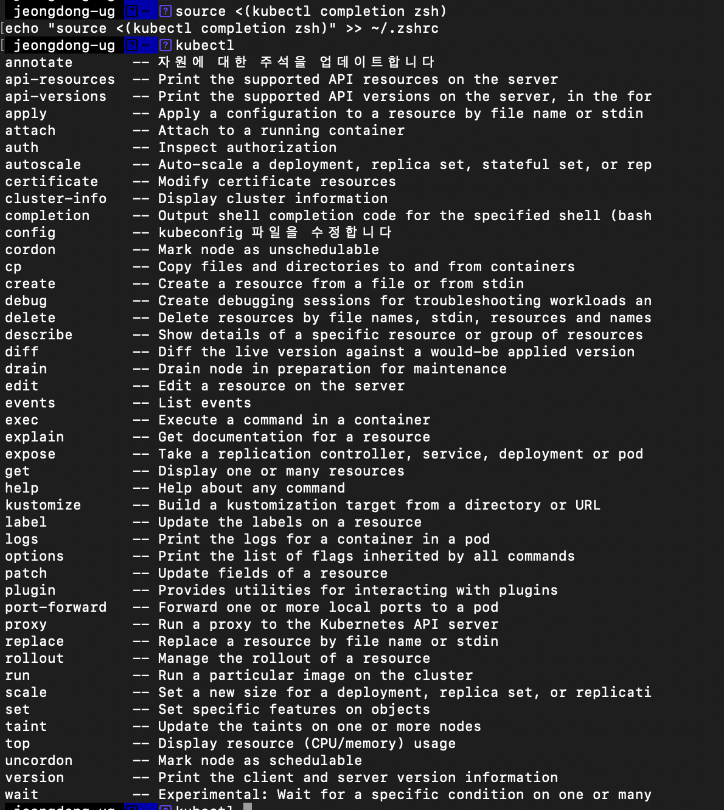
<br/><br/>

### 2. Docker 이미지 생성하기
1. 배포하고 싶은 FastAPI 앱에 대해 **Dockerfile**을 생성합니다.<br/>
```Dockerfile
# FastAPI로 앱 제작 시 예시
FROM python:3.9
WORKDIR /app
COPY . /app
# 필요한 패키지 설치
RUN apt-get update && apt-get install -y libgl1-mesa-glx
# 의존성 설치
RUN pip install --upgrade pip
RUN pip install --no-cache-dir -r requirements.txt
# 서비스 실행
CMD ["uvicorn", "main:app", "--host", "0.0.0.0", "--port", "8000"]
```

2. 명령어를 사용해 이미지를 생성합니다.<br/>
```bash
# 예시
docker build -t my-fastapi-app:latest .
```
<br/><br/><br/><br/>

## Kubernetes 설정
### 1. Kubernetes Deployment 리소스 정의하기(Deployment.yaml)
Kubernetes에서 각 FastAPI 앱을 배포하려면 **Deployment**와 **Service** 리소스를 정의합니다.<br/>
Deployment 리소스는 FastAPI 앱을 실행하는 Pod을 관리하고, Service 리소스는 Pod에 대한 로드 밸런싱을 제공합니다.<br/>

**[예시 - 1GB 메모리와 1.0 CPU 코어 설정]**<br/>
```yaml 
apiVersion: apps/v1
kind: Deployment
metadata:
  name: fastapi-app
spec:
  replicas: 3
  selector:
    matchLabels:
      app: fastapi-app
  template:
    metadata:
      labels:
        app: fastapi-app
    spec:
      containers:
      - name: fastapi-app
        image: my-fastapi-app:latest
        resources:
          requests:
            memory: "1Gi"   # 최소 1GB 메모리
            cpu: "1000m"    # 최소 1.0 CPU 코어
          limits:
            memory: "1Gi"   # 최대 1GB 메모리
            cpu: "1000m"    # 최대 1.0 CPU 코어
```
<br/><br/><br/><br/>

### 2. Kubernetes Service 리소스 정의하기(Service.yaml)
Service 리소스는 Deployment 리소스로 생성된 Pod에 대한 로드 밸런싱을 제공합니다.<br/>
Pod에 대한 로드 밸런싱을 위해 **ClusterIP** 타입을 사용하며, **NodePort** 타입을 사용할 수도 있습니다.<br/>

**[예시 - ClusterIP 타입]**<br/>
```yaml
apiVersion: v1
kind: Service
metadata:
  name: fastapi-service
spec:
  selector:
    app: fastapi-app
  ports:
    - protocol: TCP
      port: 80
      targetPort: 8000  # FastAPI 컨테이너 내부 포트
  type: ClusterIP
```
<br/><br/>


### 3. Horizontal Pod Autoscaler 설정하기
#### 3-1. 스케일 아웃 조건 설정하기
CPU나 메모리 사용량이 50%를 넘으면 자동으로 스케일 아웃되도록 **Horizontal Pod Autoscaler(HPA)**를 설정합니다.<br/>
CPU 사용량을 기반으로 설정할 시 Kubernetes에서 명령어로 쉽게 HPA를 설정할 수 있습니다.<br/>
```bash
kubectl autoscale deployment fastapi-app --min=3 --max=10 --cpu-percent=50
```

#### 3-2. 스케일 인 조건 설정
기본적으로 Kubernetes는 리소스 사용량이 줄어들면 자동으로 스케일 인이 되지만, 일정시간 지연 시간을 두고 싶다면 `-horizontal-pod-autoscaler-downscale-stabilization` 플래그로 시간 조건을 추가할 수 있습니다.<br/>
하지만 이렇게 명령어를 사용하는 것 보다는 **HPA 리소스 파일**을 사용하는 것이 더 재사용성 및 확장성이 높아 권장됩니다.<br/>

**[예시 - 50% 이하로 내려온 상태로 5분이상 지속될 시 스케일인 진행]**<br/>
```bash
kubectl autoscale deployment fastapi-app --min=3 --max=10 --cpu-percent=50 --horizontal-pod-autoscaler-downscale-stabilization=5m
```
<br/><br/><br/><br/>

### 4. Kubernetes 리소스 파일로 설정 적용하기
`deployment.yaml`, `service.yaml`, `hpa.yaml`와 같은 파일명을 사용할 수 있습니다.

#### 4-1. 파일 구조 예시
```bash
project-root/
└── k8s/
    ├── deployment.yaml   # Deployment 관리 파일
    ├── service.yaml      # Service 관리 파일
    └── hpa.yaml          # Horizontal Pod Autoscaler 관리 파일
```

#### 4-2. 파일 내용
각 조건을 충족하는 파일들을 아래와 같이 작성할 수 있습니다.

**[`deployment.yaml` (Deployment 설정 파일)]**<br/>
아래 글을 설정하기 전에 `export KUBECONFIG="$(kind get kubeconfig-path --name=<클러스터_이름>)"`을 통해 kind의 docker 클러스터 kubectl이 접속 가능해야 합니다.<br/>

```yaml
apiVersion: apps/v1
kind: Deployment
metadata:
  name: fastapi-app
  labels:
    app: fastapi-app
spec:
  replicas: 1  # 초기 파드 개수
  selector:
    matchLabels:
      app: fastapi-app
  template:
    metadata:
      labels:
        app: fastapi-app
    spec:
      containers:
        - name: fastapi-app
          image: my-fastapi-app:latest  # 로컬에서 빌드한 이미지 사용
          imagePullPolicy: Never        # 이미지를 당겨오지 않고 로컬 이미지를 사용
          resources:
            requests:          # 요청한 최소 리소스
              memory: "512Mi"  # 최소 512Mb 메모리 요청
              cpu: "500m"      # 최소 0.5 CPU 코어 요청
            limits:            # 최대 사용 가능한 리소스
              memory: "1Gi"    # 최대 1GB 메모리
              cpu: "1000m"     # 최대 1.0 CPU 코어
          ports:
            - containerPort: 8000
```

**[`service.yaml` (Service 설정 파일)]**<br/>
```yaml
apiVersion: v1
kind: Service
metadata:
  name: fastapi-service
spec:
  selector:
    app: fastapi-app
  ports:
    - protocol: TCP
      port: 80
      targetPort: 8000  # FastAPI 컨테이너 내부 포트
  type: ClusterIP
```

**[`hpa.yaml` (Horizontal Pod Autoscaler 설정 파일)]**<br/>
```yaml
apiVersion: autoscaling/v2
kind: HorizontalPodAutoscaler
metadata:
  name: fastapi-app-hpa
spec:
  scaleTargetRef:
    apiVersion: apps/v1
    kind: Deployment
    name: fastapi-app
  minReplicas: 1
  maxReplicas: 5
  behavior:
    scaleDown:
      stabilizationWindowSeconds: 300  # 5분 동안 CPU/Memory가 50% 이하로 유지되어야 스케일 인
  metrics:
  - type: Resource
    resource:
      name: cpu
      target:
        type: Utilization
        averageUtilization: 50  # CPU 사용량 50% 이상 시 스케일 아웃
  - type: Resource
    resource:
      name: memory
      target:
        type: Utilization
        averageUtilization: 50  # Memory 사용량 50% 이상 시 스케일 아웃
```

#### 4-3. 파일 적용 방법
아래 kubectl 명령어를 사용하여 각각 적용할 수 있습니다.<br/>
```bash
# Docker Desktop을 사용하는 경우
brew install kind

# Kubernetes Cluster 생성
kind create cluster --name my-cluster

# Deployment, Service, HPA 리소스 파일 적용
kubectl apply -f k8s/deployment.yaml
kubectl apply -f k8s/service.yaml
kubectl apply -f k8s/hpa.yaml

# 추후 문제가 있을 시 삭제 방법
kubectl delete -f k8s/deployment.yaml
kubectl delete -f k8s/service.yaml
kubectl delete -f k8s/hpa.yaml
```

<br/><br/><br/><br/>


---
# Kubernetes 클러스터에 배포 및 모니터링 방법
## 1. 위 설정 파일 기반으로 Kubernetes 클러스터에 배포하기
설정 파일을 통해 Kubernetes 클러스터에 처음으로 애플리케이션을 배포하는 과정을 안내드리겠습니다.<br/>
배포 과정에서 자주 발생하는 문제와 배포 후의 확인 절차도 함께 설명하니, 하나씩 꼼꼼히 따라가시면 됩니다.

### 1-1 클러스터 초기 준비사항
Kubernetes에 애플리케이션을 배포하기 전 준비가 필요합니다. 배포 준비 과정에서는 아래 사항을 꼭 확인하세요.


1. **Dockerfile Build 해두기**<br/>
   `Docker`가 설치되어 있는 상태여야 합니다.<br/>
    ```bash
    docker build -t my-fastapi-app:latest .
    ```

2. **kubectl 설치 확인**<br/>
   `kubectl`이 설치되어 있고, 클러스터에 연결된 상태여야 합니다.<br/>
    ```bash
    kubectl version --client
    ```

   이 명령어로 `kind` 클라이언트가 정상적으로 설치되어 있는지 확인하세요. 설치가 되어 있지 않다면, Homebrew를 사용해 설치할 수 있습니다<br/>
    ```bash
    brew install kind
    ```
   
   이 명령어로 `kubectl` 클라이언트가 정상적으로 설치되어 있는지 확인하세요. 설치가 되어 있지 않다면, Homebrew를 사용해 설치할 수 있습니다<br/>
    ```bash
    brew install kubectl
    ```
3. **Kubernetes 클러스터 생성 및 Docker 이미지 로드 방법**<br/>
   아래 명령어를 활용해 클러스터 생성
    ```bash
    # 클러스터 생성
    kind create cluster --name my-cluster
    # 추후 문제가 있을 시 삭제 방법
    kind delete cluster --name my-cluster
   
    # 생성된 클러스터 확인
    kind get clusters
    kubectl config get-contexts
    ```
4. **Kubernetes 클러스터 연결 확인**<br/>
   클러스터와의 연결 상태를 확인해 봅니다. 클러스터의 노드 목록이 출력되면 연결이 잘 된 상태입니다. 노드가 출력되지 않는다면 클러스터 설정을 다시 확인해 주세요.<br/>
    ```bash
    kubectl get nodes
    ```

**[실제 예시]**<br/>
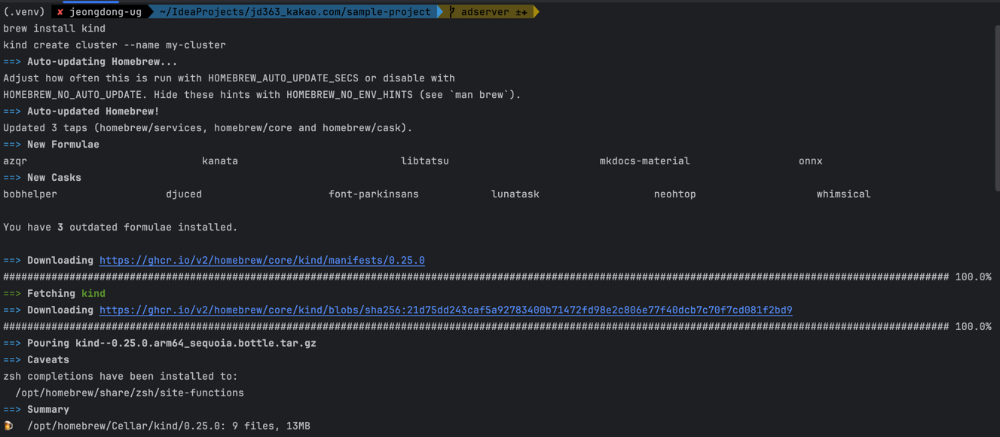<br/>
kind를 사용하여 클러스터를 생성하고, `kubectl get nodes` 명령어로 노드 목록을 확인합니다.

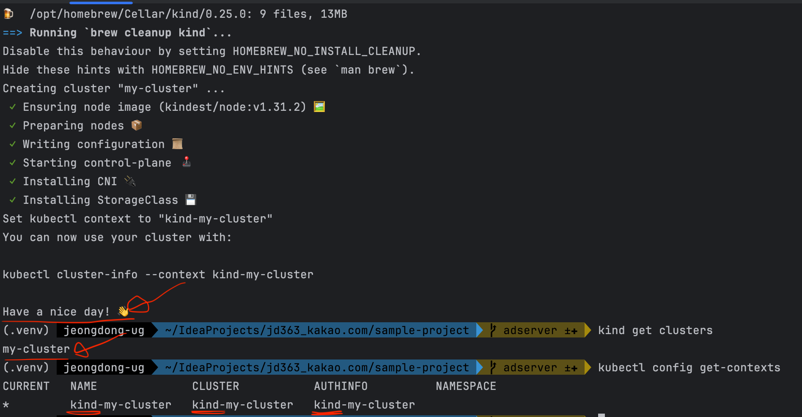<br/>
설치되고 나면 위와 같이 확인 가능합니다.

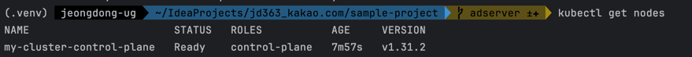<br/>
컨트롤 플레인 노드가 마스터 노드라고 생각하면 됩니다 > 상단의 공식 홈페이지 이미지 참조
<br/><br/>


### 1-2 배포 파일 구조 재확인
클러스터에 배포할 때, 파일 구조가 정확해야 하며 설정 파일이 올바른 디렉터리에 있어야 합니다.<br/>
이 가이드에서는 `k8s` 폴더에 배포와 관련된 YAML 파일을 저장하도록 했습니다.<br/>
이제 YAML 파일을 차례로 `kubectl apply` 명령어로 클러스터에 적용하겠습니다.

```plaintext
project-root/
└── k8s/
    ├── deployment.yaml   # Deployment 설정 파일
    ├── service.yaml      # Service 설정 파일
    └── hpa.yaml          # Horizontal Pod Autoscaler 설정 파일
```

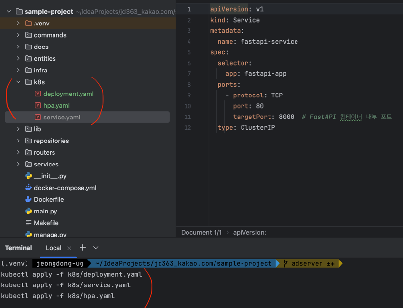

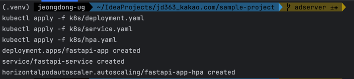

<br/><br/>

### 1-3 Deployment 설정 파일 배포하기
1. **Deployment 적용**<br/>
   먼저 `deployment.yaml` 파일을 사용하여 애플리케이션을 배포합니다. 이 파일에는 Pod이 생성될 리소스 제한과 레이블이 포함되어 있어, Kubernetes가 각 Pod을 관리할 수 있도록 합니다.<br/>
   이 명령어를 실행하면 설정된 Deployment가 클러스터에 적용되며, 지정된 수만큼의 Pod이 생성되기 시작합니다. 여기서 주의해야 할 점은 명령어 실행 후 로그에 오류가 없는지 확인하는 것입니다. 예를 들어, YAML 형식 오류나 잘못된 이미지 태그로 인해 배포가 실패할 수 있습니다. 이러한 오류는 콘솔 로그에 즉시 표시됩니다.<br/>
    ```bash
    kubectl apply -f k8s/deployment.yaml
    ```
2. **Deployment 상태 확인**<br/>
   Deployment가 제대로 적용되었는지 확인하기 위해 다음 명령어를 사용해 상태를 확인하세요.<br/>
   출력 결과에서 배포가 정상적으로 진행되고 있는지, `READY` 상태가 목표한 Pod 개수와 일치하는지 확인합니다. 만약 Pod 개수가 준비되지 않았다면 이미지 다운로드나 리소스 설정을 다시 확인해야 합니다.<br/>
    ```bash
    kubectl get deployments
    ```
<br/><br/>

### 1-4 Service 설정 파일 배포하기
Deployment가 준비되면, 이제 Pod을 외부와 연결해줄 **Service** 리소스를 설정하겠습니다.

1. **Service 적용**<br/>
   이 명령어로 Service가 설정되면, Deployment와 연결되어 Pod에 트래픽이 전달될 수 있습니다.<br/>
    ```bash
    kubectl apply -f k8s/service.yaml
    ```
2. **Service 상태 확인**<br/>
   다음 명령어로 Service가 정상적으로 생성되었는지 확인합니다.<br/>
   여기서 `CLUSTER-IP`와 포트가 올바르게 노출되고 있는지 확인하세요. 특히, 외부 트래픽을 받을 수 있는 **NodePort**나 **LoadBalancer** 유형으로 설정하지 않았다면 로컬 네트워크 안에서만 접근 가능합니다.<br/>
    ```bash
    kubectl get services
    ```
3. **Pod 및 Service 연결 확인**<br/>
   Service가 Deployment와 올바르게 연결되었는지, `kubectl describe service fastapi-service` 명령어로 확인할 수 있습니다. Service가 어느 Pod에 트래픽을 라우팅하는지와 포트 정보 등이 나옵니다.
<br/><br/>

### 1-5 Horizontal Pod Autoscaler(HPA) 설정 파일 배포하기
이제 트래픽 증가에 대비해 설정한 **HPA** 파일을 배포합니다. 이 파일은 Pod의 CPU 또는 메모리 사용량에 따라 자동으로 스케일 조절이 가능하도록 합니다.

1. **HPA 적용**<br/>
   HPA가 설정되면, Kubernetes는 자동으로 리소스 사용량을 모니터링하며 설정된 임계값에 도달할 때 Pod 수를 늘리거나 줄이게 됩니다.<br/>
    ```bash
    kubectl apply -f k8s/hpa.yaml
    ```
2. **HPA 상태 확인**:
   다음 명령어로 HPA가 올바르게 작동하는지 확인합니다.
   HPA의 `TARGETS` 열에서 CPU와 메모리 사용률이 설정된 조건에 도달하면 스케일 조정이 진행됩니다. 사용률이 반영되기까지 약간의 시간이 걸릴 수 있으니 1-2분 정도 기다렸다가 확인해 보세요.
    ```bash
    kubectl get hpa
    ```
<br/><br/>

### 1-6 배포할 이미지 Kind에 로드하기
**Docker 이미지 로드**: 본인이 빌드한 도커 이미지를 Kind에 로드 후 kubernetes가 인식할 수 있도록 합니다.<br/>
(**이렇게 안하면 이미지를 찾을 수 없다는 에러가 발생합니다!!**)

```bash
kind load docker-image <your-app>:latest --name <cluster-name>
```

**[실제 예시]**<br/>
```bash
# 로컬 Docker 이미지를 kind로 생성한 클러스터에 로딩 시키는 코드
kind load docker-image my-fastapi-app:latest --name my-cluster

# 해당 이미지가 로드 되었는지 체크
kubectl kubectl get deployments
```

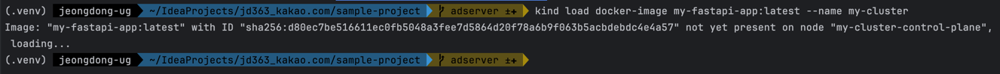<br/>
본인이 빌드한 도커 이미지를 클러스터에 로드

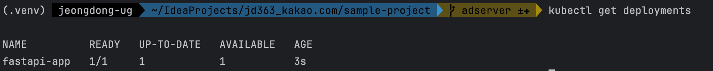<br/>
이미지가 정상 실행되었는지 체크

위 과정에서 실수가 있었으면 처음하실 때는 그냥 클러스터부터 삭제하시고 다시 시작하는 것을 추천드립니다. ㅋㅋㅋㅋ
<br/><br/>

### 1-7 배포 후 Pod 상태 확인 및 문제 해결
1. **Pod 상태 점검**<br/>
   `kubectl get pods` 명령어로 모든 Pod의 상태를 확인하세요. Pod이 정상적으로 `Running` 상태인지 확인하고, `STATUS`가 `Pending`이나 `CrashLoopBackOff`인 경우 리소스 제한 또는 설정 오류일 수 있습니다.
2. **Pod 로그 확인**<br/>
   배포 중에 문제가 발생하거나 특정 Pod에서 오류가 발생할 경우 다음 명령어로 Pod의 로그를 확인할 수 있습니다.<br/>
   오류 메시지와 스택 트레이스를 분석해, 잘못된 설정이 있는지, 리소스가 부족한지 등을 파악합니다.<br/>
    ```bash
    # pod명 확인
    kubectl get pods
    # pod 로그 확인
    kubectl logs <pod-name>
    ```
   
   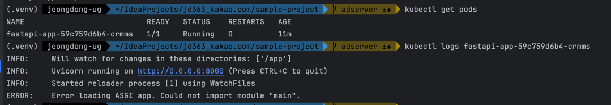<br/>
   <br/><br/>
3. **Event 확인**<br/>
   문제가 있는 Pod이나 서비스에서 발생한 이벤트를 통해 오류 원인을 찾을 수도 있습니다.<br/>
   이 명령어를 사용해 Event 섹션에서 자세한 오류 메시지를 확인할 수 있습니다.<br/>
    ```bash
    # pod명 확인
    kubectl get pods
    # pod 상세 정보 확인
    kubectl describe pod <pod-name>
    ```

   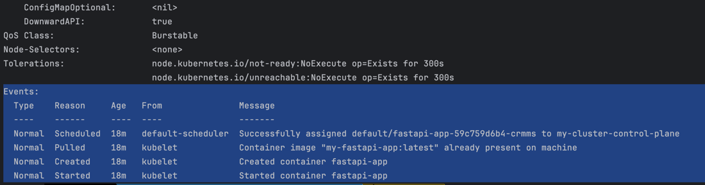<br/>
   <br/>
   위 단계를 통해 Kubernetes 클러스터에 설정 파일을 기반으로 FastAPI 애플리케이션을 배포한 모습입니다.<br/>
<br/><br/><br/><br/>

---
## 2. Kubernetes 클러스터 모니터링하기
Kubernetes 클러스터에 배포한 애플리케이션이 안정적으로 작동하는지, 리소스 사용량이 적정한지 확인하기 위해 모니터링은 필수적입니다. 모니터링 방법을 단계별로 안내하겠습니다.

### 2-1 기본 모니터링 명령어 활용하기
배포된 리소스 상태를 간단히 점검하려면 Kubernetes의 기본 명령어들을 사용할 수 있습니다.

1. **Pod 상태 모니터링**<br/>
   Pod의 `STATUS` 열이 `Running`인지 확인합니다. `Pending`이나 `CrashLoopBackOff` 상태인 경우 문제가 있을 수 있습니다.<br/>
    ```bash
    kubectl get pods
    ```
2. **Deployment 상태 모니터링**<br/>
   `READY` 열의 숫자가 기대한 Pod 수와 일치하는지 확인합니다.<br/>
    ```bash
    kubectl get deployments
    ```
3. **Service 상태 모니터링**<br/>
   Service가 올바르게 설정되어 있는지 확인하고, 포트 및 IP 정보가 정확한지 확인합니다.<br/>
    ```bash
    kubectl get services
    ```
4. **Horizontal Pod Autoscaler(HPA) 상태 모니터링**<br/>
   `TARGETS` 열에서 CPU와 메모리 사용률이 설정된 임계값에 맞춰 스케일 조정이 되고 있는지 확인할 수 있습니다. HPA가 정상 작동하고 있는지 주기적으로 모니터링하세요.<br/>
    ```bash
    kubectl get hpa
    ```
<br/><br/>

### 2-2 리소스 사용량 모니터링하기
Kubernetes에서 Pod 및 노드의 리소스 사용량을 모니터링하려면 `Metrics Server`가 필요합니다. `Metrics Server`는 CPU와 메모리 사용량을 실시간으로 수집해주는 컴포넌트입니다.

1. **Pod 모니터링을 위한 metrics-server-deployment.yaml 생성**<br/>
   metrics-server-deployment.yaml이라는 새로운 파일을 k8s 디렉토리에 추가하여 Metric Server 설정을 포함하고 `--kubelet-insecure-tls` 플래그를 추가해 TLS 인증을 무시하도록 설정합니다.<br/>
      ```yaml
      apiVersion: apps/v1
      kind: Deployment
      metadata:
        name: metrics-server
        namespace: kube-system
        labels:
          k8s-app: metrics-server
      spec:
        selector:
          matchLabels:
            k8s-app: metrics-server
        template:
          metadata:
            labels:
              k8s-app: metrics-server
          spec:
            containers:
              - name: metrics-server
                image: k8s.gcr.io/metrics-server/metrics-server:v0.6.1
                args:
                  - --cert-dir=/tmp
                  - --secure-port=10250
                  - --kubelet-preferred-address-types=InternalIP
                  - --kubelet-insecure-tls  # TLS 인증 무시 플래그
                  - --kubelet-use-node-status-port
                ports:
                  - containerPort: 10250
                    name: https
                volumeMounts:
                  - name: tmp-dir
                    mountPath: /tmp
            nodeSelector:
              kubernetes.io/os: linux
            serviceAccountName: metrics-server
            volumes:
              - name: tmp-dir
                emptyDir: {}
      ```
2. **Metric Server 적용**<br/>
  작성한 metrics-server-deployment.yaml 파일을 사용하여 Metric Server를 배포합니다.<br/>(**리소스부터 반드시 먼저 다운로드해주세요**)<br/>
   ```bash
   # 모니터링을 위해 Metric Server 설치
   kubectl apply -f https://github.com/kubernetes-sigs/metrics-server/releases/latest/download/components.yaml
       
   # deployment 추가(yaml을 이용해 설치한 Metric Server에 --kubelet-insecure-tls 플래그 추가)
   kubectl apply -f k8s/metrics-server-deployment.yaml
   # 추후 문제가 있을 시 삭제 방법
   kubectl delete deployment metrics-server -n kube-system
      
   # 명령어를 통해 metric server 정상 실행 확인(이거 로딩되는데 1~2분 걸릴 수 있습니다만, 그 이상 걸리면 뭔가 문제가 있는거니 metric server 및 관련 deployment를 delete하고 다시 설치해주세요)
   kubectl get deployments -n kube-system 
   ```

   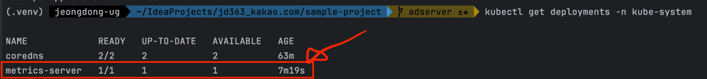<br/>
3. **Pod 리소스 사용량 확인**<br/>
   ```bash
   # Pod 리소스 사용량 확인
   kubectl top pods
   # pod명 확인
   kubectl get pods
   # 특정 Pod의 리소스 사용량 확인
   kubectl top pod <pod-name>
   ```

   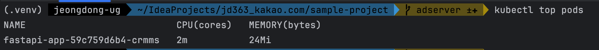<br/>
   배포 후 Pod 및 Service의 상태를 점검하고, 리소스 사용량에 따라 자동으로 스케일 조정이 가능하도록 설정하는 데까지 완료했습니다.
<br/><br/>

### 2-3 실시간 모니터링 및 시각화 도구 활용
기본 명령어 외에도 Kubernetes 모니터링 도구를 활용해 더 심도 있는 데이터를 수집하고, 시각화할 수 있습니다. 대표적인 도구로 **Prometheus**와 **Grafana**가 있습니다.

1. **Prometheus 설치 및 설정**
    - Prometheus는 Kubernetes의 리소스 사용 데이터를 수집하는 오픈 소스 모니터링 시스템입니다. Helm을 통해 Prometheus를 간단히 설치할 수 있습니다.
        ```bash
        helm repo add prometheus-community https://prometheus-community.github.io/helm-charts
        helm install prometheus prometheus-community/kube-prometheus-stack
        ```
    - 설치가 완료되면 Prometheus는 Kubernetes 리소스를 모니터링하고 수집된 데이터를 저장합니다.
2. **Grafana를 통해 시각화**
    - Grafana는 Prometheus와 연동해 리소스 사용량 데이터를 실시간으로 시각화할 수 있습니다.
    - Helm을 사용하여 Grafana를 설치합니다.
        ```bash
        helm install grafana grafana/grafana
        ```
    - 설치 후, Kubernetes 클러스터 내에 생성된 Grafana 대시보드에 접근하여 리소스 사용량, HPA의 자동 스케일링 동작 여부 등을 시각화하여 한눈에 확인할 수 있습니다.
3. **Grafana 대시보드 설정**
    - Grafana에 Prometheus 데이터를 소스로 추가하여 Kubernetes 관련 시각화 대시보드를 생성합니다.
    - Grafana의 기본 로그인 정보는 `admin/admin`이며, 로그인 후 데이터를 시각적으로 분석하고 대시보드를 커스터마이징할 수 있습니다.
<br/><br/>

### 2-4 알람 설정하기
모니터링은 문제가 발생했을 때 빠르게 대응하는 것이 목적이므로, 특정 상황에서 알람을 설정하는 것이 좋습니다. 예를 들어 CPU 사용량이 80% 이상이거나 Pod이 재시작될 때 알람이 울리도록 설정할 수 있습니다.

1. **Prometheus Alertmanager 설정**
    - Prometheus Alertmanager를 통해 특정 조건이 충족되면 알림을 보내도록 설정합니다.
    - 예를 들어, 특정 리소스 사용률이 80%를 초과하는 경우 이메일 또는 Slack을 통해 알림을 받을 수 있습니다.
2. **Grafana Alert 설정**
    - Grafana에서도 알림 조건을 설정할 수 있습니다. 특정 대시보드에서 설정한 지표가 일정 임계값을 넘으면 알림을 받도록 설정할 수 있습니다.
      <br/><br/>

이와 같은 모니터링 과정을 통해 Kubernetes 클러스터와 애플리케이션 상태를 실시간으로 점검할 수 있습니다.<br/>
`kubectl top` 명령어로 간단한 모니터링을 수행하고, Prometheus 및 Grafana와 같은 도구로 상세 모니터링 및 시각화를 진행하여 클러스터 상태를 지속적으로 확인하는 것이 좋습니다.
<br/><br/><br/><br/>

---
## 3. Kubernetes 클러스터 스케일링하기
Kubernetes 클러스터에서 애플리케이션의 트래픽 증가나 감소에 따라 자동으로 리소스를 확장하거나 축소하여 비용 효율적이고 안정적인 서비스를 제공할 수 있습니다. 이 과정에서는 **자동 스케일링**과 **수동 스케일링**을 모두 살펴보겠습니다.

### 3-1 수동 스케일링
때로는 예상 트래픽 증가나 특별한 상황에 대비해 수동으로 Pod 수를 조정하는 것이 필요할 수 있습니다.<br/>
Kubernetes에서는 간단한 명령어로 Pod 개수를 수동으로 조정할 수 있습니다.

1. **Deployment 수동 스케일링**<br/>
   이 명령어를 통해 `fastapi-app` Deployment의 Pod 개수를 5개로 조정할 수 있습니다. `--replicas` 옵션의 숫자를 조정하여 원하는 만큼 Pod을 늘리거나 줄일 수 있습니다.<br/>
    ```bash
    kubectl scale deployment fastapi-app --replicas=5
    ```
2. **수동 스케일링 상태 확인**<br/>
   `READY` 열에 표시된 Pod 수가 목표치와 일치하는지 확인하세요. Kubernetes는 스케일 조정 후 Pod이 필요한 리소스를 사용할 수 있을 때까지 배포 상태를 지속적으로 업데이트합니다.<br/>
    ```bash
    kubectl get deployment fastapi-app
    ```
<br/><br/>

### 3-2 자동 스케일링 (Horizontal Pod Autoscaler)
자동 스케일링은 트래픽이 많아지거나 리소스 사용량이 증가할 때 Kubernetes가 자동으로 Pod을 확장하거나 축소하는 기능을 제공합니다. HPA(Horizontal Pod Autoscaler)를 설정하면 CPU 및 메모리 사용량을 기준으로 자동 스케일링을 구현할 수 있습니다.

1. **HPA 설정 파일 작성**`hpa.yaml` 파일에 다음과 같이 정의할 수 있습니다.<br/>
    - `minReplicas`: 최소로 유지할 Pod 수를 설정합니다.
    - `maxReplicas`: 최대 Pod 수를 설정해 무한 확장을 방지합니다.
    - `metrics`: 스케일링 기준을 정의하며, CPU 및 메모리 사용률을 동시에 설정할 수 있습니다. 예를 들어, CPU 또는 메모리 사용률이 50%를 초과하면 스케일 아웃이 발생합니다.<br/>
    ```yaml
    apiVersion: autoscaling/v2
    kind: HorizontalPodAutoscaler
    metadata:
      name: fastapi-app-hpa
    spec:
      scaleTargetRef:
        apiVersion: apps/v1
        kind: Deployment
        name: fastapi-app
      minReplicas: 1
      maxReplicas: 10
      metrics:
      - type: Resource
        resource:
          name: cpu
          target:
            type: Utilization
            averageUtilization: 50
      - type: Resource
        resource:
          name: memory
          target:
            type: Utilization
            averageUtilization: 50
    
    ```
2. **HPA 적용**`kubectl apply -f k8s/hpa.yaml` 명령어로 HPA 설정을 적용합니다.
3. **HPA 동작 확인**<br/>
   `TARGETS` 열을 통해 설정된 CPU 및 메모리 사용률이 임계값에 도달했는지 확인할 수 있습니다. 임계값을 초과할 경우 HPA는 자동으로 스케일 아웃을 시작하며, 반대로 사용률이 낮아지면 스케일 인을 실행합니다.<br/>
    ```bash
    kubectl get hpa
    ```
<br/><br/>

### 3-3 클러스터 노드 스케일링 (Cluster Autoscaler)
Pod의 개수가 증가하면서 클러스터 전체 리소스가 부족해질 경우, 노드를 추가하거나 제거하는 **Cluster Autoscaler** 기능을 사용할 수 있습니다. 이는 클러스터의 자동 스케일링을 통해 트래픽이나 부하에 유연하게 대응할 수 있게 합니다.
1. **Cluster Autoscaler 설치**<br/>
   GKE, EKS, AKS 등 대부분의 관리형 Kubernetes 서비스에서는 Cluster Autoscaler가 기본적으로 제공되며, 설정만 활성화하면 됩니다. 만약 클러스터에 직접 설치할 경우 다음과 같이 Helm을 통해 설치할 수 있습니다.<br/>
    ```bash
    helm repo add autoscaler https://kubernetes.github.io/autoscaler
    helm install cluster-autoscaler autoscaler/cluster-autoscaler
    ```
2. **Cluster Autoscaler 설정 확인**<br/>
   설치 후, Cluster Autoscaler는 자동으로 노드 수를 조절해 클러스터 리소스를 관리합니다. `kubectl logs -f <cluster-autoscaler-pod-name>` 명령어를 사용해 로그를 확인할 수 있으며, 리소스 부족 시 노드 추가가 진행되는지 확인할 수 있습니다.
<br/><br/>

### 3-4 스케일링 상태 모니터링
1. **스케일링 이벤트 모니터링**`kubectl describe hpa fastapi-app-hpa` 명령어로 스케일 아웃 및 스케일 인 이벤트의 상세 로그를 확인할 수 있습니다. 이를 통해 스케일 조정이 제대로 이루어지고 있는지, 현재 설정이 적절한지 판단할 수 있습니다.
2. **스케일링 조건 튜닝**<br/>
   만약 트래픽이 급증하거나 예기치 않은 리소스 부족이 발생할 경우, HPA의 임계값을 조정하여 스케일링 조건을 최적화할 수 있습니다. 임계값 조정 시, 리소스 소비량과 응답 성능을 동시에 고려하여 설정하세요.
   <br/><br/>

이와 같이 Kubernetes에서는 수동, 자동, 클러스터 스케일링 기능을 모두 제공해 다양한 상황에 대응할 수 있습니다. 각 스케일링 방법을 필요에 맞게 조합하여 클러스터의 안정성과 효율성을 유지할 수 있습니다.
<br/><br/><br/><br/>

---
## 4. Kubernetes 클러스터 업데이트하기
Kubernetes 클러스터에서 애플리케이션을 운영하다 보면 새로운 기능 추가나 버그 수정으로 인해 애플리케이션을 업데이트해야 할 때가 있습니다.<br/>
Kubernetes에서는 애플리케이션을 무중단으로 업데이트하기 위한 다양한 옵션을 제공합니다. <br/>
이번 섹션에서는 Kubernetes 리소스를 업데이트하는 여러 방법을 알아보겠습니다.<br/>

### 4-1 설정 파일을 통한 Deployment 업데이트
Kubernetes에서 애플리케이션을 업데이트하는 가장 일반적인 방법은 설정 파일을 수정한 후 다시 적용하는 것입니다.<br/>
예를 들어, 이미지를 최신 버전으로 변경하거나, 환경 변수를 추가하는 등의 수정이 필요할 때 YAML 파일을 수정하여 적용할 수 있습니다.

1. **설정 파일 수정**`deployment.yaml` 파일에서 새로운 이미지 태그나 환경 변수를 추가하는 등 필요한 업데이트 내용을 수정합니다.<br/>
   예를 들어, `image` 필드에서 애플리케이션 버전을 최신 버전으로 업데이트합니다.<br/>
    ```yaml
    spec:
      containers:
      - name: fastapi-app
        image: my-fastapi-app:v2.0  # 새 버전의 이미지로 업데이트
        # ... 기타 환경 변수 추가
    ```
2. **변경 사항 적용**<br/>
   수정된 설정 파일을 클러스터에 적용합니다.<br/>
   `kubectl apply` 명령어는 현재 설정된 리소스와 비교하여 변경 사항이 있는 부분만 적용하기 때문에, 클러스터에 무중단으로 업데이트를 적용할 수 있습니다.<br/>
    ```bash
    kubectl apply -f k8s/deployment.yaml
    ```
<br/><br/>

### 4-2 `kubectl set` 명령어로 특정 설정 업데이트하기
`kubectl set` 명령어를 사용하면 설정 파일을 수정하지 않고도 특정 필드를 빠르게 업데이트할 수 있습니다. <br/>
예를 들어, 컨테이너 이미지를 업데이트할 때 `kubectl set image` 명령어를 사용할 수 있습니다.

1. **이미지 업데이트**<br/>
   다음 명령어로 `fastapi-app` Deployment의 컨테이너 이미지를 새로운 버전으로 즉시 업데이트합니다.<br/>
   이 명령어는 설정 파일 없이도 업데이트가 가능하여, 빠르게 업데이트해야 하는 경우 유용합니다.<br/>
    ```bash
    kubectl set image deployment/fastapi-app fastapi-app=my-fastapi-app:v2.0
    ```
2. **업데이트 결과 확인**<br/>
   업데이트가 진행되는 동안 `kubectl get pods` 명령어로 새 버전의 Pod이 배포되는 과정을 확인할 수 있습니다. 기존 Pod이 점진적으로 교체되며 새 버전의 이미지로 업데이트됩니다.
<br/><br/>

### 4-3 Rolling Update 확인하기
Kubernetes의 `Rolling Update` 방식은 기존 Pod을 점진적으로 교체하여 무중단 배포를 가능하게 합니다.<br/>
새 버전의 Pod이 준비 상태에 도달하면 기존 Pod을 순차적으로 종료하고 새 Pod로 교체합니다. 이로 인해 서비스 중단 없이 업데이트가 진행됩니다.

1. **업데이트 진행 상태 확인**<br/>
   업데이트 중인 Deployment의 상태를 다음 명령어로 확인할 수 있습니다.<br/>
   이 명령어는 업데이트가 완료될 때까지 현재 진행 상황을 표시합니다.<br/>
    ```bash
    kubectl rollout status deployment/fastapi-app
    ```
2. **업데이트 완료 확인**<br/>
   업데이트가 완료되면, `kubectl get pods` 명령어로 모든 Pod이 새 버전으로 교체되었는지 확인합니다.<br/>
   새로운 Pod이 `Running` 상태로 변경되었는지, 그리고 `READY` 상태가 모두 충족되었는지 확인하여 업데이트가 성공적으로 완료되었는지 검토합니다.
<br/><br/>

### 4-4 환경 변수를 통한 설정 변경
Kubernetes Deployment에서 특정 환경 변수만 업데이트할 필요가 있을 때는 설정 파일을 통해 환경 변수를 추가하거나 수정하여 무중단 업데이트를 진행할 수 있습니다.

1. **환경 변수 추가**<br/>
   `deployment.yaml` 파일에 새로운 환경 변수를 추가합니다.<br/>
    ```yaml
    env:
    - name: APP_ENV
      value: "production"
    - name: NEW_FEATURE_FLAG
      value: "enabled"
    ```
2. **업데이트 적용**<br/>
   설정 파일을 적용하여 변경 사항을 반영합니다.<br/>
    ```bash
    kubectl apply -f k8s/deployment.yaml
    ```
3. **변경 사항 확인**<br/>
   업데이트된 환경 변수가 각 Pod에 적용되었는지 확인하려면 다음 명령어를 사용합니다.<br/>
   `Env` 섹션에서 추가된 환경 변수가 올바르게 반영되었는지 확인합니다.<br/>
    ```bash
    kubectl describe pod <pod-name>
    ```
<br/><br/>

### 4-5 업데이트 기록 관리 및 롤백 준비
업데이트는 항상 의도한 대로 진행되지 않을 수 있으므로, Kubernetes는 기본적으로 업데이트 기록을 보관하여 문제가 발생할 경우 이전 버전으로 되돌릴 수 있습니다.

1. **업데이트 기록 확인**<br/>
   다음 명령어로 Deployment의 업데이트 기록을 확인할 수 있습니다.<br/>
    ```bash
    kubectl rollout history deployment/fastapi-app
    ```
2. **이전 버전으로 롤백**<br/>
   업데이트 후 문제가 발생한 경우, 이전 버전으로 롤백하여 안정적인 상태를 유지할 수 있습니다. 이 내용은 이후 **롤백하기** 섹션에서 다룰 예정입니다.
   <br/><br/>

이와 같은 Kubernetes 클러스터 업데이트 방법을 통해 애플리케이션을 무중단으로 안정적으로 업데이트할 수 있습니다. 각 방법을 필요에 맞게 선택하여 운영 환경에서의 안정적인 업데이트를 유지하세요.
<br/><br/><br/><br/>

---
## 5. Kubernetes 클러스터 롤링 업데이트하기
Kubernetes의 롤링 업데이트(Rolling Update)는 새로운 버전의 애플리케이션을 무중단으로 배포할 수 있는 기능입니다.<br/>
기존 Pod을 하나씩 새 버전으로 교체하며, 각 Pod이 준비 상태에 도달할 때까지 순차적으로 교체해 서비스 중단 없이 업데이트가 가능합니다.<br/>
이번 섹션에서는 롤링 업데이트의 원리와 적용 방법을 단계별로 살펴보겠습니다.

### 5-1 롤링 업데이트의 기본 원리
롤링 업데이트는 Kubernetes에서 기본 업데이트 전략으로, 다음 원리에 따라 무중단 배포를 지원합니다<br/>
- **순차 교체**: 기존 Pod을 하나씩 종료하고, 새로운 Pod을 하나씩 추가합니다.
- **가용성 유지**: 새로운 Pod이 `Running` 상태로 전환되고 준비가 완료되기 전까지 기존 Pod을 유지합니다.
- **최소 및 최대 Pod 수 제한**: 동시에 교체되는 Pod의 수를 최소화해, 성능 저하나 서비스 중단을 방지합니다.
<br/><br/>

### 5-2 기본 롤링 업데이트 설정
기본적으로 Deployment의 `RollingUpdate` 전략은 `maxUnavailable`과 `maxSurge` 설정을 통해 교체 시 동시 Pod 개수를 제어할 수 있습니다.<br/>
- **`maxUnavailable`**: 업데이트 중 비활성화될 수 있는 최대 Pod 수를 지정합니다.
- **`maxSurge`**: 교체 중 활성화될 수 있는 최대 Pod 수로, 필요한 리소스를 고려하여 설정할 수 있습니다.

```yaml
strategy:
  type: RollingUpdate
  rollingUpdate:
    maxUnavailable: 1    # 교체 시점에 비활성화될 수 있는 최대 Pod 수 (1개 이하 비활성화)
    maxSurge: 1           # 교체 시점에 새롭게 추가될 수 있는 최대 Pod 수 (1개 이하 활성화)
```
<br/><br/>

### 5-3 롤링 업데이트 진행하기
롤링 업데이트는 설정 파일을 수정하고 이를 적용함으로써 자동으로 진행됩니다. 새 버전의 이미지를 설정 파일에 적용해 봅시다.<br/>
1. **새로운 이미지로 업데이트**`deployment.yaml` 파일에서 이미지를 새 버전으로 업데이트합니다.<br/>
    ```yaml
    spec:
      containers:
      - name: fastapi-app
        image: my-fastapi-app:v2.0  # 새 버전 이미지로 업데이트
    ```
2. **업데이트 적용**`kubectl apply` 명령어로 변경 사항을 클러스터에 적용하여 롤링 업데이트를 시작합니다.<br/>
    ```bash
    kubectl apply -f k8s/deployment.yaml
    ```
3. **롤링 업데이트 진행 상태 확인**<br/>
   업데이트가 진행되는 동안 현재 상태를 확인하려면 `kubectl rollout status` 명령어를 사용할 수 있습니다.<br/>
   명령어 실행 시 새로운 Pod이 준비 상태로 전환될 때까지 상태를 표시하며, 업데이트가 완료되면 완료 메시지가 나타납니다.<br/>
    ```bash
    kubectl rollout status deployment/fastapi-app
    ```
<br/><br/>

### 5-4 롤링 업데이트 중 문제 해결
롤링 업데이트 중 문제가 발생할 경우, 진행 중인 업데이트를 일시 중단하거나 즉시 중단할 수 있습니다.<br/>
1. **업데이트 일시 중단**<br/>
   업데이트를 중단하려면 다음 명령어를 사용합니다.<br/>
   이 명령어로 업데이트가 중단된 상태에서 현재 Pod 상태를 검토할 수 있습니다.<br/>
    ```bash
    kubectl rollout pause deployment/fastapi-app
    ```
2. **업데이트 재개**<br/>
   중단된 업데이트를 다시 시작하려면 다음 명령어를 사용하세요.<br/>
    ```bash
    kubectl rollout resume deployment/fastapi-app
    ```
3. **이전 버전으로 롤백**<br/>
   롤링 업데이트 중 문제가 발생하여 안정성을 확보해야 할 경우, 다음 명령어로 이전 버전으로 롤백할 수 있습니다.<br/>
    ```bash
    kubectl rollout undo deployment/fastapi-app
    ```
<br/><br/>

### 5-5 롤링 업데이트 완료 확인
롤링 업데이트가 완료되면 새로운 버전의 애플리케이션이 모든 Pod에 적용됩니다. 다음 명령어로 모든 Pod이 새로운 이미지로 업데이트되었는지 확인합니다.<br/>
출력된 목록에서 `READY` 열이 모두 설정된 개수와 일치하고, `STATUS`가 `Running`인지 확인합니다. 모든 Pod이 정상적으로 업데이트되어 가용 상태를 유지하고 있는지 점검하세요.

```bash
kubectl get pods -l app=fastapi-app
```
<br/><br/>

Kubernetes의 롤링 업데이트는 서비스 중단 없이 새로운 버전의 애플리케이션을 안정적으로 배포할 수 있도록 해주며, 필요 시 문제 해결 및 롤백도 지원합니다.<br/>
이러한 롤링 업데이트 전략을 통해 운영 중인 애플리케이션을 지속적으로 개선하고 업데이트할 수 있습니다.
<br/><br/><br/><br/>

---
## 6. Kubernetes 클러스터 롤백하기
Kubernetes에서 애플리케이션 업데이트 후 문제가 발생할 경우, 롤백 기능을 사용하여 이전 안정 버전으로 되돌릴 수 있습니다. <br/>
롤백은 예상치 못한 오류로 인해 서비스 중단을 방지하는 데 매우 중요한 역할을 합니다. 이번 섹션에서는 Kubernetes에서 롤백을 수행하는 방법과 그 원리를 단계별로 설명하겠습니다.

### 6-1 롤백의 기본 원리
Kubernetes는 Deployment의 업데이트 히스토리를 자동으로 저장하여, 특정 버전으로 되돌리는 기능을 지원합니다. <br/>
기본적으로 마지막 몇 개의 버전 기록을 보관하여 언제든지 이전 상태로 복원할 수 있으며, 롤백은 다음과 같은 원칙으로 동작합니다.<br/>
- **업데이트 기록 저장**: Kubernetes는 업데이트된 Deployment의 `revision history`를 유지하여 여러 버전의 기록을 보관합니다.
- **롤백 시점 선택**: 문제가 발생한 시점의 직전 버전으로 롤백하여 안정성을 유지할 수 있습니다.
- **무중단 복원**: 롤백 중에도 롤링 업데이트 방식을 적용해 서비스 중단 없이 이전 상태로 복원합니다.
<br/><br/>

### 6-2 롤백 가능한 업데이트 기록 확인하기
롤백 전에, Kubernetes가 보관 중인 Deployment의 업데이트 기록을 먼저 확인하는 것이 좋습니다. 다음 명령어로 기록된 `revision`들을 조회할 수 있습니다.<br/>
출력된 목록에서 각 `revision`은 이전에 배포된 버전을 의미하며, 이를 기반으로 롤백할 버전을 선택할 수 있습니다.

```bash
kubectl rollout history deployment/fastapi-app
```
<br/><br/>

### 6-3 롤백 수행하기
Kubernetes에서는 직전 버전으로 간단히 롤백할 수 있으며, 특정 `revision`을 지정하여 특정 버전으로 되돌릴 수도 있습니다.

1. **직전 버전으로 롤백**<br/>
   다음 명령어로 마지막 성공한 버전으로 Deployment를 롤백합니다.<br/>
   이 명령어는 현재 버전에서 문제가 발생했을 때 직전 버전으로 빠르게 되돌릴 수 있도록 해 줍니다.<br/>
    ```bash
    kubectl rollout undo deployment/fastapi-app
    ```
2. **특정 `revision`으로 롤백**<br/>
   특정 버전으로 복원하려면 `-to-revision` 플래그와 함께 해당 `revision` 번호를 지정하여 롤백할 수 있습니다.<br/>
   `revision` 번호는 `kubectl rollout history` 명령어로 확인한 후 원하는 버전으로 지정합니다.<br/>
    ```bash
    kubectl rollout undo deployment/fastapi-app --to-revision=2
    ```
3. **롤백 진행 상태 확인**<br/>
   롤백이 진행되는 동안 현재 상태를 모니터링하여 롤백이 원활하게 이루어지고 있는지 확인할 수 있습니다.<br/>
   이 명령어는 롤백이 완료될 때까지 현재 상태를 계속 표시하며, 모든 Pod이 준비 상태에 도달하면 롤백이 성공적으로 완료된 것입니다.<br/>
    ```bash
    kubectl rollout status deployment/fastapi-app
    ```
<br/><br/>

### 6-4 롤백 확인하기
롤백이 완료된 후, 이전 상태로 돌아갔는지 확인하려면 다음과 같은 방법을 사용할 수 있습니다.

1. **Pod 상태 확인**<br/>
   `STATUS`가 모두 `Running`인지, 그리고 `READY` 상태가 모두 일치하는지 확인하여 모든 Pod이 안정적인 상태인지 확인합니다.<br/>
    ```bash
    kubectl get pods -l app=fastapi-app
    ```
2. **업데이트 이력 검토**<br/>
   롤백 후에도 `kubectl rollout history` 명령어로 업데이트 기록을 다시 확인하여 롤백된 버전이 현재 배포 중인 버전인지 재확인합니다.
3. **로그 및 이벤트 확인**<br/>
   롤백된 Pod에서 애플리케이션이 정상적으로 실행되는지 로그와 이벤트를 확인합니다.<br/>
    ```bash
    kubectl logs <pod-name>
    kubectl describe pod <pod-name>
    ```
<br/><br/>

롤백은 Kubernetes의 안정적인 운영을 보장하는 중요한 기능으로, 문제가 발생할 경우 신속하게 안정적인 상태로 복원할 수 있도록 지원합니다. <br/>
롤백 과정에서 발생할 수 있는 오류와 서비스 중단을 방지하기 위해 업데이트 히스토리를 관리하고, 필요한 시점에 적절하게 복구할 수 있도록 대비하는 것이 중요합니다.
<br/><br/><br/><br/>

---
## 7. Kubernetes 클러스터 로깅하기
Kubernetes 클러스터에서 로그 관리는 애플리케이션의 상태와 성능을 모니터링하고 문제를 해결하는 데 매우 중요한 역할을 합니다. <br/>
특히 분산 환경에서 여러 Pod이 다양한 작업을 동시에 수행하기 때문에 효과적인 로그 관리가 필수적입니다. <br/>
이번 섹션에서는 Kubernetes 클러스터에서 로깅을 수행하는 기본적인 방법과, 외부 로깅 시스템을 활용한 확장 방법을 설명하겠습니다.

### 7-1 기본 로깅 명령어로 Pod 로그 확인하기
Kubernetes는 기본적으로 각 Pod과 컨테이너의 로그를 확인할 수 있는 명령어를 제공합니다. 이를 통해 특정 Pod에서 발생하는 오류나 상태를 즉시 확인할 수 있습니다.

1. **단일 컨테이너 로그 확인**<br/>
    ```bash
    kubectl logs <pod-name>
    ```

   **특정 Pod의 로그를 확인**하려면 아래 명령어를 사용합니다. Pod이 여러 컨테이너를 포함하고 있을 경우, `-c` 옵션으로 컨테이너 이름을 지정하여 해당 컨테이너의 로그만 조회할 수 있습니다.<br/>
    ```bash
    kubectl logs <pod-name> -c <container-name>
    ```
2. **로그 실시간 스트리밍**<br/>
   로그를 실시간으로 모니터링하려면 `f` 옵션을 추가하여 새로운 로그가 출력될 때마다 자동으로 갱신됩니다.<br/>
    ```bash
    kubectl logs -f <pod-name>
    ```
3. **다중 Pod 로그 확인**<br/>
   여러 Pod에서 동일한 애플리케이션이 실행 중인 경우, `kubectl logs` 명령어만으로는 각 Pod의 로그를 개별적으로 확인해야 하므로 번거로울 수 있습니다.<br/>
   이 경우 **로그 수집 도구**를 사용하여 다중 Pod의 로그를 한곳에 통합해 관리하는 것이 좋습니다.
<br/><br/>

### 7-2 외부 로깅 시스템을 사용한 클러스터 로깅 확장
분산된 Kubernetes 환경에서는 모든 로그를 중앙에서 관리하고 분석하는 것이 효과적입니다. <br/>
Kubernetes에서는 대표적으로 **ELK Stack**(Elasticsearch, Logstash, Kibana)이나 **EFK Stack**(Elasticsearch, Fluentd, Kibana)과 같은 외부 로깅 시스템을 통해 로그를 수집하고 시각화할 수 있습니다.

1. **EFK Stack 구성하기**
    - **Elasticsearch**: 로그 데이터를 저장하고 검색할 수 있는 스토리지 역할을 합니다.
    - **Fluentd**: Kubernetes의 로그를 수집하여 Elasticsearch로 전송하는 데이터 수집기입니다.
    - **Kibana**: Elasticsearch에 저장된 로그를 시각화하고 분석할 수 있는 대시보드 도구입니다.
2. **EFK 설치 및 구성**<br/>
   Helm을 사용하면 EFK Stack을 간편하게 설치할 수 있습니다. Helm을 이용해 Elasticsearch, Fluentd, Kibana를 클러스터에 배포합니다.<br/>
    ```bash
    helm repo add elastic https://helm.elastic.co
    helm install elasticsearch elastic/elasticsearch
    helm install kibana elastic/kibana
    helm repo add fluent https://fluent.github.io/helm-charts
    helm install fluentd fluent/fluentd
    
    ```
3. **Fluentd 설정 파일 작성**<br/>
   Fluentd의 설정 파일을 통해 로그 수집 경로와 전송 방식을 설정합니다. 예를 들어, 각 Pod의 로그를 Elasticsearch로 전송하도록 설정할 수 있습니다.
4. **Kibana 대시보드에서 로그 확인**<br/>
   Kibana에서 Elasticsearch에 수집된 로그 데이터를 시각화하고 필터링하여 클러스터와 애플리케이션의 상태를 실시간으로 모니터링할 수 있습니다.<br/>
   이를 통해 다양한 Pod에서 발생하는 로그를 한 곳에서 편리하게 관리할 수 있습니다.
<br/><br/>

### 7-3 애플리케이션 레벨의 구조적 로깅 도입
기본 로그 외에도 애플리케이션에서 직접 구조화된 로그를 남기는 것도 중요합니다. 예를 들어 JSON 형식으로 로그를 작성하면, 로그 분석 시스템에서 필드를 기반으로 로그를 분류하고 분석할 수 있습니다.

1. **JSON 포맷으로 구조적 로그 작성**<br/>
   FastAPI나 Django 같은 Python 애플리케이션에서는 `logging` 모듈을 사용해 JSON 형식의 로그를 작성할 수 있습니다.<br/>
    ```python
    import logging
    import json
    
    logger = logging.getLogger("my_app")
    logging.basicConfig(level=logging.INFO, format=json.dumps({
        "timestamp": "%(asctime)s",
        "level": "%(levelname)s",
        "message": "%(message)s"
    }))
    logger.info("This is a structured log message")
    ```
2. **구조적 로그의 장점**<br/>
   JSON 형식의 구조적 로그는 키-값 쌍으로 작성되므로, 로그 분석 툴에서 필터링하거나 조건을 추가해 손쉽게 분석할 수 있습니다.
<br/><br/>

### 7-4 로깅 설정 최적화 및 주의 사항
로깅이 지나치게 상세하거나 불필요한 정보가 많을 경우 클러스터의 스토리지 리소스를 많이 차지할 수 있습니다. 다음과 같은 점을 고려하여 로깅을 설정하면 효율적인 로그 관리를 할 수 있습니다.

1. **로그 수준 설정**<br/>
   개발, 테스트, 운영 환경에 따라 적절한 로그 수준(DEBUG, INFO, WARNING, ERROR, CRITICAL)을 설정하세요. <br/>
   운영 환경에서는 일반적으로 `INFO` 또는 `WARNING` 수준으로 설정하여 불필요한 로그를 줄일 수 있습니다.
2. **로그 보존 기간 설정**<br/>
   Elasticsearch 등의 스토리지에 저장되는 로그 데이터의 보존 기간을 설정하여 오래된 로그는 자동으로 삭제되도록 관리하세요. 이를 통해 스토리지 리소스를 효율적으로 사용할 수 있습니다.
3. **로그 샘플링**<br/>
   트래픽이 많은 서비스에서는 모든 요청의 로그를 남기기보다는 샘플링을 통해 대표적인 로그만 수집하여 관리 부담을 줄일 수 있습니다.
<br/><br/>

이와 같이 Kubernetes 클러스터에서 로깅을 관리하면 애플리케이션 상태와 성능을 효과적으로 모니터링할 수 있습니다.<br/>
기본 명령어로 간단히 로그를 확인하고, EFK Stack과 같은 외부 로깅 시스템을 통해 로그를 통합 관리하여 클러스터의 운영 효율성을 극대화하세요.
<br/><br/><br/><br/>

# Outro
이번 글을 통해 Kubernetes의 다양한 기능과 활용법을 이해하고, 실무에서 안정적으로 애플리케이션을 배포하고 관리하는 방법을 익히셨기를 바랍니다.<br/>
Kubernetes는 확장성과 유연성을 갖춘 도구이지만, 설정과 관리에서 놓치기 쉬운 부분도 많습니다.<br/>
따라서 단계별로 정확하게 설정을 검토하고, 모니터링과 로깅을 통해 지속적인 관리와 개선이 필요합니다.

저도 이 글에 제가 실제로 배포하면서 캡처한 사진들을 계속해서 업데이트할 예정이니 혹시나 궁금하신 점이나 추가적인 정보가 필요하시다면 언제든지 댓글로 남겨주세요.

긴 글 읽어주셔서 감사합니다! 🙏