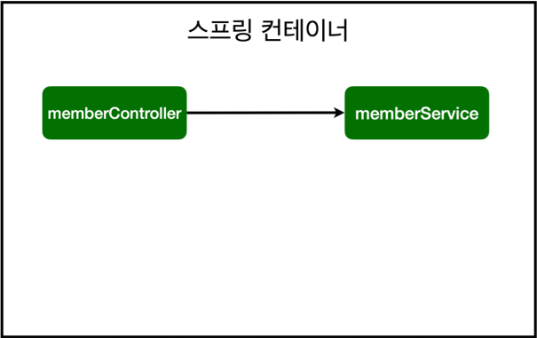
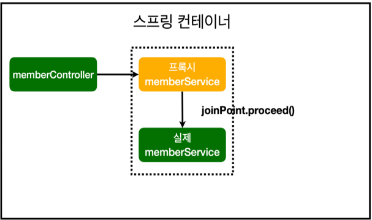

## Intro
안녕하세요 Jams & Donguk의 **Donguk**입니다
Spring Boot를 실무에서 사용하다보니 Spring 기본 원리에 대해 다시 한 번 복습하는 과정이 필요할 것 같아 글을 작성하게 되었습니다.<br/>
Java를 기본적으로 사용해보신 적이 있다는 전제하에 글을 쓸 것이기 때문에 Java를 모르시는 분들에게는 친절한 글이 아닐 수 있습니다.<br/>
Spring에 대한 기본적인 내용을 간단하게 확인하면서 넘어가도록 하겠습니다.

아래 글은 김영한님의 스프링 입문 강의를 수강하고 작성하여 관련 내용이 많이 나오므로 시간이 있으신분들은 김영한님의 강의를 수강해보시는걸 추천드립니다.(무료입니다.)<br/>
Link : https://www.inflearn.com/course/%EC%8A%A4%ED%94%84%EB%A7%81-%EC%9E%85%EB%AC%B8-%EC%8A%A4%ED%94%84%EB%A7%81%EB%B6%80%ED%8A%B8/lecture/49603?tab=curriculum

<br/><br/><br/><br/>

## Spring 구성
스프링을 구성하는 것들 중 크게 3가지를 미리 눈에 익히시고 이후에 나오는 내용들을 보시면 이해가 쉬울 것 같습니다.<br/>
앞으로 계속 사용할 용어들이기 때문에 자연스럽게 익히실 수 있도록 자주 보여드리겠습니다.
<br/>
1. **Spring Container**
> Spring Container는 Spring Bean을 보관 및 관리하는 곳으로서 이후 나올 SpringCore가 작동하는 공간입니다.

2. **Spring Bean**
> **Spring Container에 등록되어지는 객체**들로 **Singleton Pattern**을 적용해 등록되기 때문에 Spring 실행 시 한 번만 등록된다는 특징을 가진 객체들입니다.<br/>
> *물론 객체 스스로가 그렇게 작동하는 것이 아닌 **Spring Core가 관리**하는 것입니다.*<br/>
> 내부 설정을 바꿔주면 특정 조건마다 새롭게 객체를 등록할 수는 있지만 굳이 그런 식으로 사용되는 경우는 극히 드뭅니다.

3. **Spring Core**
> Spring의 핵심 기능 3가지 <br/>
제어역전 - IOC(Inversion Of Controller)<br/>
관점지향 프로그래밍 - AOP(Aspect Oriented Programming)<br/>
이식 가능한 서비스 추상화 - PSA(Portable Service Abstraction)<br/>
위 3가지가 가능하도록 Spring Bean들을 관리하는 Spring의 Engine이라고 생각하시면 됩니다.

아마 Spring을 처음 접하시면 위 3가지에 대해 모르는 분들이 많을 텐데 위 내용이 있다는 것만 아시고 그냥 글을 쭉 읽어주시면 되겠습니다.
<br/><br/><br/><br/>

## Spring의 간단한 등장 배경
Spring은 Java위에서 실행되어 Web Service를 효과적으로 만들 수 있도록 지원하는 FrameWork입니다.
따라서 사실은 없어도 개발은 가능합니다.

실제로 Spring이 없던 시절에는 **POJO**라고 불렸던 순수자바객체(변수, Getter, Setter, Constructor로 구성된 객체)와 **JDBC Connection**을 활용해 개발을 진행했었다고 합니다.
하지만 위 방법은 단점이 많았습니다.

1. DB Connection을 구성하기 위해 너무 많은 코드를 작성
2. 쿼리 사용해 DB에 한 번 요청을 보내기 위해 너무 많은 중복 코드 작성 필요
3. MVC 구조를 만들 때 각각의 객체들을 연결하기 위해 너무 많은 객체들을 중복해서 인스턴스 해야하는 이슈 존재
4. 핵심 로직을 제외한 나머지 공통 로직을 매 기능을 제작할 때마다 수시로 작성해야하는 이슈 존재
5. 전체 Controller로 접근하는 요청들에 대해 보안기능적용, filter, intercepter등을 제작하기 어려움
6. ...

너무 많은 이슈들이 존재했습니다.
간단한 기능을 제작할 때에도 위와 같은 이슈들을 모두 고려하며 제작을 해야하는 어려움을 줄이고자 개발자들에게 봄을 가져다 준다는 **Spring**이 등장한 것입니다.
<br/><br/><br/><br/>

## Spring이 가져다준 봄
그럼 어떤 기능들이 추가되었을까요?
너무 많은 기능들이 있지만 위에 있는 내용들에 대한 답변 형식으로 크게 3가지를 설명드려보겠습니다.

#### DB Connection을 구성하기 위해 너무 많은 코드를 작성
PSA(Portable Service Abstraction) 글을 쭉 읽으셨으면 한 번 지나친 개념입니다.
이 개념은 **추상화 객체를 활용해 내장된 다양한 서비스를 사용하는 것**을 의미합니다.
이게 왜 DB Connection쪽에 등장하는 개념일까요?
<br/><br/>
Java로 DB와 통신을 구현하기 위한 방법을 살펴봅시다.<br/>
**1) Spring 등장 이전**<br/>
> 1. DB Connection 연결
2. Transaction 시작
3. Query실행
4. Commit or Rollback
5. DB Connection 연결 종료(즉, 자원반납)

```java
public void method_name() throw Exception {
    private final DataSource dataSource;
    public JdbcMemberRepository(DataSource dataSource) {
        this.dataSource = dataSource;
    }
    @Override
    public Optional<Member> findByName(String name) {
        String sql = "select * from member where name = ?";
        Connection conn = null;
        PreparedStatement pstmt = null;
        ResultSet rs = null;
        try {
            conn = getConnection();
            pstmt = conn.prepareStatement(sql);
            pstmt.setString(1, name);
            rs = pstmt.executeQuery();
            if(rs.next()) {
                Member member = Member.builder().no(rs.getLong("no")).name(rs.getString("name")).build();
                return Optional.of(member);
            }
            return Optional.empty();
        } catch (Exception e) {
            throw new IllegalStateException(e);
        } finally {
            close(conn, pstmt, rs);
        }
    }
    private Connection getConnection() {
        return DataSourceUtils.getConnection(dataSource);
    }
    private void close(Connection conn, PreparedStatement pstmt, ResultSet rs)
    {
        try {
            if (rs != null) {
                rs.close();
            }
        } catch (SQLException e) {
            e.printStackTrace();
        }
        try {
            if (pstmt != null) {
                pstmt.close();
            }
        } catch (SQLException e) {
            e.printStackTrace();
        }
        try {
            if (conn != null) {
                close(conn);
            }
        } catch (SQLException e) {
            e.printStackTrace();
        }
    }
    private void close(Connection conn) throws SQLException {
        DataSourceUtils.releaseConnection(conn, dataSource);
    }
}
```
*DB와 연결해야되는 모든 객체는 위와 같이 작업을 해야 했습니다.*
<br/><br/>

**2) Spring 등장 이후**<br/>
DB연결을 하는 Spring Bean 생성 시 내가 생성하지도 않은 @Transactional이라는 Anotation을 활용할 수 있어집니다.(Spring Data JPA를 활용하면 이런 과정 조차 사라집니다.)

> 1. DB 연결 객체를 Configuration을 활용해 Spring Bean에 1회만 등록
2. 이후 원하는 곳에서 내가 만든적도 없는 @Transactional만을 선언해 트랜잭션 관리(즉, Spring 내장 기능 활용 가능)<br/>
다만 Spring Bean으로 선언된 객체 안에서만 작동

```java
@Configuration
public class AppConfig {
      private DataSource dataSource;
      @Autowired
      public DbConnectionConfig(DataSource dataSource) {
          this.dataSource = dataSource;
      }
      @Bean
      public MemberRepository memberRepository(){
          return new JdbcTemplateMemberRepository(dataSource);
      }
}
```

```java
public class JdbcTemplateMemberRepository implements MemberRepository{

    private final JdbcTemplate jdbcTemplate;

    // 사실 생성자가 딱 하나만 존재하면 @Autowired는 생략해도 괜찮다.
    @Autowired
    public JdbcTemplateMemberRepository(DataSource dataSource){
        this.jdbcTemplate = new JdbcTemplate(dataSource);
    }

    // 아래 save 기능이 작동될 때 해당 트랜잭션을 관리하겠다는 뜻
    @Transactional
    @Override
    public Member save(Member member) {
        // 기본 Setting
        SimpleJdbcInsert insert = new SimpleJdbcInsert(jdbcTemplate);
        Map<String, Object> parameters = new ConcurrentHashMap<>();
        insert.withTableName("member").usingGeneratedKeyColumns("no"); // GeneratedKey = auto increase 같은 개념
        parameters.put("name", member.getName());

        // insert 진행
        Number key = insert.executeAndReturnKey(new MapSqlParameterSource(parameters));

        // 결과 수신
        member = Member.builder().no(key.longValue()).name(member.getName()).build();
        return member;
    }
}
```
이렇게 하나의 **추상화된 Spring Bean 객체로 등록**함으로써 **눈에 보이지 않는 여러 기능(@Transaction)을 활용할 수 있는 것**을 **<strong style="color: #bb4177;">'PSA(Portable Service Abstraction)'</strong>**라고 부릅니다.
<br/><br/>


#### MVC 구조를 만들 때 각각의 객체들을 연결하기 위해 너무 많은 객체들을 중복해서 인스턴스 해야하는 이슈 존재
Java를 해보신 분은 알겠지만 특정 Class에서 외부 Class들을 가져와 사용하기 위해서는 **<strong style="color: #bb4177;">'Instance'</strong>**라는 과정이 필요합니다.

간단하게 Service와 Repository를 연결해보겠습니다.<br/>
**1) Spring 등장 이전**<br/>
JdbcMemberRepository라는 Repository객체를 MemberService 객체에서 불러와 사용하기 위해서는 아래와 같이 instance를 시켜 사용할 수 있습니다.
```java
public class MemberService {
    private final JdbcMemberRepository memberRepository = new JdbcMemberRepository();

    public Long join(Member member){
        member = memberRepository.save(member);
        return member.getNo();
    }
}
```
하지만 아래와 같은 방법을 한번만 실행하는 것이 아니라 수천, 수만명이 사용하는 서비스에 적용하게 된다면 어떻게 될까요?
요청이 들어올 때 마다 **new를 통해 계속해서 Instance**를 하기 때문에 메모리 낭비가 당연히 커질 수 밖에 없어 이는 Web Service를 만들기에 적합한 방법이 아닙니다.<br/>
그렇다면 이를 **Singleton Pattern**을 활용해 하나만 Instance 후 이를 활용하는 모든 객체에서 가져다 쓸 수 있도록 팩토리 패턴을 구현한다치겠습니다. 이를 구현하기 위한 노력을 개발자들이 하는 순간 사실상 **서비스로직을 개발하는데 사용해야 하는 인적 리소스를 공통을 잡는데 뺐기는 격**이 됩니다.<br/>
이런 비효율을 막기 위해 Spring에서 제공하는 기능을 살펴보겠습니다.
<br/><br/>

**2) Spring 등장 이후**<br/>
Spring을 활용하면 위와 같은 리소스 낭비를 줄일 수 있습니다.

```java
@Service
public class MemberService {
    private final MemberRepository memberRepository;
    @Autowired
    public MemberService(MemberRepository memberRepository) {
        this.memberRepository = memberRepository;
    }

    public Long join(Member member){
        member = memberRepository.save(member);
        return member.getNo();
    }
}
```

위 코드 분석
1. Service로 사용할 객체 위에 @Component Anotation이 내장된 @Service Anotation를 선언
2. @Component가 내장된 모든 Anotation들은 Spring이 최초 실행될 때 Component Scan을 통해 Singleton형식으로 Spring Container에 Bean으로 등록
3. 이후 원하는 Spring Bean에디서든 @Autowired를 통해 Spring Container 내 Spring Bean들에 접근 가능
4. 직접 Bean을 Container에 주입하고 싶다면 @Conmponent가 아니라 @Configuration을 class위에 선언하여 객체를 만들고 그 안에서 @Bean을 호출하여 등록이 가능
5. 직접등록함으로써 얻을 수 있는 장점은 여러 Spring Bean들을 한눈에 보기 좋게 관리할 수 있다는 장점이 존재
6. Spring Bean을 사용하고 싶다면 만들어진 객체에서 **PSA를 활용해 @Autowired Anotation 호출**
7. 아래 코드를 보면 Spring Bean에 등록된 MemberRepository 객체를 Spring Container로 부터 인스턴스 없이 가져와 **주입**

위 기능이 **<strong style="color: #bb4177;">'제어역전' 또는 'IOC(Inversion Of Controller)'</strong>**라고 부르는 특성입니다.
<br/>
**제어 역전**이란 원래 개발자가 직접 관리하던 Bean의 제어권을 Spring으로 돌림으로서 개발자의 추가적인 노력없이도 Spring에 의해 Bean이 관리되는 것을 의미합니다.
<br/>
**제어 역전**을 하게 되면 위에서 본 **<strong style="color: #bb4177;">'의존성 주입(Dependency Injection)'</strong>**이 가능해집니다.
따로 어떤 객체를 Instance하는 과정 필요 없이 Spring Container로 부터 **Singleton으로 등록된 객체를 사용하고자 하는 객체에 주입해 사용**함으로써 Multi-Thread 환경을 고려해야하는 웹개발에서 **메모리 효율적인 관리가 가능**해집니다.
<br/><br/>

#### 핵심 로직을 제외한 나머지 공통 로직을 매 기능을 제작할 때마다 수시로 작성해야하는 이슈 존재
로직을 짤 때는 흔히 말하는 핵심로직과 공통로직이 존재합니다.

예시로 회원가입을 살펴보겠습니다.
>1. 핵심로직 : 유저 회원 정보를 DB에 저장하는 프로세스
>2. 공통로직 : 저장되는 회원 정보 확인을 위한 log작업, DB에 날린 요청이 처리된 시간 측정 등 기능 수행에는 영향을 끼치지 않는 곁다리 작업

**2) Spring 등장 이후**
<br>
핵심로직에서 곁다리로 사용되는 공통로직들(Log 작성, Exception 처리 등)을 굳이 개발자가 신경쓰지 않아도 자동으로 처리한다면 얼마나 편할까요?
<br>
Spring에서는 **공통로직과 핵심로직을 분리**하여 반복적으로 사용되는 **공통로직은 한 곳에 몰아 따로 미리 처리**한 뒤 **개별적으로 작업해야 하는 핵심로직에 더 집중해 개발**할 수 있습니다. 이 과정을 Spring에서는 **<strong style="color: #bb4177;">'관점지향 프로그래밍(AOP-Aspect Oriented Programming)'</strong>**이라 부르고 있습니다.

AOP 구현을 통해 얻을 수 있는 효과
> 1. 공통로직과 핵심로직을 분리하여 개발자들의 클래스 및 메서드를 작성 시 핵심로직 위주의 코딩이 가능해 가독성을 높힘
> 2. 개발자의 코드 작성 부담 및 놓치는 부분 발생 확률을 줄임
> 3. 공통로직을 한 곳에 모아 관리함으로써 추후 변경이 필요할 시 전체를 돌며 수정할 필요가 없어 유지보수에 유리


```Java
@Aspect
@Component
public class TimeTraceAop {
    // 해당 AOP가 어디서 작동할지 결정
    @Around("execution(* spring.study.withjpa..*(..))")
    public Object execute(ProceedingJoinPoint joinPoint) throws Throwable{
        long startTime = System.currentTimeMillis();
        System.out.println("start TIme : " + startTime);
        try {
            return joinPoint.proceed();
        } finally {
            long finishTime = System.currentTimeMillis();
            long timems = finishTime - startTime;
            System.out.println("사용된 포인트 : " + joinPoint.toString() + "\n소요 시간 : " + timems + "ms");
        }
    }
}
```

위 코드 분석
1. **@Aspect**라고 선언하게 되면 해당 클래스를 AOP로 사용 가능하도록 지정
  * 일반 객체의 의존관계와 AOP가 선언된 객체의 의존관계 정리
> 1. "요청을 보내는 객체 > 프록시 객체(AOP) > 실제 사용 객체" 순서로 작업 진행
>   * AOP 적용 전 의존 관꼐<br/>
        
>   * AOP 적용 후 의존 관계<br/>
        
> 2. 프록시 객체가 중요한데 Spring Bean 객체가 다른 Spring Bean객체를 호출할 때 그 사이에서 프록시 객체가 전달되는 메세지를 인터셉트하여 먼저 호출
> 3. 이렇게 인터셉트 당하게 되면 memberService객체에 접근하기 전 AOP가 작동
> 4. APO 내 'ProceedingJoinPoint' 객체 내 'proceed'메서드가 가 선언된 곳에서 실제 요청을 받을 Spring Bean객체(MemberService)의 Method를 실행하게 된다.
2. Spring Cantainer에 등록해 어디서든 호출 가능한 상태로 유지
3. **@Around**를 선언함으로서 어디서 해당 AOP가 작동할지 범위를 설정 - package, class, method 다 지정 가능
4. 위 코드와 같이 Setting하게 되면 AOP가 작동하는 시점
> 1. Spring 실행 시 Around로 지정된 범위 내 @Bean을 활용해 Spring Container에 등록되는 객체들을 대상으로 AOP 작동
> 2. @Controller에서 @Service로 요청을 보낼 때 AOP 작동
> 3. @Service에서 @Repository를 호출 시 AOP 작동
> 4. @Repository에서 DB로 요청을 보낼 시 AOP 작동
> 5. ...<br/>
> 위와 같이 Spring Bean으로 등록된 객체들 사이에서 메세지를 전달해 Method가 실행될 때마다 AOP가 자동으로 작동한다.

<br/><br/>
## Spring의 생애주기(Spring Life Cycle)
위에서 쭉 설명했던 Spring Bean을 활용하는 것이 웹개발에 많은 편의성을 제공한다는 것은 이제 이해하실 수 있으실 겁니다.
마지막으로 어떻게 이 Spring Bean이 생성되고 소멸되는지 확인하며 마무리하겠습니다.
<br/>

**<strong style="color: #bb4177;">'Spring Bean의 생애주기'</strong>**
