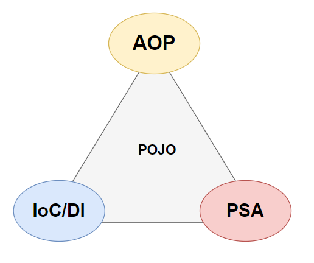
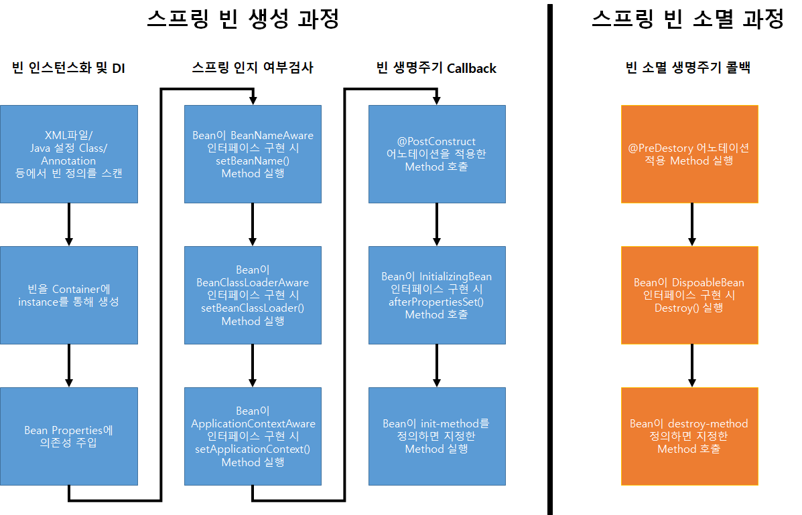

# 목차
[1. Intro](#intro)
 
[2. Spring Framework(Legacy) 설명](#spring-framework-legacy)
 
[3. Spring_3대_특징](#spring-3대-특징)
 
[4. Spring_Framework의_POJO](#spring-framework의-pojo)
 
[5. Spring_Bean_Life_Cycle](#spring-bean-life-cycle)
 
[6. SpringContainer의_종류](#spring-container의-종류)
 
[7. 마무리하며](#마무리하며)
    

# Intro
안녕하세요 Jams & Donguk의 **Donguk**입니다
Spring Boot를 실무에서 사용하다보니 Spring 기본 원리에 대해 다시 한 번 복습하는 과정이 필요할 것 같아 글을 작성하게 되었습니다. 
Java를 기본적으로 사용해보신 적이 있다는 전제하에 글을 쓸 것이기 때문에 Java를 모르시는 분들에게는 친절한 글이 아닐 수 있습니다. 
Spring에 대한 기본적인 내용을 간단하게 확인하면서 넘어가도록 하겠습니다.

아래 글은 김영한님의 스프링 입문 강의를 수강하고 작성하여 관련 내용이 많이 나오므로 시간이 있으신분들은 김영한님의 강의를 수강해보시는걸 추천드립니다.(무료입니다.) 
[강의 URI](https://www.inflearn.com/course/%EC%8A%A4%ED%94%84%EB%A7%81-%EC%9E%85%EB%AC%B8-%EC%8A%A4%ED%94%84%EB%A7%81%EB%B6%80%ED%8A%B8/lecture/49603?tab=curriculum)
    

## Spring Framework Legacy
## Spring Framework등장 배경
Spring Framework의 등장은 EJB기술의 등장으로 인해 생겼습니다.
 
EJB는 점점 IT 시스템이 복잡한 기술이 요구되어 자바의 기초적인 JDK,
이 때문에 트랜잭션처리, 상태관리, 멀티스레딩, 리소스 풀링, 보안 등을 충족시켜야 하면서
애플리케이션 로직의 복잡도와 상세 기술의 복잡함을 개발자들이 한번에 다루기가 어려워졌습니다.
 
과거에는 이런 문제들을 다루기 위해서 EJB가 등장했지만 EJB는 현실에서 1%미만의 애플리케이션에서만 필요한 멀티 DB를 위한 분산트랜잭션을 위해 나머지 99%의 애플리케이션이 희생하여 무거운 툴을 사용해야하는 단점이 존재했습니다.
 
이런 단점을 보완해 나온 것이 Spring Framework이며 EJB가 가지고 있던 시스템 복잡도를 최대한 낮추고 예전 POJO(Plain Old Java Object)방식의 Class를 지향하면서 더 간결한 객체를 만들어 내도록 지원하고 있습니다.
  

## Spring Framework란?
자바 플랫폼을 위한 오픈소스 애플리케이션 프레임워크로서
엔터프라이즈급 애플리케이션을 개발하기 위한 모든 기능을 종합적으로 제공하는 경량화된 Framework입니다.
> 엔터프라이즈급이란?
 
엔터프라이즈급 개발이란 뜻대로만 풀이하면 기업을 대상으로 하는 개발이라는 말로
즉, 대규모 데이터 처리와 트랜잭션이 동시에 여러 사용자로 부터 행해지는 매우 큰 규모의 환경을 엔터프라이즈 환경이라 칭합니다.

 
Spirng Framework는 Spring Core에 의해 경량 컨테이너(IoC Container)로 자바 객체(Spring Bean)를 담고 직접 관리하며 객체의 Spring Bean의 Life-Cycle을 관리합니다.
 
이를 통해 Container에 등록된 Spring Bean을 언제든 필요한 객체를 검색하고 필요로 하는 곳에 주입시켜 사용가능한 것이 큰 특징입니다.
  

# Spring 3대 특징

  

## Spring IoC(Inversion of Control)란?
[Spring 3대 특징 중 "IoC"](https://jd6186.github.io/Spring_IoC/)

## Spring AOP(Aspect Oriented Programming)란?
[Spring 3대 특징 중 "AOP"](https://jd6186.github.io/Spring_AOP/)

## Spring PSA(Portable Service Abstraction)란?
[Spring 3대 특징 중 "PSA"](https://jd6186.github.io/Spring_PSA/)

# Spring Framework의 POJO
POJO(Plain Old Java Object) 란 말 그대로 평범한 자바 오브젝트입니다.
이전 EJB(Enterprise JavaBeans)는 확장 가능한 재사용이 가능한 로직을 개발하기 위해 사용했습니다.
하지만 EJB는 한가지 기능을 위해 불필요한 복잡한 로직이 과도하게 들어가는 단점이 있다고 말씀드렸죠?
  
이 때문에 다시 조명을 받은게 POJO형식입니다.
 
> POJO : 생성자, Getter, Setter, 실행 메서드로 구성된 java 객체

POJO는 gettet/setter를 가진 단순 자바 오브젝트로 정의되는데 단순 오브젝트는 의존성이 없고 추후 테스트 및 유지보수가 편리한 유연성이 장점입니다.
  

# Spring MVC
MVC란 (Model View Controller) 사용자 인터페이스와 비지니스 로직을 분리하여 개발 하는 것입니다.
## 자세한 설명
[Spring MVC 작동원리](https://jd6186.github.io/Spring_MVC/)
  

# Spring Bean Life Cycle
Spring bean 생성 과정 - 생성 시점은 Spring Container 초기화 시 생성됩니다.
1. Bean Instance
    1. XML 파일 / Java 설정 Class / Annotation 등에서 Bean을 정의하는 내용을 스캔
    2. 확인된 내용을 바탕으로 Bean을 Container에 Instance
    3. Bean Properties에 의존성을 주입하여 DI 구현
2. Spring이 해당 Bean을 인지하는지 체크
    1. Bean이 BeanNameAware 인터페이스 구현 시 setBeanName() Method를 실행하여 정상 작동 확인
    2. Bean이 BeanClassLoaderAware 인터페이스 구현 시 setBeanClassLoader() Method들 실행하여 정상 작동 확인
    3. Bean이 ApplicationContextAware Interface구현 시 setApplicationContext() Method 실행하여 정상 작동 확인
3. Bean 생명주기 Callback
    1. @PostConstruct Annotation이 적용된 Method를 호출
    2. Bean이 initializingBean Interface 구현 시 afterPropertiesSet() Method 호출
    3. Bean이 init-method를 정의 시 지정한 Method 실행

  

# Spring Container의 종류
## 빈팩토리 BeanFactory
- 빈을 등록하고 생성하고 조회하고 돌려주고, 그 외에 부가적인 빈을 관리하는 기능을 담당
- 빈 팩토리가 빈의 정의는 즉시 로딩하는 반면, 빈 자체가 필요하게 되기 전까지는 인스턴스화 X
- getBean()이 호출되면, 팩토리는 의존성 주입을 이용해 빈을 인스턴스화하고 빈의 특성을 설정하기 시작.
- 여기서 빈의 일생이 시작
  

## 어플리케이션 컨텍스트 Application Context
- Bean Factory를 상속하며 Bean Factory를 확장한 향상 된 컨테이너
- 기본적인 기능은 Bean Factory와 동일하고 Spring이 제공하는 각종 부가 서비스를 추가로 제공
    - 국제화가 지원되는 텍스트 메시지를 관리
    - 이미지같은 파일 자원을 로드 할 수 있는 포괄적인 방법을 제공
    - 리너스로 등록된 빈에게 이벤트 발생을 알림
  

## 두 Container의 차이점
- Bean Factory
    - 처음으로 getBean()이 호출된 시점에서야 해당 빈을 생성(lazy loading)
- Application Context
    - 컨텍스트 초기화 시점에 모든 싱글톤 빈을 미리 로드한 후 애플리케이션 기동 후에는 빈을 지연 없이 얻을 수 있음
    - 즉, 미리 빈을 생성해 놓아 빈이 필요할 때 즉시 사용할 수 있도록 보장
    - 여기까지 보면 알 수 있겠지만 바로 저 Application Context가 DI를 가능하게 하는 Container
    - 이 Application Context를 두고 IoC Container라고도 부름
    

# 마무리하며
알듯 말듯 모호했던 내용들을 정리하며 마무리했던 공부과정이었습니다.

Spring 자체가 워낙 방대하다보니 전부를 공부할 수는 없었지만 적어도 Client단부터 DB통신에 이르기까지 이제는 어떤 진행과정에서 문제가 발생한 것인지는 파악이 가능한 정도로 공부는 한 것 같습니다.

아직 실무 프로젝트에서 JPA를 활용해 본 경험이 없어 JPA에 대해 자세하게 다루지는 못했지만 이번 기회에 tomcat작동 원리에 대해 찾아보며 작업할 수 있어서 Application 앞단에서 어떤 작업이 이뤄지고 있는지 알 수 있는 좋은 시간이었습니다.

이후부터는 자격증 취득을 목표로하고 있어 AWS 자격증 취득에 대한 블로깅을 할 예정입니다.
긴글 봐주셔서 감사합니다.
